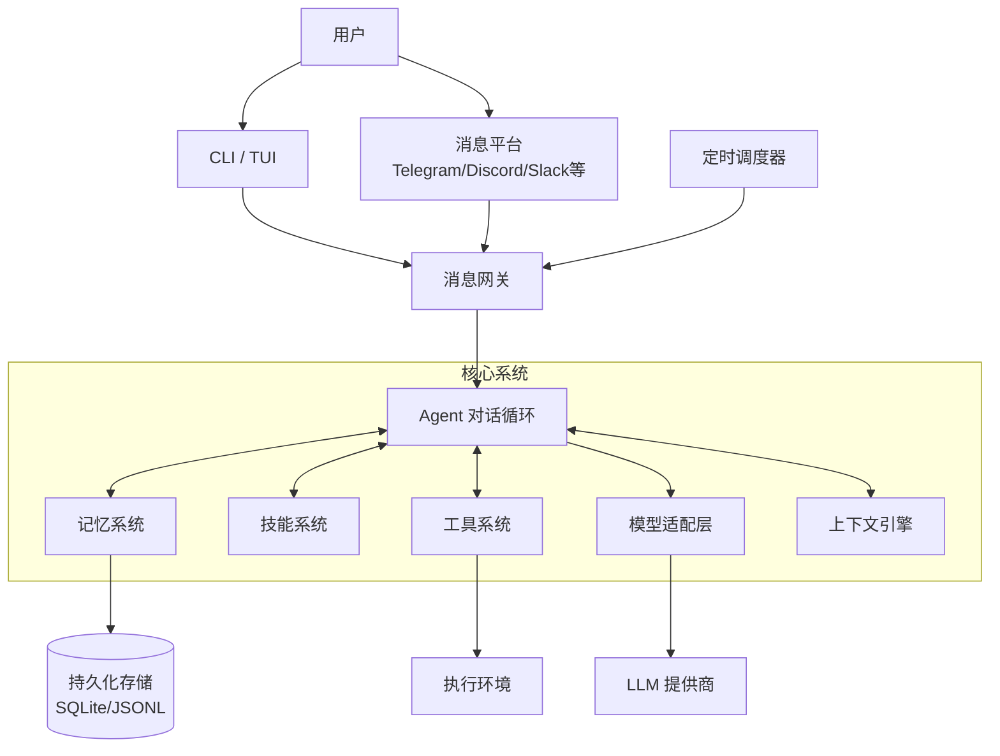

<p align="center">
  
</p>

# Hermes Agent ☤

<p align="center">
  <a href="https://hermes-agent.nousresearch.com/docs/"></a>
  <a href="https://discord.gg/NousResearch"></a>
  <a href="https://github.com/NousResearch/hermes-agent/blob/main/LICENSE"></a>
  <a href="https://nousresearch.com"></a>
  <a href="README.md"></a>
</p>

**由 [Nous Research](https://nousresearch.com) 构建的自进化 AI 代理。** 它是唯一内置学习闭环的智能代理——从经验中创建技能，在使用中改进技能，主动持久化知识，搜索过往对话，并在跨会话中逐步构建对你的深度理解。可以在 $5 的 VPS 上运行，也可以在 GPU 集群上运行，或者使用几乎零成本的 Serverless 基础设施。它不绑定你的笔记本——你可以在 Telegram 上与它对话，而它在云端 VM 上工作。

支持任意模型——[Nous Portal](https://portal.nousresearch.com)、[OpenRouter](https://openrouter.ai)（200+ 模型）、[NVIDIA Nemotron](https://build.nvidia.com)、[小米 MiMo](https://platform.xiaomimimo.com)、[z.ai/GLM](https://z.ai)、[Kimi/Moonshot](https://platform.moonshot.ai)、[MiniMax](https://www.minimaxai.com)、[Hugging Face](https://huggingface.co)、OpenAI，或自定义端点。使用 `hermes model` 即可切换——无需改代码，无锁定。

<table>
<tr><td><b>真正的终端界面</b></td><td>完整的 TUI，支持多行编辑、斜杠命令自动补全、对话历史、中断重定向和流式工具输出。</td></tr>
<tr><td><b>随你所在</b></td><td>Telegram、Discord、Slack、WhatsApp、Signal 和 CLI——全部从单个网关进程运行。语音备忘录转写、跨平台对话连续性。</td></tr>
<tr><td><b>闭环学习</b></td><td>代理管理记忆并定期自我提醒。复杂任务后自动创建技能。技能在使用中自我改进。FTS5 会话搜索配合 LLM 摘要实现跨会话回溯。<a href="https://github.com/plastic-labs/honcho">Honcho</a> 辩证式用户建模。兼容 <a href="https://agentskills.io">agentskills.io</a> 开放标准。</td></tr>
<tr><td><b>定时自动化</b></td><td>内置 cron 调度器，支持向任何平台投递。日报、夜间备份、周审计——全部用自然语言描述，无人值守运行。</td></tr>
<tr><td><b>委派与并行</b></td><td>生成隔离子代理处理并行工作流。编写 Python 脚本通过 RPC 调用工具，将多步管道压缩为零上下文开销的轮次。</td></tr>
<tr><td><b>随处运行</b></td><td>六种终端后端——本地、Docker、SSH、Daytona、Singularity 和 Modal。Daytona 和 Modal 提供 Serverless 持久化——代理环境空闲时休眠、按需唤醒，空闲期间几乎零成本。$5 VPS 或 GPU 集群都能跑。</td></tr>
<tr><td><b>研究就绪</b></td><td>批量轨迹生成、轨迹压缩——用于训练下一代工具调用模型。</td></tr>
</table>

---

## 📚 文档导航

| 文档 | 说明 |
|------|------|
| [快速上手指南](docs/quick-start.md) | 🚀 10 分钟上手 Hermes |
| [技术调研报告](docs/technical-research-report.md) | 🔬 深入技术架构和模块分析 |
| [架构设计文档](docs/architecture-design.md) | 🏗️ 完整系统架构详解 |
| [配置文档](docs/configuration.md) | ⚙️ 所有配置选项说明 |
| [部署指南](docs/deployment.md) | 📦 生产环境部署 |
| [开发者指南](docs/developer-guide.md) | 👨‍💻 为 Hermes 贡献代码 |
| [API 文档](docs/api-docs.md) | 📖 核心 API 参考 |
| [最佳实践](docs/best-practices.md) | ✨ 使用技巧和注意事项 |
| [架构文档](docs/architecture/overview.md) | 🏛️ 架构设计文档集 |

---

## 快速安装

```bash
curl -fsSL https://raw.githubusercontent.com/NousResearch/hermes-agent/main/scripts/install.sh | bash
```

支持 Linux、macOS、WSL2 和 Android (Termux)。安装程序会自动处理平台特定的配置。

> **Android / Termux：** 已测试的手动安装路径请参考 [Termux 指南](https://hermes-agent.nousresearch.com/docs/getting-started/termux)。在 Termux 上，Hermes 会安装精选的 `.[termux]` 扩展，因为完整的 `.[all]` 扩展会拉取 Android 不兼容的语音依赖。
>
> **Windows：** 原生 Windows 不受支持。请安装 [WSL2](https://learn.microsoft.com/zh-cn/windows/wsl/install) 并运行上述命令。

安装后：

```bash
source ~/.bashrc    # 重新加载 shell（或: source ~/.zshrc）
hermes              # 开始对话！
```

详细安装说明请参考 [快速上手指南](docs/quick-start.md)。

---

## 快速入门

```bash
hermes              # 交互式 CLI — 开始对话
hermes model        # 选择 LLM 提供商和模型
hermes tools        # 配置启用的工具
hermes config set   # 设置单个配置项
hermes gateway      # 启动消息网关（Telegram、Discord 等）
hermes setup        # 运行完整设置向导（一次性配置所有内容）
hermes claw migrate # 从 OpenClaw 迁移（如果来自 OpenClaw）
hermes update       # 更新到最新版本
hermes doctor       # 诊断问题
```

📖 **[完整文档 →](https://hermes-agent.nousresearch.com/docs/)**

### 第一次使用？

1. **安装**：运行上述安装命令
2. **配置 API**：获取 OpenRouter、Anthropic 或其他提供商的 API 密钥
3. **运行设置向导**：`hermes setup`
4. **开始对话**：`hermes`

详细步骤请参考 [快速上手指南](docs/quick-start.md)。

---

## CLI 与消息平台 快速对照

Hermes 有两种入口：用 `hermes` 启动终端 UI，或运行网关从 Telegram、Discord、Slack、WhatsApp、Signal 或 Email 与之对话。进入对话后，许多斜杠命令在两种界面中通用。

| 操作 | CLI | 消息平台 |
|------|-----|----------|
| 开始对话 | `hermes` | 运行 `hermes gateway setup` + `hermes gateway start`，然后给机器人发消息 |
| 开始新对话 | `/new` 或 `/reset` | `/new` 或 `/reset` |
| 更换模型 | `/model [provider:model]` | `/model [provider:model]` |
| 设置人格 | `/personality [name]` | `/personality [name]` |
| 重试或撤销上一轮 | `/retry`、`/undo` | `/retry`、`/undo` |
| 压缩上下文 / 查看用量 | `/compress`、`/usage`、`/insights [--days N]` | `/compress`、`/usage`、`/insights [days]` |
| 浏览技能 | `/skills` 或 `/<skill-name>` | `/skills` 或 `/<skill-name>` |
| 中断当前工作 | `Ctrl+C` 或发送新消息 | `/stop` 或发送新消息 |
| 平台特定状态 | `/platforms` | `/status`、`/sethome` |

完整命令列表请参考 [CLI 指南](https://hermes-agent.nousresearch.com/docs/user-guide/cli) 和 [消息网关指南](https://hermes-agent.nousresearch.com/docs/user-guide/messaging)。

---

## 核心特性

### 🤖 自进化能力

- **自动技能创建**：从复杂任务中自动学习并创建可复用技能
- **技能自我改进**：技能在使用中不断优化和完善
- **跨会话记忆**：持久化存储对话历史，支持全文搜索
- **用户建模**：学习你的偏好、习惯和工作方式

### 🌐 多平台支持

| 平台 | 状态 | 特殊功能 |
|------|------|----------|
| Telegram | ✅ 完全支持 | Forum Topics、流式传输、按钮交互 |
| Discord | ✅ 完全支持 | 线程、按钮、频道技能绑定 |
| Slack | ✅ 完全支持 | Assistant API、线程 |
| Signal | ✅ 完全支持 | 加密消息 |
| Matrix | ✅ 完全支持 | 加密房间 |
| WhatsApp | ✅ 支持 | 网桥集成 |
| 微信 | ✅ 完全支持 | 个人微信、群聊 |
| 飞书 | ✅ 完全支持 | 富文本、按钮 |
| 企业微信 | ✅ 完全支持 | 应用回调 |
| 钉钉 | ✅ 完全支持 | AI 卡片 |
| 更多... | - | 持续扩展中 |

### 🛠️ 强大工具生态

- **40+ 内置工具**：文件操作、终端执行、浏览器、Git 等
- **6 种执行环境**：本地、Docker、SSH、Modal、Daytona、Singularity
- **MCP 协议支持**：连接任意 MCP 服务器扩展能力
- **安全审批流程**：敏感操作需要用户确认

### ⏰ 定时自动化

- **内置 Cron 调度器**：使用自然语言定义定时任务
- **跨平台投递**：将定时任务结果发送到任意平台
- **任务模板**：日报、周报、备份、健康检查等

---

## 架构概览

Hermes Agent 采用模块化分层架构：



**核心模块：**

- **Agent 对话循环**：核心消息处理逻辑
- **消息网关**：多平台接入和会话管理
- **记忆系统**：跨会话记忆和用户建模
- **技能系统**：技能创建、执行和自我改进
- **工具系统**：40+ 内置工具，支持多种执行环境
- **模型适配层**：支持 200+ 模型，统一接口

详细架构说明请参考 [架构设计文档](docs/architecture-design.md) 和 [技术调研报告](docs/technical-research-report.md)。

---

## 文档

所有文档位于 **[hermes-agent.nousresearch.com/docs](https://hermes-agent.nousresearch.com/docs/)**，或查看项目内文档：

### 用户文档

| 文档 | 说明 |
|------|------|
| [快速上手指南](docs/quick-start.md) | 🚀 10 分钟快速上手指南 |
| [配置文档](docs/configuration.md) | ⚙️ 所有配置选项详细说明 |
| [部署指南](docs/deployment.md) | 📦 生产环境部署指南 |
| [最佳实践](docs/best-practices.md) | ✨ 使用技巧和常见问题 |

### 技术文档

| 文档 | 说明 |
|------|------|
| [技术调研报告](docs/technical-research-report.md) | 🔬 完整的技术调研和模块分析 |
| [架构设计文档](docs/architecture-design.md) | 🏗️ 系统架构详解 |
| [架构文档集](docs/architecture/overview.md) | 🏛️ 各模块详细架构文档 |
| [技术栈说明](docs/tech-stack.md) | 💻 技术栈和依赖说明 |
| [API 文档](docs/api-docs.md) | 📖 核心 API 参考 |
| [开发者指南](docs/developer-guide.md) | 👨‍💻 贡献代码指南 |

### 架构文档（按模块）

| 文档 | 说明 |
|------|------|
| [整体架构](docs/architecture/overview.md) | 系统总览 |
| [对话流程](docs/architecture/conversation-flow.md) | 消息处理完整流程 |
| [网关架构](docs/architecture/gateway-architecture.md) | 消息网关详解 |
| [工具调用流程](docs/architecture/tool-call-flow.md) | 工具系统详解 |
| [技能系统](docs/architecture/skill-system.md) | 技能系统详解 |
| [记忆系统](docs/architecture/memory-system.md) | 记忆系统详解 |
| [定时任务流程](docs/architecture/cron-flow.md) | 定时任务详解 |
| [目录结构](docs/architecture/directory-tree.md) | 项目结构说明 |
| [依赖关系](docs/architecture/dependencies.md) | 依赖关系说明 |

---

## 从 OpenClaw 迁移

如果你来自 OpenClaw，Hermes 可以自动导入你的设置、记忆、技能和 API 密钥。

**首次安装时：** 安装向导（`hermes setup`）会自动检测 `~/.openclaw` 并在配置开始前提供迁移选项。

**安装后任意时间：**

```bash
hermes claw migrate              # 交互式迁移（完整预设）
hermes claw migrate --dry-run    # 预览将要迁移的内容
hermes claw migrate --preset user-data   # 仅迁移用户数据，不含密钥
hermes claw migrate --overwrite  # 覆盖已有冲突
```

导入内容：
- **SOUL.md** — 人格文件
- **记忆** — MEMORY.md 和 USER.md 条目
- **技能** — 用户创建的技能 → `~/.hermes/skills/openclaw-imports/`
- **命令白名单** — 审批模式设置
- **消息设置** — 平台配置、允许用户、工作目录
- **API 密钥** — 白名单中的密钥（Telegram、OpenRouter、OpenAI、Anthropic、ElevenLabs）
- **TTS 资产** — 工作区音频文件
- **工作区指令** — AGENTS.md（使用 `--workspace-target`）

使用 `hermes claw migrate --help` 查看所有选项，或使用 `openclaw-migration` 技能进行交互式代理引导迁移（含干运行预览）。

---

## 贡献

欢迎贡献！请阅读以下文档了解如何参与：

- [开发者指南](docs/developer-guide.md) — 开发环境设置、PR 流程、代码风格
- [架构设计文档](docs/architecture-design.md) — 理解系统架构
- [技术调研报告](docs/technical-research-report.md) — 深入技术细节

**贡献者快速开始：**

```bash
# 克隆仓库
git clone https://github.com/NousResearch/hermes-agent.git
cd hermes-agent

# 使用设置脚本
./setup-hermes.sh

# 或手动设置
curl -LsSf https://astral.sh/uv/install.sh | sh
uv venv venv --python 3.11
source venv/bin/activate
uv pip install -e ".[all,dev]"

# 运行测试
python -m pytest tests/ -q

# 启动 Hermes
./hermes
```

---

## 社区

- 💬 **Discord**：[加入我们的社区](https://discord.gg/NousResearch)
- 📚 **技能中心**：[agentskills.io](https://agentskills.io) — 分享和发现技能
- 🐛 **Issues**：[GitHub Issues](https://github.com/NousResearch/hermes-agent/issues) — 报告 bug 和请求功能
- 💡 **讨论区**：[GitHub Discussions](https://github.com/NousResearch/hermes-agent/discussions) — 提问和讨论
- 🔌 **HermesClaw**：[社区微信桥接](https://github.com/AaronWong1999/hermesclaw) — 在同一微信账号上运行 Hermes Agent 和 OpenClaw

---

## 项目文件结构

```
hermes-agent/
├── agent/                    # Agent 核心模块
├── gateway/                  # 消息网关模块
├── tools/                    # 工具系统模块
├── cron/                     # 定时任务模块
├── skills/                   # 内置技能目录
├── hermes_cli/               # CLI 模块
├── docs/                     # 文档
│   ├── quick-start.md        # 快速上手指南
│   ├── technical-research-report.md  # 技术调研报告
│   ├── architecture-design.md        # 架构设计文档
│   ├── configuration.md      # 配置文档
│   ├── deployment.md         # 部署指南
│   ├── developer-guide.md    # 开发者指南
│   ├── api-docs.md           # API 文档
│   ├── best-practices.md     # 最佳实践
│   ├── tech-stack.md         # 技术栈说明
│   └── architecture/         # 架构文档集
├── tests/                    # 测试
├── scripts/                  # 脚本
├── pyproject.toml            # 项目配置
├── README.md                 # 英文 README
└── README.zh-CN.md           # 中文 README（本文件）
```

用户数据目录 `~/.hermes/`：
```
~/.hermes/
├── config.yaml               # 主配置文件
├── .env                      # 环境变量
├── sessions/                 # 会话历史
├── skills/                   # 用户技能
├── cron/                     # 定时任务
├── hooks/                    # 事件钩子
└── logs/                     # 日志文件
```

详细结构说明请参考 [目录结构文档](docs/architecture/directory-tree.md)。

---

## 许可证

MIT — 详见 [LICENSE](LICENSE)。

由 [Nous Research](https://nousresearch.com) 构建。

---

## 致谢

感谢所有为 Hermes Agent 做出贡献的开发者和社区成员！

特别感谢：
- OpenClaw 社区的早期采用者
- 所有平台适配器的贡献者
- 技能生态系统的建设者

---

**相关链接：**
- [Nous Research 官网](https://nousresearch.com)
- [Nous Portal](https://portal.nousresearch.com)
- [GitHub 仓库](https://github.com/NousResearch/hermes-agent)
- [Discord 社区](https://discord.gg/NousResearch)
- [技能中心](https://agentskills.io)
