# Hermes Agent 架构设计文档

本文档详细描述 Hermes Agent 的完整系统架构，包括各模块的职责、交互方式、数据流等。

---

## 目录

1. [系统总览](#系统总览)
2. [分层架构](#分层架构)
3. [核心模块详解](#核心模块详解)
4. [数据流设计](#数据流设计)
5. [关键设计模式](#关键设计模式)
6. [部署架构](#部署架构)
7. [扩展性设计](#扩展性设计)
8. [安全性设计](#安全性设计)

---

## 系统总览

### 1.1 架构概览图

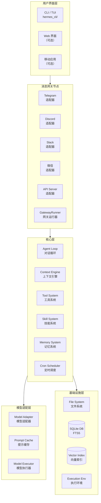
```mermaid
graph TB
    subgraph UserLayer[用户界面层]
        CLI[CLI / TUI<br>hermes_cli/]
        Web[Web 界面<br>（可选）]
        Mobile[移动应用<br>（可选）]
    end
    
    subgraph GatewayLayer[消息网关节点]
        TG[Telegram<br>适配器]
        DC[Discord<br>适配器]
        SK[Slack<br>适配器]
        WX[微信<br>适配器]
        AP[API Server<br>适配器]
        GR[GatewayRunner<br>网关运行器]
    end
    
    subgraph CoreLayer[核心层]
        AL[Agent Loop<br>对话循环]
        CE[Context Engine<br>上下文引擎]
        TS[Tool System<br>工具系统]
        SS[Skill System<br>技能系统]
        MS[Memory System<br>记忆系统]
        CS[Cron Scheduler<br>定时调度]
    end
    
    subgraph ModelLayer[模型适配层]
        MA[Model Adapter<br>模型适配器]
        PC[Prompt Cache<br>提示缓存]
        ME[Model Executor<br>模型执行器]
    end
    
    subgraph InfraLayer[基础设施层]
        FS[File System<br>文件系统]
        DB[(SQLite DB<br>FTS5)]
        Vec[(Vector Index<br>向量索引)]
        EE[Execution Env<br>执行环境]
    end
    
    UserLayer --> GatewayLayer
    GatewayLayer --> CoreLayer
    CoreLayer --> ModelLayer
    CoreLayer --> InfraLayer
```

### 1.2 核心特性

| 特性 | 说明 |
|------|------|
| **模块化设计** | 各组件独立开发、测试、部署 |
| **多平台支持** | 15+ 消息平台，统一接口 |
| **自进化能力** | 自动学习、技能改进、用户建模 |
| **安全隔离** | 工具执行在隔离环境中 |
| **持久化存储** | 会话、记忆、技能均持久化 |
| **流式优先** | 实时流式响应支持 |
| **并发安全** | 任务级状态隔离 |

---

## 分层架构

### 2.1 分层架构图

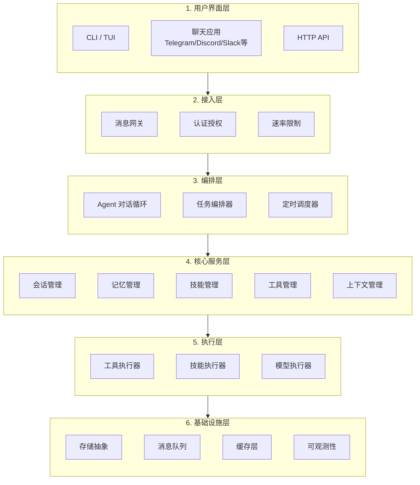
```mermaid
graph TB
    subgraph Layer1[1. 用户界面层]
        direction TB
        CLI[CLI / TUI]
        ChatApps[聊天应用<br>Telegram/Discord/Slack等]
        API[HTTP API]
    end
    
    subgraph Layer2[2. 接入层]
        direction TB
        Gateway[消息网关]
        Auth[认证授权]
        RateLimit[速率限制]
    end
    
    subgraph Layer3[3. 编排层]
        direction TB
        AgentLoop[Agent 对话循环]
        Orchestrator[任务编排器]
        CronScheduler[定时调度器]
    end
    
    subgraph Layer4[4. 核心服务层]
        direction TB
        SessionMgr[会话管理]
        MemoryMgr[记忆管理]
        SkillMgr[技能管理]
        ToolMgr[工具管理]
        ContextMgr[上下文管理]
    end
    
    subgraph Layer5[5. 执行层]
        direction TB
        ToolExec[工具执行器]
        SkillExec[技能执行器]
        ModelExec[模型执行器]
    end
    
    subgraph Layer6[6. 基础设施层]
        direction TB
        Storage[存储抽象]
        Queue[消息队列]
        Cache[缓存层]
        Observability[可观测性]
    end
    
    Layer1 --> Layer2
    Layer2 --> Layer3
    Layer3 --> Layer4
    Layer4 --> Layer5
    Layer5 --> Layer6
```

### 2.2 各层职责

#### 用户界面层
- 提供多种交互方式（CLI/TUI、聊天应用、API）
- 用户输入处理
- 响应展示
- 前端状态管理

#### 接入层
- 多平台协议适配
- 消息接收和发送
- 认证和授权
- 速率限制和防护
- 会话路由

#### 编排层
- 对话流程编排
- 任务调度和执行
- 工具调用协调
- 错误处理和重试
- 超时控制

#### 核心服务层
- 会话生命周期管理
- 记忆存储和检索
- 技能管理和执行
- 工具注册和管理
- 上下文构建和压缩

#### 执行层
- 工具执行环境隔离
- 技能逻辑执行
- LLM 调用和流式处理
- 结果处理和转换

#### 基础设施层
- 数据持久化
- 缓存管理
- 消息队列
- 日志和监控
- 追踪和诊断

---

## 核心模块详解

### 3.1 Agent 对话循环

#### 3.1.1 架构图

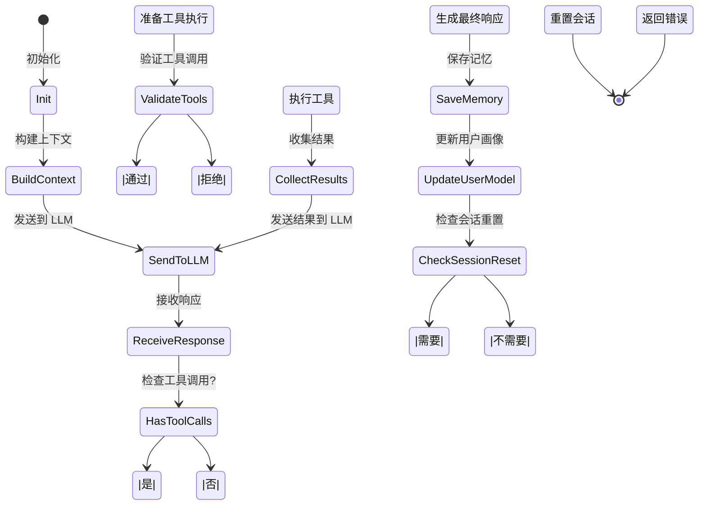
```mermaid
stateDiagram-v2
    [*] --> Init: 初始化
    
    Init --> BuildContext: 构建上下文
    BuildContext --> SendToLLM: 发送到 LLM
    SendToLLM --> ReceiveResponse: 接收响应
    
    ReceiveResponse --> HasToolCalls: 检查工具调用?
    HasToolCalls -->|是| PrepareTools: 准备工具执行
    HasToolCalls -->|否| GenerateFinal: 生成最终响应
    
    PrepareTools --> ValidateTools: 验证工具调用
    ValidateTools -->|通过| ExecuteTools: 执行工具
    ValidateTools -->|拒绝| ReturnError: 返回错误
    ExecuteTools --> CollectResults: 收集结果
    CollectResults --> SendToLLM: 发送结果到 LLM
    
    GenerateFinal --> SaveMemory: 保存记忆
    SaveMemory --> UpdateUserModel: 更新用户画像
    UpdateUserModel --> CheckSessionReset: 检查会话重置
    CheckSessionReset -->|需要| ResetSession: 重置会话
    CheckSessionReset -->|不需要| [*]
    ResetSession --> [*]
    
    ReturnError --> [*]
```

#### 3.1.2 核心组件

| 组件 | 文件位置 | 职责 |
|------|----------|------|
| AgentLoop | `agent/conversation_loop.py` | 主对话循环控制器 |
| ContextEngine | `agent/context_engine.py` | 上下文构建和管理 |
| PromptBuilder | `agent/prompt_builder.py` | 提示词构建 |
| ToolExecutor | `agent/tool_executor.py` | 工具执行协调 |
| MemoryManager | `agent/memory_manager.py` | 记忆管理 |

#### 3.1.3 交互流程

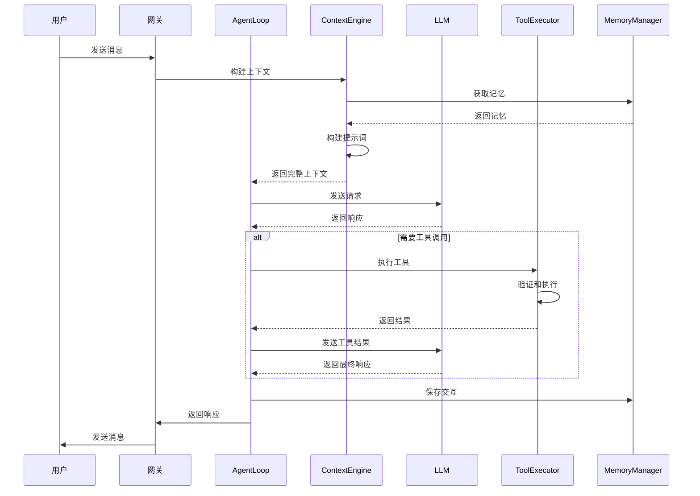
```mermaid
sequenceDiagram
    participant U as 用户
    participant G as 网关
    participant AL as AgentLoop
    participant CE as ContextEngine
    participant LLM as LLM
    participant TE as ToolExecutor
    participant MM as MemoryManager
    
    U->>G: 发送消息
    G->>CE: 构建上下文
    CE->>MM: 获取记忆
    MM-->>CE: 返回记忆
    CE->>CE: 构建提示词
    CE-->>AL: 返回完整上下文
    
    AL->>LLM: 发送请求
    LLM-->>AL: 返回响应
    
    alt 需要工具调用
        AL->>TE: 执行工具
        TE->>TE: 验证和执行
        TE-->>AL: 返回结果
        AL->>LLM: 发送工具结果
        LLM-->>AL: 返回最终响应
    end
    
    AL->>MM: 保存交互
    AL->>G: 返回响应
    G->>U: 发送消息
```

### 3.2 消息网关

#### 3.2.1 架构图

```mermaid
graph TB
    subgraph Gateway[Gateway 核心]
        GR[GatewayRunner<br>主控制器]
        SS[SessionStore<br>会话存储]
        DR[DeliveryRouter<br>投递路由]
        HR[HookRegistry<br>事件钩子]
        PR[PlatformRegistry<br>平台注册]
        SC[StreamConsumer<br>流消费者]
    end
    
    subgraph Adapters[平台适配器]
        BA[BasePlatformAdapter<br>基类]
        TA[TelegramAdapter]
        DA[DiscordAdapter]
        SA[SlackAdapter]
        OA[其他适配器...]
    end
    
    subgraph Sessions[会话管理]
        SK[会话键构建]
        SL[会话生命周期]
        SP[会话持久化]
    end
    
    subgraph Delivery[消息投递]
        DT[目标解析]
        DF[消息格式化]
        DS[发送调度]
    end
    
    BA <|-- TA
    BA <|-- DA
    BA <|-- SA
    BA <|-- OA
    
    GR --> SS
    GR --> DR
    GR --> HR
    GR --> PR
    GR --> SC
    
    SS --> Sessions
    DR --> Delivery
```

#### 3.2.2 核心组件

| 组件 | 文件位置 | 职责 |
|------|----------|------|
| GatewayRunner | `gateway/run.py` | 网关主控制器 |
| SessionStore | `gateway/session.py` | 会话存储和管理 |
| DeliveryRouter | `gateway/delivery.py` | 消息投递路由 |
| HookRegistry | `gateway/hooks.py` | 事件钩子系统 |
| PlatformRegistry | `gateway/platform_registry.py` | 平台注册中心 |
| StreamConsumer | `gateway/stream_consumer.py` | 流式传输消费 |
| BasePlatformAdapter | `gateway/platforms/base.py` | 平台适配器基类 |

#### 3.2.3 平台适配器模式

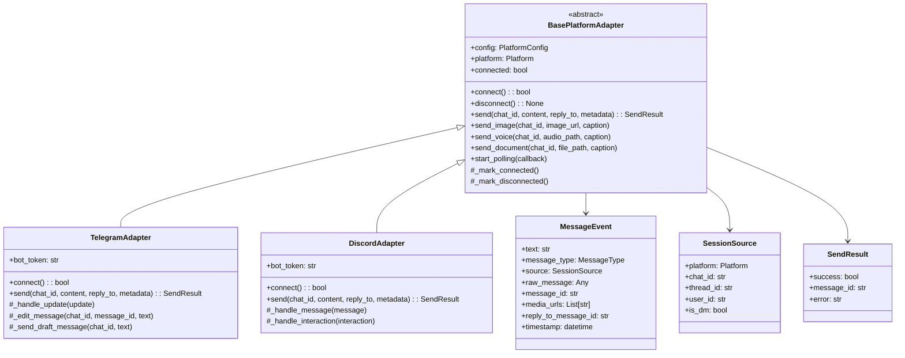
```mermaid
classDiagram
    class BasePlatformAdapter {
        <<abstract>>
        +config: PlatformConfig
        +platform: Platform
        +connected: bool
        +connect(): bool
        +disconnect(): None
        +send(chat_id, content, reply_to, metadata): SendResult
        +send_image(chat_id, image_url, caption)
        +send_voice(chat_id, audio_path, caption)
        +send_document(chat_id, file_path, caption)
        +start_polling(callback)
        #_mark_connected()
        #_mark_disconnected()
    }
    
    class MessageEvent {
        +text: str
        +message_type: MessageType
        +source: SessionSource
        +raw_message: Any
        +message_id: str
        +media_urls: List[str]
        +reply_to_message_id: str
        +timestamp: datetime
    }
    
    class SessionSource {
        +platform: Platform
        +chat_id: str
        +thread_id: str
        +user_id: str
        +is_dm: bool
    }
    
    class SendResult {
        +success: bool
        +message_id: str
        +error: str
    }
    
    class TelegramAdapter {
        +bot_token: str
        +connect(): bool
        +send(chat_id, content, reply_to, metadata): SendResult
        #_handle_update(update)
        #_edit_message(chat_id, message_id, text)
        #_send_draft_message(chat_id, text)
    }
    
    class DiscordAdapter {
        +bot_token: str
        +connect(): bool
        +send(chat_id, content, reply_to, metadata): SendResult
        #_handle_message(message)
        #_handle_interaction(interaction)
    }
    
    BasePlatformAdapter <|-- TelegramAdapter
    BasePlatformAdapter <|-- DiscordAdapter
    BasePlatformAdapter --> MessageEvent
    BasePlatformAdapter --> SessionSource
    BasePlatformAdapter --> SendResult
```

### 3.3 工具系统

#### 3.3.1 架构图

```mermaid
graph TB
    subgraph Interface[接口层]
        TD[ToolDef<br>工具定义]
        TS[ToolSchema<br>参数Schema]
        TE[ToolExamples<br>使用示例]
    end
    
    subgraph Registry[注册层]
        TR[ToolRegistry<br>工具注册表]
        TDsc[ToolDiscovery<br>工具发现]
        TL[ToolLoader<br>工具加载器]
    end
    
    subgraph GuardRail[防护层]
        Perm[Permission<br>权限检查]
        Safe[Safety<br>安全检查]
        Appr[Approval<br>审批流程]
        Budg[Budget<br>预算控制]
    end
    
    subgraph Execution[执行层]
        Exec[ToolExecutor<br>工具执行器]
        EM[EnvManager<br>环境管理]
        Iso[Isolation<br>隔离机制]
        TO[Timeout<br>超时控制]
    end
    
    subgraph Envs[执行环境]
        Local[Local<br>本地]
        Docker[Docker<br>容器]
        SSH[SSH<br>远程]
        Modal[Modal<br>Serverless]
        Daytona[Daytona<br>开发环境]
    end
    
    Interface --> Registry
    Registry --> GuardRail
    GuardRail --> Execution
    Execution --> Envs
```

#### 3.3.2 工具执行流程

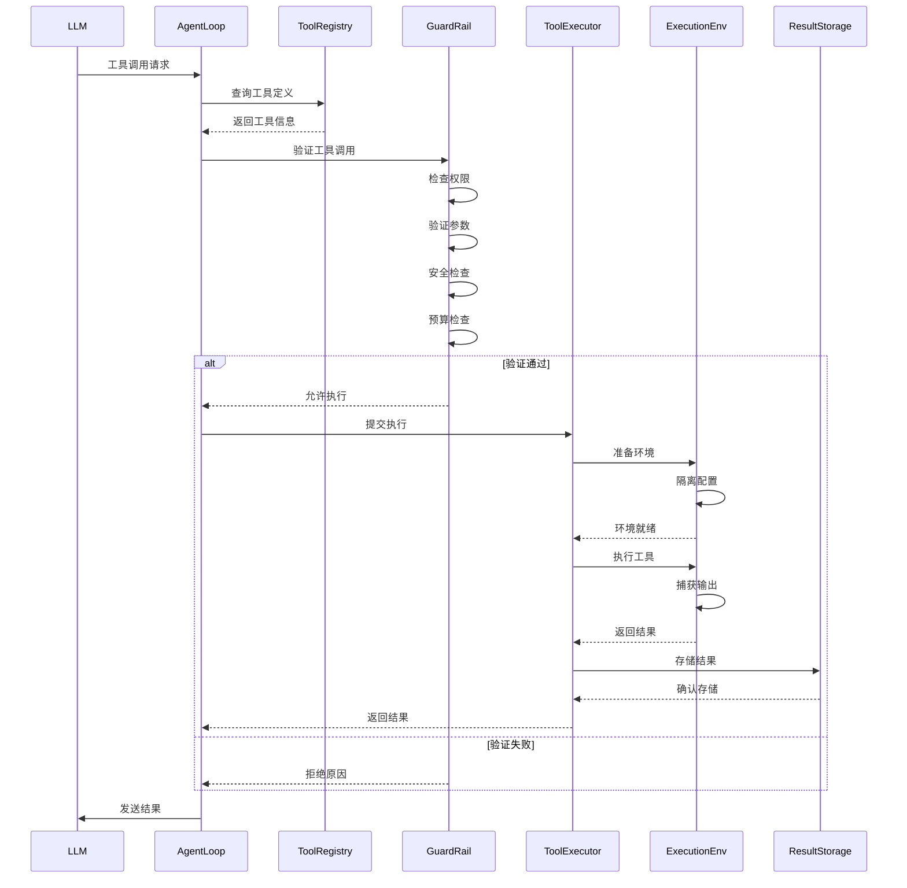
```mermaid
sequenceDiagram
    participant LLM as LLM
    participant AL as AgentLoop
    participant TR as ToolRegistry
    participant GR as GuardRail
    participant TE as ToolExecutor
    participant EE as ExecutionEnv
    participant RS as ResultStorage
    
    LLM->>AL: 工具调用请求
    AL->>TR: 查询工具定义
    TR-->>AL: 返回工具信息
    
    AL->>GR: 验证工具调用
    GR->>GR: 检查权限
    GR->>GR: 验证参数
    GR->>GR: 安全检查
    GR->>GR: 预算检查
    
    alt 验证通过
        GR-->>AL: 允许执行
        AL->>TE: 提交执行
        TE->>EE: 准备环境
        EE->>EE: 隔离配置
        EE-->>TE: 环境就绪
        TE->>EE: 执行工具
        EE->>EE: 捕获输出
        EE-->>TE: 返回结果
        TE->>RS: 存储结果
        RS-->>TE: 确认存储
        TE-->>AL: 返回结果
    else 验证失败
        GR-->>AL: 拒绝原因
    end
    
    AL->>LLM: 发送结果
```

#### 3.3.3 工具分类

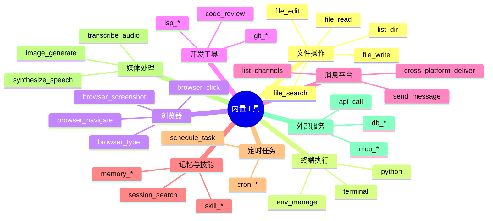
```mermaid
mindmap
    root((内置工具))
        文件操作
            file_read
            file_write
            file_edit
            file_search
            list_dir
        终端执行
            terminal
            python
            env_manage
        浏览器
            browser_navigate
            browser_click
            browser_type
            browser_screenshot
        开发工具
            git_*
            lsp_*
            code_review
        消息平台
            send_message
            list_channels
            cross_platform_deliver
        记忆与技能
            memory_*
            skill_*
            session_search
        定时任务
            cron_*
            schedule_task
        媒体处理
            image_generate
            transcribe_audio
            synthesize_speech
        外部服务
            api_call
            mcp_*
            db_*
```

### 3.4 技能系统

#### 3.4.1 架构图

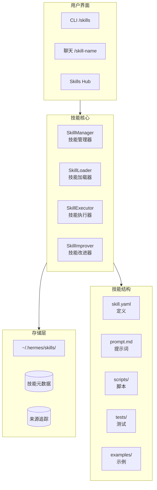
```mermaid
graph TB
    subgraph UI[用户界面]
        CLI[CLI /skills]
        Chat[聊天 /skill-name]
        Hub[Skills Hub]
    end
    
    subgraph Core[技能核心]
        SM[SkillManager<br>技能管理器]
        SL[SkillLoader<br>技能加载器]
        SE[SkillExecutor<br>技能执行器]
        SI[SkillImprover<br>技能改进器]
    end
    
    subgraph Storage[存储层]
        SD[~/.hermes/skills/]
        SMeta[(技能元数据)]
        Prov[(来源追踪)]
    end
    
    subgraph Skill[技能结构]
        SY[skill.yaml<br>定义]
        PM[prompt.md<br>提示词]
        SC[scripts/<br>脚本]
        ST[tests/<br>测试]
        EX[examples/<br>示例]
    end
    
    UI --> Core
    Core --> Storage
    Core --> Skill
```

#### 3.4.2 技能生命周期

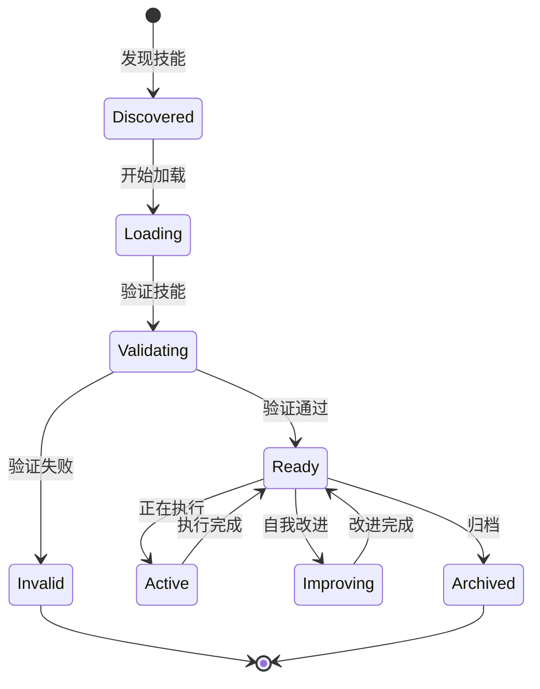
```mermaid
stateDiagram-v2
    [*] --> Discovered: 发现技能
    Discovered --> Loading: 开始加载
    Loading --> Validating: 验证技能
    
    Validating --> Ready: 验证通过
    Validating --> Invalid: 验证失败
    
    Ready --> Active: 正在执行
    Active --> Ready: 执行完成
    
    Ready --> Improving: 自我改进
    Improving --> Ready: 改进完成
    
    Ready --> Archived: 归档
    Invalid --> [*]
    Archived --> [*]
```

#### 3.4.3 自动创建流程

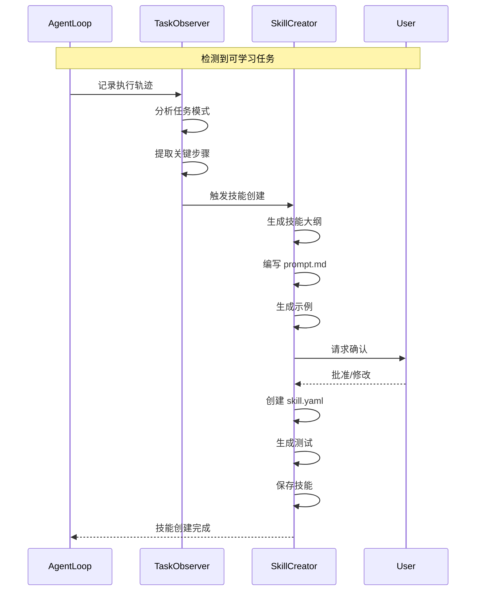
```mermaid
sequenceDiagram
    participant AL as AgentLoop
    participant Obs as TaskObserver
    participant Cr as SkillCreator
    participant U as User
    
    Note over AL,U: 检测到可学习任务
    AL->>Obs: 记录执行轨迹
    Obs->>Obs: 分析任务模式
    Obs->>Obs: 提取关键步骤
    
    Obs->>Cr: 触发技能创建
    Cr->>Cr: 生成技能大纲
    Cr->>Cr: 编写 prompt.md
    Cr->>Cr: 生成示例
    Cr->>U: 请求确认
    U-->>Cr: 批准/修改
    
    Cr->>Cr: 创建 skill.yaml
    Cr->>Cr: 生成测试
    Cr->>Cr: 保存技能
    
    Cr-->>AL: 技能创建完成
```

### 3.5 记忆系统

#### 3.5.1 架构图

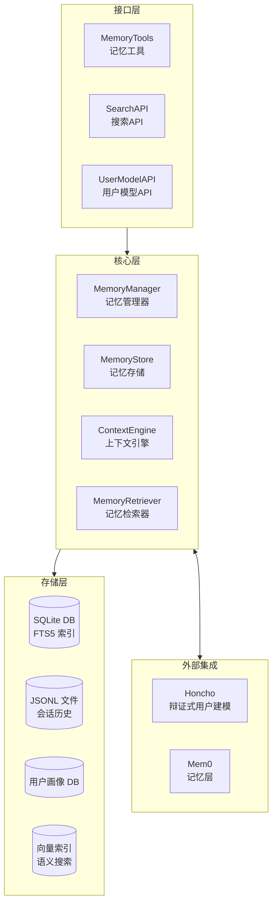
```mermaid
graph TB
    subgraph Interface[接口层]
        MT[MemoryTools<br>记忆工具]
        SA[SearchAPI<br>搜索API]
        UM[UserModelAPI<br>用户模型API]
    end
    
    subgraph Core[核心层]
        MM[MemoryManager<br>记忆管理器]
        MS[MemoryStore<br>记忆存储]
        CE[ContextEngine<br>上下文引擎]
        MR[MemoryRetriever<br>记忆检索器]
    end
    
    subgraph Storage[存储层]
        SQLite[(SQLite DB<br>FTS5 索引)]
        JSONL[(JSONL 文件<br>会话历史)]
        UDB[(用户画像 DB)]
        Vec[(向量索引<br>语义搜索)]
    end
    
    subgraph External[外部集成]
        Honcho[Honcho<br>辩证式用户建模]
        Mem0[Mem0<br>记忆层]
    end
    
    Interface --> Core
    Core --> Storage
    Core <--> External
```

#### 3.5.2 记忆类型

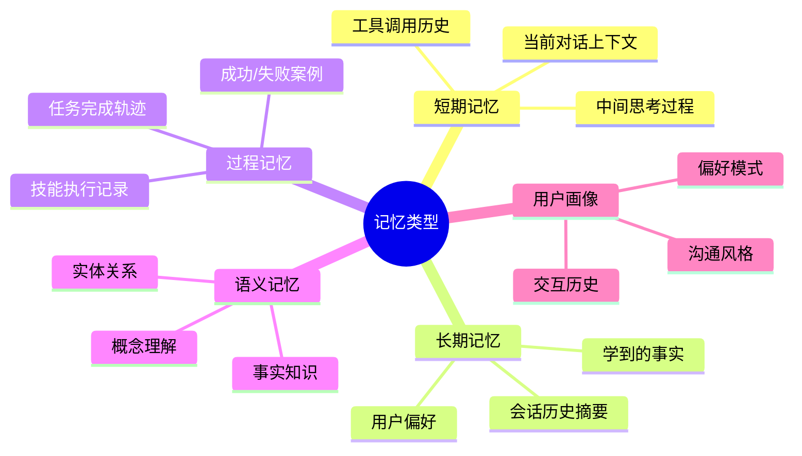
```mermaid
mindmap
    root((记忆类型))
        短期记忆
            当前对话上下文
            工具调用历史
            中间思考过程
        长期记忆
            会话历史摘要
            用户偏好
            学到的事实
        过程记忆
            技能执行记录
            任务完成轨迹
            成功/失败案例
        语义记忆
            实体关系
            事实知识
            概念理解
        用户画像
            交互历史
            偏好模式
            沟通风格
```

#### 3.5.3 混合检索流程

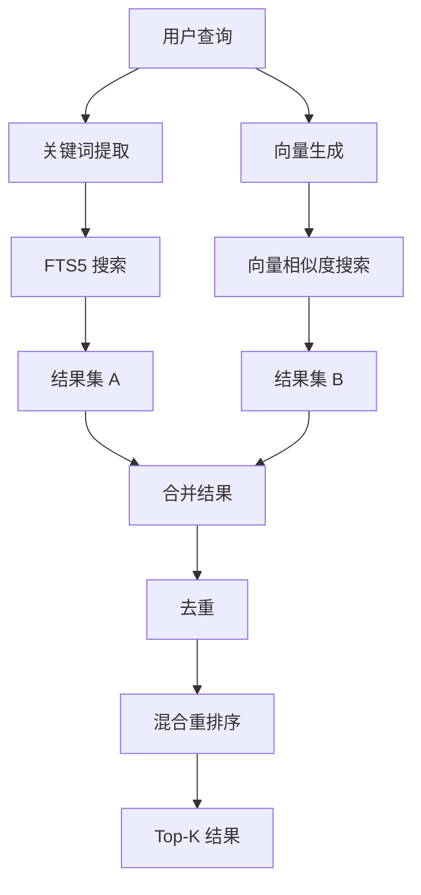
```mermaid
graph TB
    Q[用户查询] --> KWE[关键词提取]
    Q --> VE[向量生成]
    
    KWE --> FTS[FTS5 搜索]
    VE --> VS[向量相似度搜索]
    
    FTS --> RA[结果集 A]
    VS --> RB[结果集 B]
    
    RA --> Merge[合并结果]
    RB --> Merge
    
    Merge --> Dedupe[去重]
    Dedupe --> Rerank[混合重排序]
    Rerank --> TopK[Top-K 结果]
```

#### 3.5.4 数据库 Schema

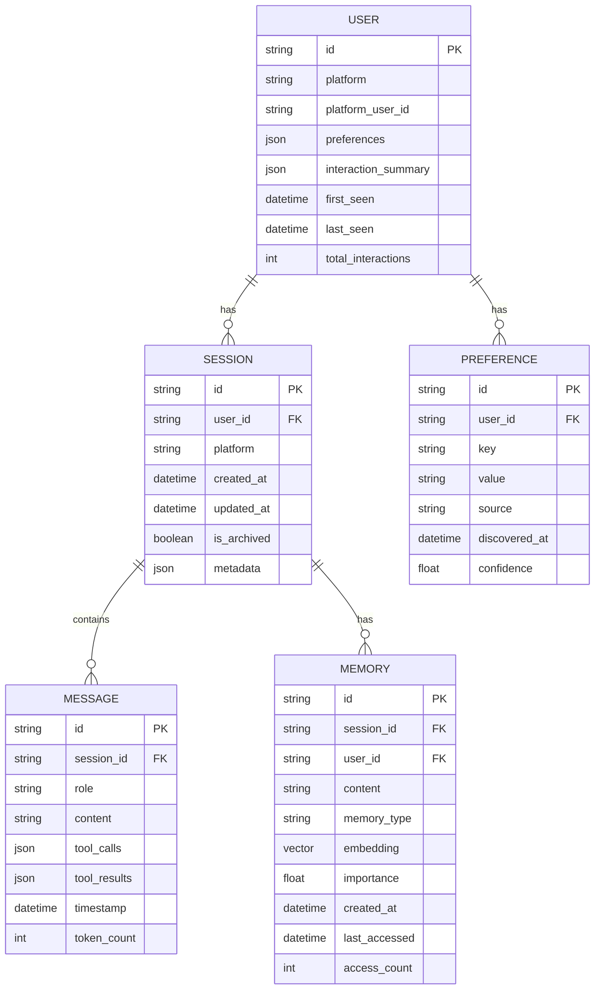
```mermaid
erDiagram
    SESSION ||--o{ MESSAGE : contains
    SESSION ||--o{ MEMORY : has
    USER ||--o{ SESSION : has
    USER ||--o{ PREFERENCE : has
    
    SESSION {
        string id PK
        string user_id FK
        string platform
        datetime created_at
        datetime updated_at
        boolean is_archived
        json metadata
    }
    
    MESSAGE {
        string id PK
        string session_id FK
        string role
        string content
        json tool_calls
        json tool_results
        datetime timestamp
        int token_count
    }
    
    MEMORY {
        string id PK
        string session_id FK
        string user_id FK
        string content
        string memory_type
        vector embedding
        float importance
        datetime created_at
        datetime last_accessed
        int access_count
    }
    
    USER {
        string id PK
        string platform
        string platform_user_id
        json preferences
        json interaction_summary
        datetime first_seen
        datetime last_seen
        int total_interactions
    }
    
    PREFERENCE {
        string id PK
        string user_id FK
        string key
        string value
        string source
        datetime discovered_at
        float confidence
    }
```

### 3.6 定时任务系统

#### 3.6.1 架构图

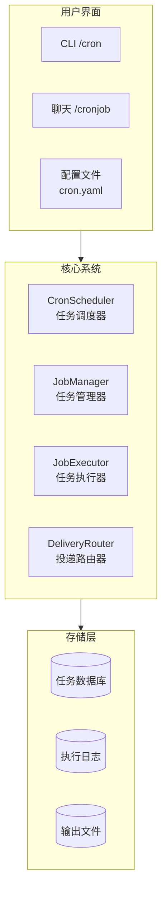
```mermaid
graph TB
    subgraph UI[用户界面]
        CC[CLI /cron]
        ChatC[聊天 /cronjob]
        CF[配置文件<br>cron.yaml]
    end
    
    subgraph Core[核心系统]
        CS[CronScheduler<br>任务调度器]
        JM[JobManager<br>任务管理器]
        JE[JobExecutor<br>任务执行器]
        DR[DeliveryRouter<br>投递路由器]
    end
    
    subgraph Storage[存储层]
        JDB[(任务数据库)]
        JLog[(执行日志)]
        Out[(输出文件)]
    end
    
    UI --> Core
    Core --> Storage
```

#### 3.6.2 任务状态机

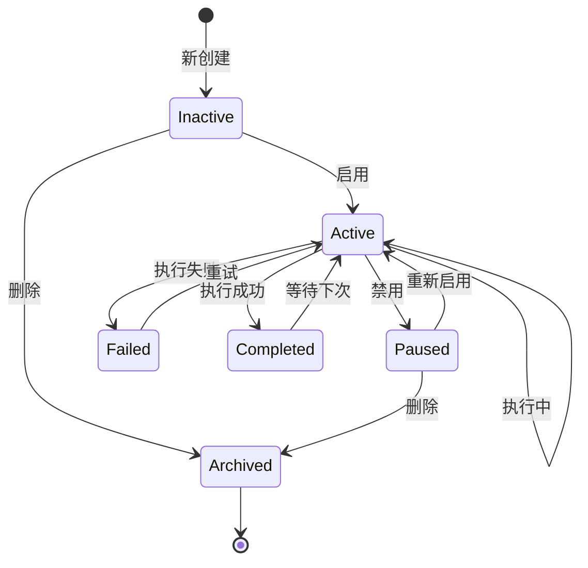
```mermaid
stateDiagram-v2
    [*] --> Inactive: 新创建
    Inactive --> Active: 启用
    Active --> Active: 执行中
    Active --> Paused: 禁用
    Paused --> Active: 重新启用
    Active --> Failed: 执行失败
    Failed --> Active: 重试
    Active --> Completed: 执行成功
    Completed --> Active: 等待下次
    Inactive --> Archived: 删除
    Paused --> Archived: 删除
    Archived --> [*]
```

#### 3.6.3 调度流程

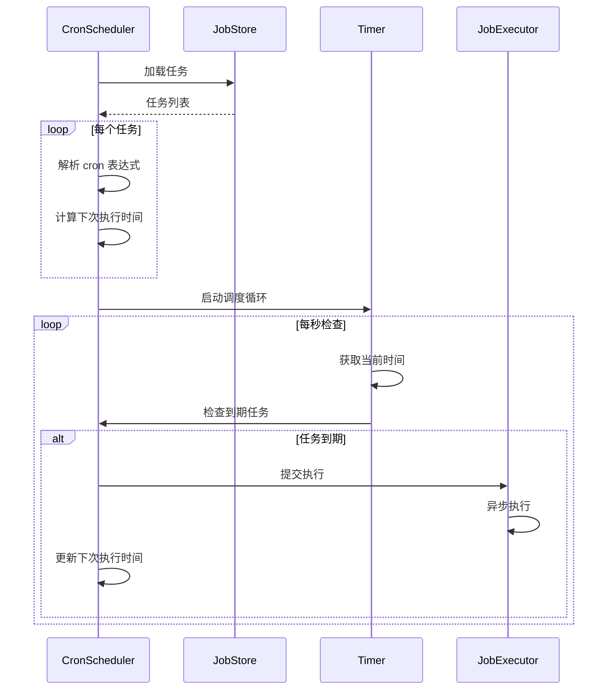
```mermaid
sequenceDiagram
    participant CS as CronScheduler
    participant JS as JobStore
    participant T as Timer
    participant JE as JobExecutor
    
    CS->>JS: 加载任务
    JS-->>CS: 任务列表
    
    loop 每个任务
        CS->>CS: 解析 cron 表达式
        CS->>CS: 计算下次执行时间
    end
    
    CS->>T: 启动调度循环
    
    loop 每秒检查
        T->>T: 获取当前时间
        T->>CS: 检查到期任务
        
        alt 任务到期
            CS->>JE: 提交执行
            JE->>JE: 异步执行
            CS->>CS: 更新下次执行时间
        end
    end
```

---

## 数据流设计

### 4.1 完整消息流

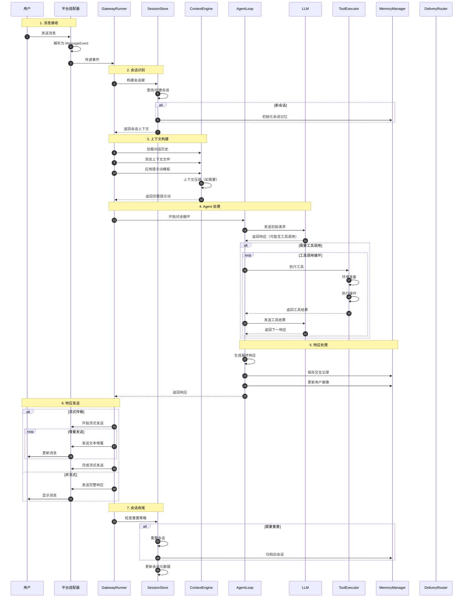
```mermaid
sequenceDiagram
    autonumber
    participant U as 用户
    participant P as 平台适配器
    participant G as GatewayRunner
    participant S as SessionStore
    participant C as ContextEngine
    participant A as AgentLoop
    participant L as LLM
    participant T as ToolExecutor
    participant M as MemoryManager
    participant D as DeliveryRouter
    
    Note over U,P: 1. 消息接收
    U->>P: 发送消息
    P->>P: 解析为 MessageEvent
    P->>G: 传递事件
    
    Note over G,S: 2. 会话识别
    G->>S: 构建会话键
    S->>S: 查找/创建会话
    alt 新会话
        S->>M: 初始化会话记忆
    end
    S-->>G: 返回会话上下文
    
    Note over G,C: 3. 上下文构建
    G->>C: 加载对话历史
    G->>C: 添加上下文文件
    G->>C: 应用提示词模板
    C->>C: 上下文压缩（如需要）
    C-->>G: 返回完整提示词
    
    Note over G,L: 4. Agent 处理
    G->>A: 开始对话循环
    A->>L: 发送初始请求
    L-->>A: 返回响应（可能含工具调用）
    
    alt 需要工具调用
        loop 工具调用循环
            A->>T: 执行工具
            T->>T: 环境准备
            T->>T: 执行操作
            T-->>A: 返回工具结果
            A->>L: 发送工具结果
            L-->>A: 返回下一响应
        end
    end
    
    Note over A,M: 5. 响应处理
    A->>A: 生成最终响应
    A->>M: 保存交互记录
    A->>M: 更新用户画像
    A-->>G: 返回响应
    
    Note over G,U: 6. 响应发送
    alt 流式传输
        G->>P: 开始流式发送
        loop 增量发送
            G->>P: 发送文本增量
            P->>U: 更新消息
        end
        G->>P: 完成流式发送
    else 非流式
        G->>P: 发送完整响应
        P->>U: 显示消息
    end
    
    Note over G,S: 7. 会话收尾
    G->>S: 检查重置策略
    alt 需要重置
        S->>S: 重置会话
        S->>M: 归档旧会话
    end
    S->>S: 更新会话元数据
```

### 4.2 工具调用数据流

```mermaid
graph TB
    LLM[LLM 响应] --> Parse[解析工具调用]
    Parse --> Validate{验证工具}
    
    Validate -->|存在| Params[验证参数]
    Validate -->|不存在| Err1[返回错误]
    
    Params -->|有效| Perm[权限检查]
    Params -->|无效| Err2[参数错误]
    
    Perm -->|允许| Budget[预算检查]
    Perm -->|拒绝| Err3[权限拒绝]
    
    Budget -->|充足| Env[准备执行环境]
    Budget -->|不足| Err4[预算不足]
    
    Env --> Exec[执行工具]
    Exec --> Capture[捕获输出]
    Capture --> Sanitize[清理结果]
    Sanitize --> Store[存储结果]
    Store --> Return[返回给 LLM]
    
    Err1 --> Return
    Err2 --> Return
    Err3 --> Return
    Err4 --> Return
```

### 4.3 记忆读写流

```mermaid
graph TB
    subgraph Write[记忆写入]
        A[Agent 交互] --> B[提取关键信息]
        B --> C{记忆类型}
        C -->|会话消息| D[JSONL 文件]
        C -->|结构化数据| E[(SQLite DB)]
        C -->|向量嵌入| F[(向量索引)]
        C -->|用户画像| G[(用户 DB)]
    end
    
    subgraph Read[记忆读取]
        H[记忆查询] --> I[解析意图]
        I --> J{检索策略}
        J -->|时间最近| K[按时间排序]
        J -->|语义相似| L[向量搜索]
        J -->|关键词| M[FTS5 搜索]
        J -->|混合| N[多策略融合]
        
        K --> O[过滤结果]
        L --> O
        M --> O
        N --> O
        
        O --> P[重排序]
        P --> Q[截断到上下文窗口]
        Q --> R[格式化]
        R --> S[返回给 Agent]
    end
```

---

## 关键设计模式

### 5.1 适配器模式（平台适配）

```mermaid
classDiagram
    class Target {
        <<interface>>
        +request()
    }
    
    class Adapter {
        -adaptee: Adaptee
        +request()
    }
    
    class Adaptee {
        +specificRequest()
    }
    
    Target <|.. Adapter
    Adapter o--> Adaptee
```

**应用场景：**
- 平台适配器（Telegram、Discord、Slack 等）
- LLM 提供商适配（Anthropic、OpenAI、Google 等）
- 执行环境适配（Local、Docker、SSH、Modal 等）

### 5.2 策略模式（多种实现）

```mermaid
classDiagram
    class Context {
        -strategy: Strategy
        +setStrategy(strategy)
        +executeStrategy()
    }
    
    class Strategy {
        <<interface>>
        +execute()
    }
    
    class ConcreteStrategyA {
        +execute()
    }
    
    class ConcreteStrategyB {
        +execute()
    }
    
    Strategy <|.. ConcreteStrategyA
    Strategy <|.. ConcreteStrategyB
    Context o--> Strategy
```

**应用场景：**
- 会话重置策略（daily、idle、both、none）
- 记忆检索策略（时间最近、语义相似、关键词、混合）
- 流式传输模式（auto、draft、edit、off）

### 5.3 工厂模式（对象创建）

```mermaid
classDiagram
    class Creator {
        <<abstract>>
        +factoryMethod()
    }
    
    class ConcreteCreator {
        +factoryMethod()
    }
    
    class Product {
        <<interface>>
        +operation()
    }
    
    class ConcreteProduct {
        +operation()
    }
    
    Creator <|-- ConcreteCreator
    Product <|.. ConcreteProduct
    Creator --> Product
```

**应用场景：**
- 平台适配器工厂
- 工具创建工厂
- 技能加载工厂

### 5.4 事件驱动模式（Hook 系统）

```mermaid
graph TB
    E[Event Source<br>事件源]
    H[Hook Registry<br>钩子注册]
    L1[Handler 1<br>处理器]
    L2[Handler 2<br>处理器]
    L3[Handler 3<br>处理器]
    
    E -->|emit event| H
    H -->|dispatch| L1
    H -->|dispatch| L2
    H -->|dispatch| L3
```

**应用场景：**
- HookRegistry 事件钩子系统
- 网关生命周期事件
- 会话创建/结束事件
- Agent 处理事件

### 5.5 插件架构（动态加载）

```mermaid
graph TB
    Core[核心系统]
    PluginAPI[插件 API]
    PluginLoader[插件加载器]
    PluginA[插件 A]
    PluginB[插件 B]
    PluginC[插件 C]
    
    Core --> PluginAPI
    PluginAPI --> PluginLoader
    PluginLoader --> PluginA
    PluginLoader --> PluginB
    PluginLoader --> PluginC
```

**应用场景：**
- 平台插件
- 技能插件
- MCP 服务器插件
- 事件钩子插件

---

## 部署架构

### 6.1 单机部署

```mermaid
graph TB
    subgraph User[用户]
        CLI[CLI]
        TG[Telegram]
        DC[Discord]
    end
    
    subgraph Server[单服务器]
        GW[Gateway 进程]
        Cron[Cron 调度器]
        FS[文件系统<br>~/.hermes/]
        DB[(SQLite DB)]
    end
    
    User --> Server
```

**适用场景：**
- 个人使用
- 小团队
- 开发测试环境

### 6.2 容器化部署

```mermaid
graph TB
    subgraph Client[客户端层]
        TG[Telegram]
        DC[Discord]
        API[HTTP API]
    end
    
    subgraph Docker[Docker Compose]
        GW[Gateway 服务]
        Cron[Cron 服务]
    end
    
    subgraph Storage[存储层]
        Vol[数据卷]
        Bkp[备份存储]
    end
    
    Client --> Docker
    Docker --> Storage
```

**适用场景：**
- 生产环境
- 需要备份和恢复
- 需要版本控制

### 6.3 高可用部署

```mermaid
graph TB
    subgraph LB[负载均衡器]
        Nginx[Nginx]
    end
    
    subgraph Cluster[应用集群]
        GW1[Gateway 实例 1]
        GW2[Gateway 实例 2]
        GW3[Gateway 实例 3]
    end
    
    subgraph Storage[共享存储]
        PG[(PostgreSQL)]
        Redis[(Redis)]
        FS[(共享文件系统)]
    end
    
    Client --> LB
    LB --> Cluster
    Cluster --> Storage
```

**适用场景：**
- 大规模用户
- 高可用性要求
- 需要水平扩展

### 6.4 Serverless 部署

```mermaid
graph TB
    subgraph Client[客户端]
        TG[Telegram]
        DC[Discord]
    end
    
    subgraph Cloud[云服务]
        API[API Gateway]
        Func[Serverless 函数]
        Queue[消息队列]
    end
    
    subgraph Storage[存储]
        DB[(托管数据库)]
        Obj[(对象存储)]
    end
    
    Client --> Cloud
    Cloud --> Storage
```

**适用场景：**
- 流量波动大
- 成本敏感
- 按需扩展

---

## 扩展性设计

### 7.1 扩展点

#### 7.1.1 平台扩展

```mermaid
graph TB
    PR[PlatformRegistry<br>平台注册中心]
    NewP[新平台适配器]
    Entry[PlatformEntry<br>注册信息]
    
    NewP -->|实现| BA[BasePlatformAdapter]
    NewP -->|提供| Entry
    Entry -->|注册到| PR
```

**步骤：**
1. 继承 `BasePlatformAdapter`
2. 实现必要方法
3. 创建 `PlatformEntry`
4. 注册到 `PlatformRegistry`

#### 7.1.2 工具扩展

```mermaid
graph TB
    TR[ToolRegistry<br>工具注册表]
    NewT[新工具]
    Def[ToolDef<br>工具定义]
    
    NewT -->|提供| Def
    Def -->|注册到| TR
```

**步骤：**
1. 定义工具 Schema
2. 实现工具逻辑
3. 注册到 `ToolRegistry`

#### 7.1.3 技能扩展

技能无需修改代码，直接放入 `~/.hermes/skills/` 目录即可。

#### 7.1.4 MCP 服务器扩展

```mermaid
graph TB
    Hermes[Hermes Agent]
    MCP[MCP 客户端]
    Server1[MCP Server 1]
    Server2[MCP Server 2]
    
    Hermes --> MCP
    MCP --> Server1
    MCP --> Server2
```

**步骤：**
1. 配置 MCP 服务器
2. Hermes 自动发现和连接
3. 工具自动注册

### 7.2 水平扩展

```mermaid
graph TB
    subgraph LB[负载均衡]
        LB1[LB]
    end
    
    subgraph Workers[Worker 池]
        W1[Worker 1]
        W2[Worker 2]
        W3[Worker 3]
        WN[Worker N]
    end
    
    subgraph Queue[任务队列]
        Q1[任务队列]
    end
    
    subgraph Storage[共享存储]
        DB[数据库]
        Cache[缓存]
    end
    
    LB1 --> Workers
    Workers --> Q1
    Workers --> Storage
```

---

## 安全性设计

### 8.1 安全架构

```mermaid
graph TB
    subgraph Layer1[边界安全]
        Auth[认证授权]
        RateLimit[速率限制]
        IPFilter[IP 过滤]
    end
    
    subgraph Layer2[应用安全]
        InputVal[输入验证]
        Sanitize[输出净化]
        CSRF[CSRF 防护]
    end
    
    subgraph Layer3[数据安全]
        Encrypt[加密存储]
        ACL[访问控制]
        Audit[审计日志]
    end
    
    subgraph Layer4[执行安全]
        Isolate[执行隔离]
        Sandbox[沙箱环境]
        Approval[审批流程]
    end
```

### 8.2 工具执行防护

```mermaid
graph TB
    Call[工具调用请求] --> Static[静态检查]
    Static --> Param[参数验证]
    Param --> Path[路径安全]
    Path --> Perm[权限检查]
    Perm --> Dynamic[动态检查]
    Dynamic --> Appr[用户审批]
    Appr --> Budget[预算检查]
    Budget --> Exec[执行]
    
    Exec --> Isolate{隔离级别}
    Isolate -->|高| Docker[Docker 容器]
    Isolate -->|中| SSH[SSH 远程]
    Isolate -->|低| Local[本地执行]
```

### 8.3 数据保护

| 数据类型 | 保护措施 |
|---------|---------|
| API 密钥 | 加密存储、权限控制 |
| 会话历史 | 本地存储、可选加密 |
| 用户画像 | 匿名化处理、访问控制 |
| 技能数据 | 版本控制、来源追踪 |

### 8.4 审计和监控

```mermaid
graph TB
    Event[安全事件] --> Log[日志记录]
    Log --> Alert[告警触发]
    Alert --> Notify[通知管理员]
    Log --> Audit[审计追踪]
    Audit --> Metrics[指标统计]
```

---

## 总结

Hermes Agent 采用分层模块化架构，具有良好的扩展性、安全性和可维护性。关键设计亮点：

1. **清晰的分层**：用户界面层、接入层、编排层、核心服务层、执行层、基础设施层
2. **模块化设计**：各组件独立、低耦合、高内聚
3. **插件化扩展**：平台、工具、技能、MCP 服务器均可扩展
4. **安全第一**：多层防护、隔离执行、审批流程
5. **高可用性**：支持多种部署架构，适应不同规模需求

---

**相关文档：**
- [技术调研报告](./technical-research-report.md)
- [快速上手指南](./quick-start.md)
- [整体架构](./architecture/overview.md)
- [对话流程](./architecture/conversation-flow.md)
- [网关架构](./architecture/gateway-architecture.md)
- [技能系统](./architecture/skill-system.md)
- [记忆系统](./architecture/memory-system.md)
- [工具调用流程](./architecture/tool-call-flow.md)
- [定时任务流程](./architecture/cron-flow.md)
- [目录结构](./architecture/directory-tree.md)
