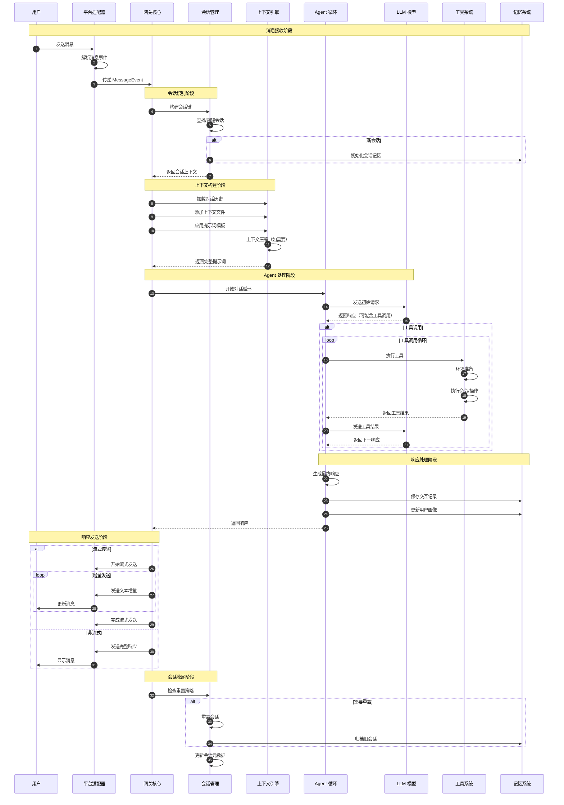
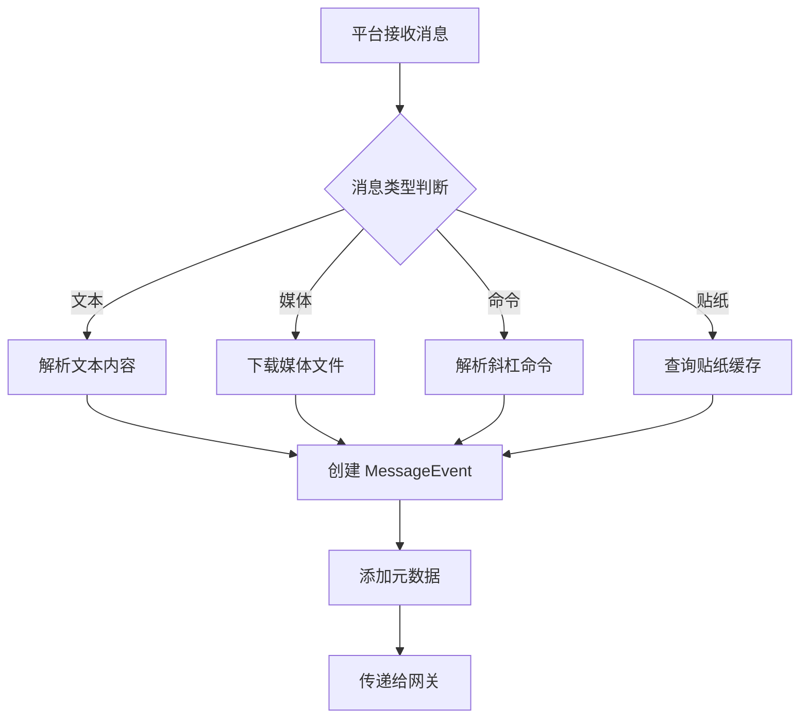
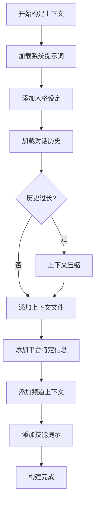
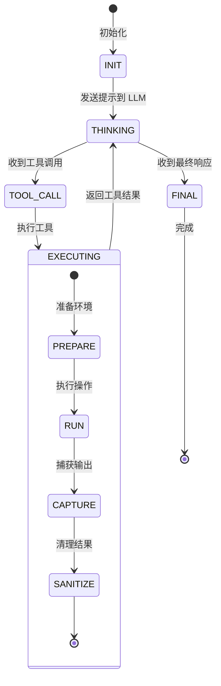
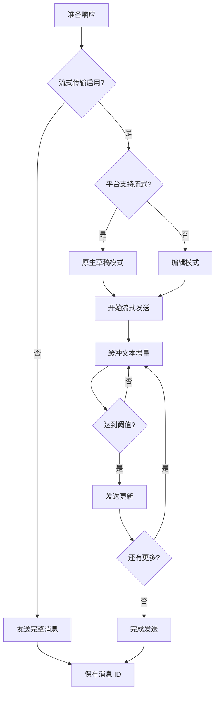
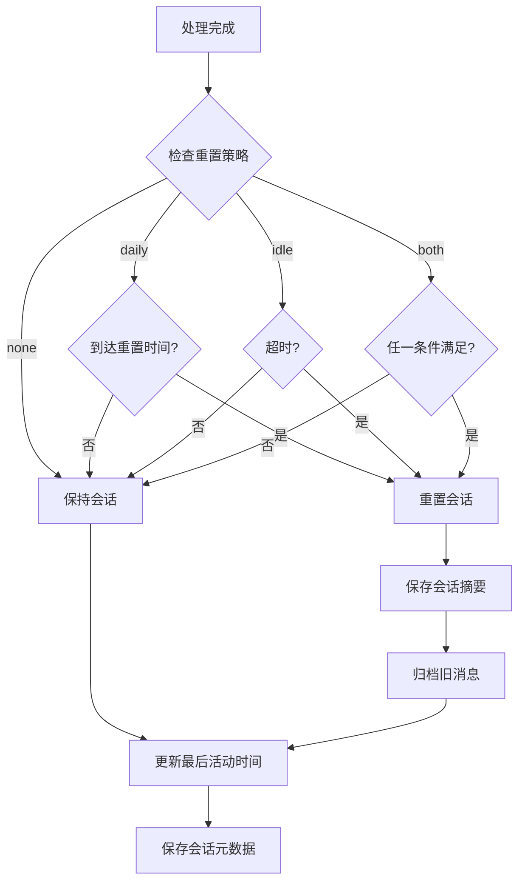
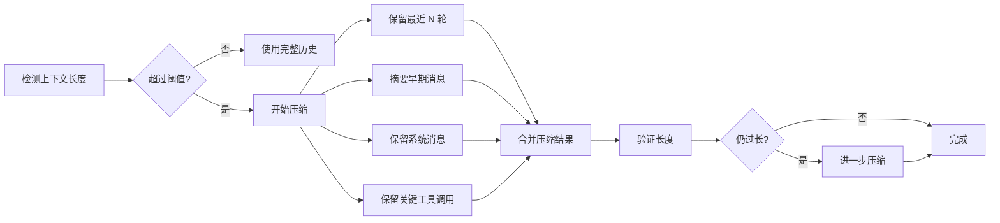
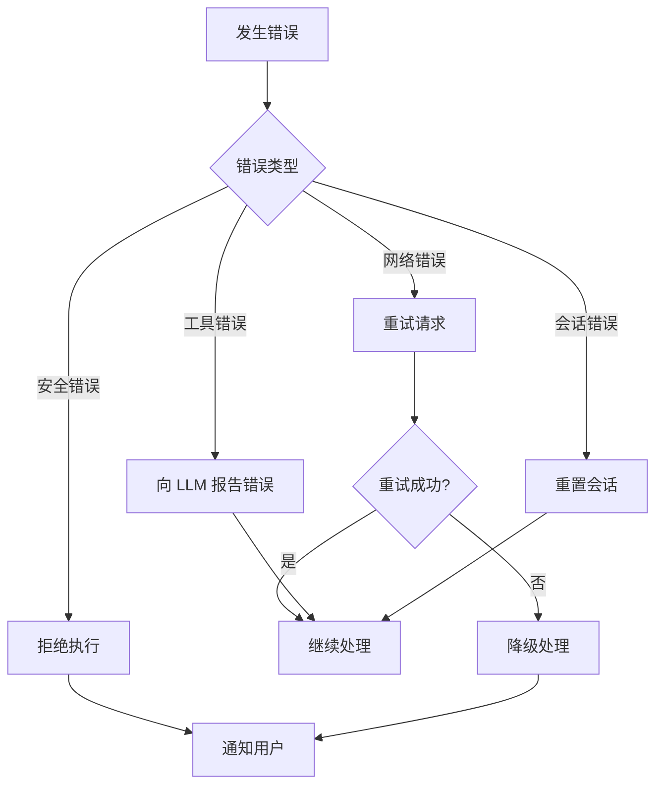

# 对话流程

本文档详细描述 Hermes Agent 从接收用户消息到发送响应的完整对话处理流程。

## 完整对话流程图



## 详细流程说明

### 1. 消息接收阶段



**关键点：**
- 支持多种消息类型：文本、图片、语音、文档、贴纸等
- 自动转写语音消息（如启用）
- 解析平台特定事件（按钮交互、话题等）

### 2. 会话识别阶段

会话键构建规则：

```mermaid
graph LR
    A[会话源] --> B{会话类型}
    B -->|DM| C[agent:main:{platform}:dm:{chat_id}]
    B -->|群聊隔离| D[agent:main:{platform}:group:{chat_id}:{user_id}]
    B -->|群聊共享| E[agent:main:{platform}:group:{chat_id}]
    B -->|线程| F[agent:main:{platform}:thread:{thread_id}]
    C --> G{会话存在?}
    D --> G
    E --> G
    F --> G
    G -->|是| H[加载现有会话]
    G -->|否| I[创建新会话]
    H --> J[检查会话状态]
    I --> J
    J --> K{是否挂起?}
    K -->|是| L[拒绝处理]
    K -->|否| M[继续处理]
```

### 3. 上下文构建阶段



**上下文组成部分：**
- 系统提示词（核心指令）
- 人格设定（SOUL.md）
- 对话历史（最近 N 轮）
- 上下文文件（项目相关文件）
- 平台特定提示
- 频道上下文
- 技能相关提示

### 4. Agent 处理阶段



**迭代预算：**
- 默认最大迭代次数：通常为 20-30 步
- 可配置的迭代限制
- 自动检测循环和停滞

### 5. 响应发送阶段



**流式传输模式：**
- `auto`：自动选择最佳模式
- `draft`：原生草稿流式（Telegram Bot API 9.5+）
- `edit`：渐进式编辑消息
- `off`：禁用流式

### 6. 会话收尾阶段



## 会话重置策略

| 策略 | 说明 | 配置 |
|------|------|------|
| `daily` | 每日定时重置 | `at_hour`（默认 4 点） |
| `idle` | 空闲超时重置 | `idle_minutes`（默认 1440） |
| `both` | 任一条件满足即重置 | 两者都配置 |
| `none` | 永不自动重置 | 手动 `/reset` |

## 上下文压缩

当对话历史过长时，系统会自动压缩上下文：



## 错误处理流程



## 相关文档

- [整体架构](./overview.md)
- [工具调用流程](./tool-call-flow.md)
- [网关架构](./gateway-architecture.md)
- [记忆系统](./memory-system.md)
