# 定时任务流程

本文档详细描述 Hermes Agent 的定时任务系统，包括任务调度、执行、消息投递的完整机制。

## 定时系统总览

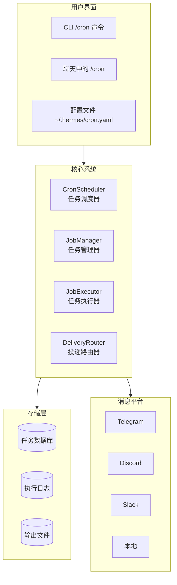

## Cron 表达式解析

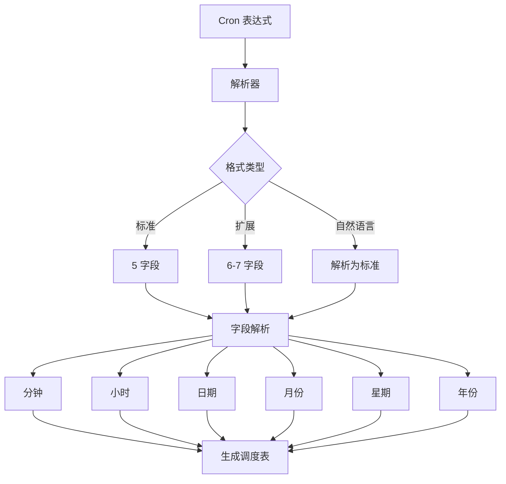

### Cron 字段说明

| 字段 | 范围 | 特殊字符 | 示例 |
|------|------|----------|------|
| 分钟 | 0-59 | `*` `,` `-` `/` | `*/5` 每 5 分钟 |
| 小时 | 0-23 | `*` `,` `-` `/` | `9-17` 早 9 晚 5 |
| 日期 | 1-31 | `*` `,` `-` `/` `?` `L` `W` | `15` 每月 15 号 |
| 月份 | 1-12 | `*` `,` `-` `/` | `1,3,5` 1/3/5 月 |
| 星期 | 0-6 (日-六) | `*` `,` `-` `/` `?` `L` `#` | `1-5` 工作日 |
| 年份 (可选) | 2024-2100 | `*` `,` `-` `/` | `2024/2` 偶数年 |

## 任务定义结构

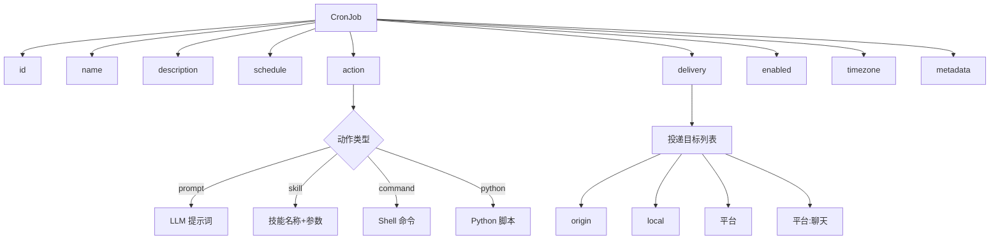

## 任务调度流程

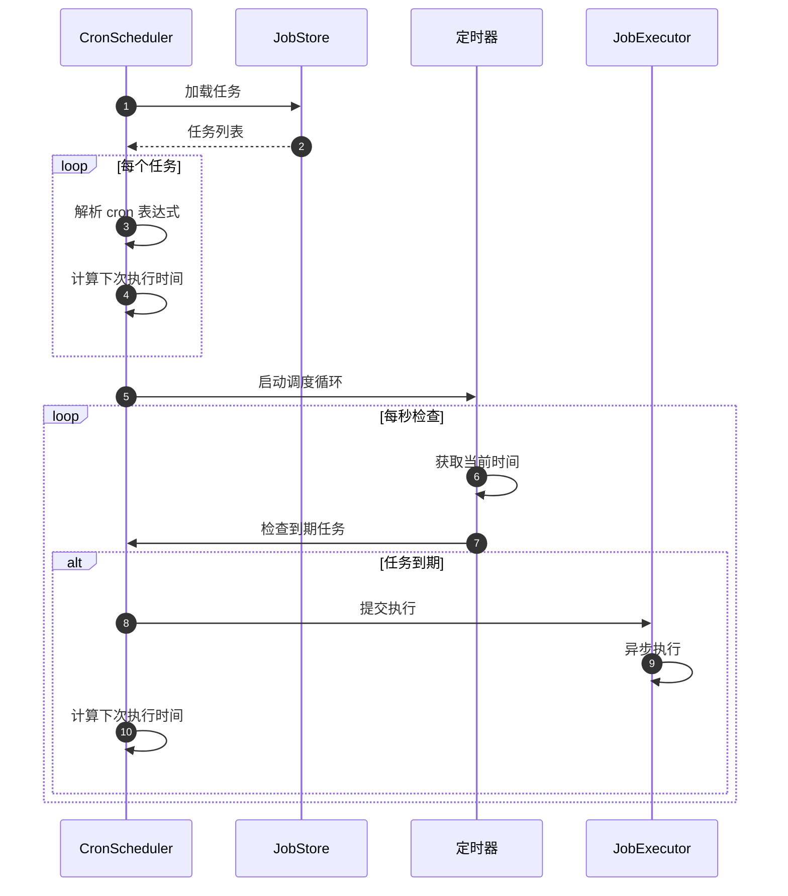

## 任务执行流程

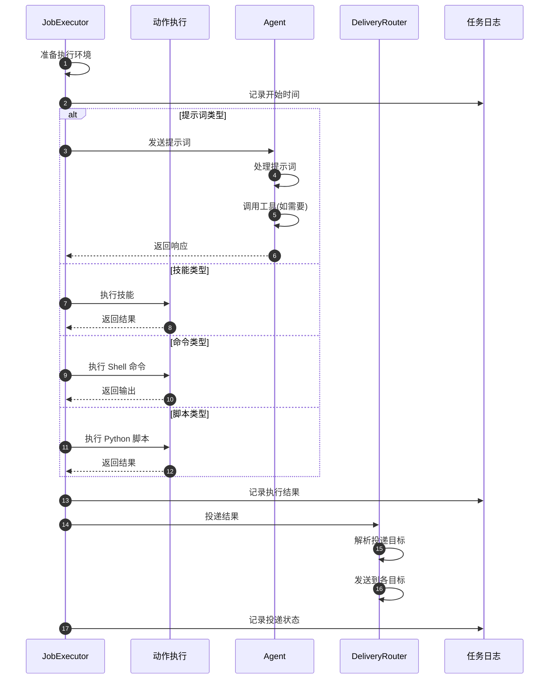

## 消息投递流程

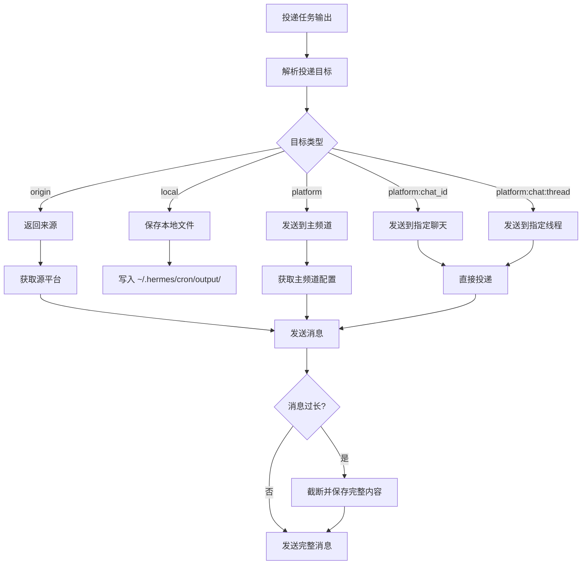

## 任务管理操作

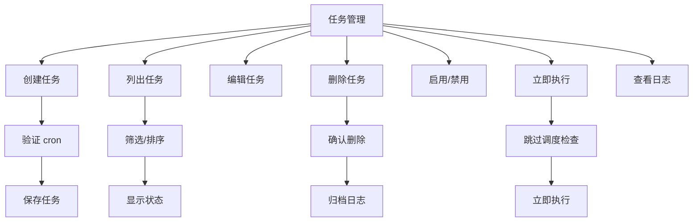

## 任务状态机

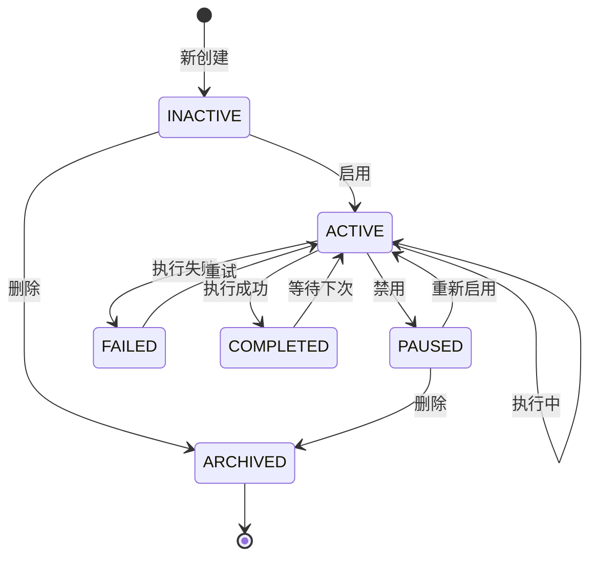

## 任务配置示例

### 配置文件格式 (cron.yaml)

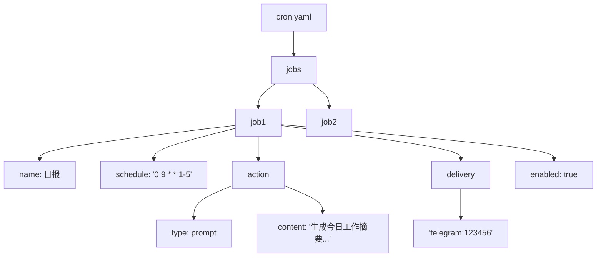

### 常见任务示例

| 任务类型 | Cron 表达式 | 说明 |
|----------|-------------|------|
| 日报 | `0 9 * * 1-5` | 工作日早 9 点 |
| 周报 | `0 10 * * 1` | 周一早 10 点 |
| 备份 | `0 2 * * *` | 每天凌晨 2 点 |
| 健康检查 | `*/30 * * * *` | 每 30 分钟 |
| 月度报告 | `0 8 1 * *` | 每月 1 号早 8 点 |

## 时区处理

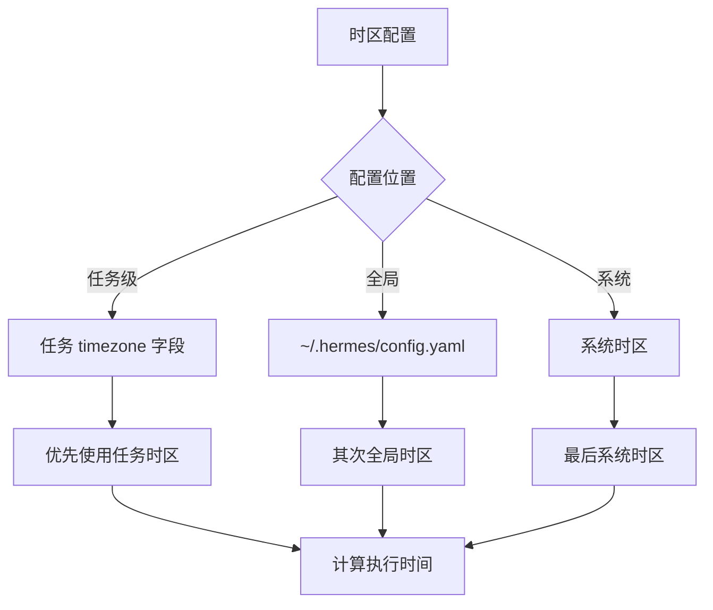

## 任务执行日志

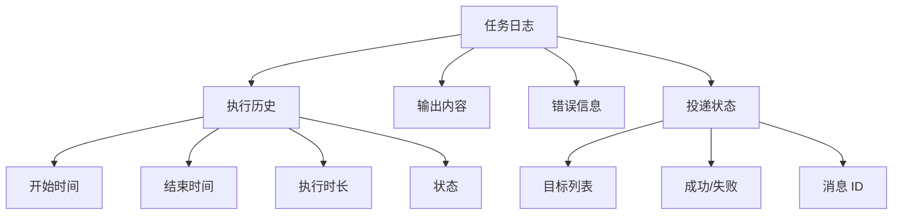

## 错误处理与重试

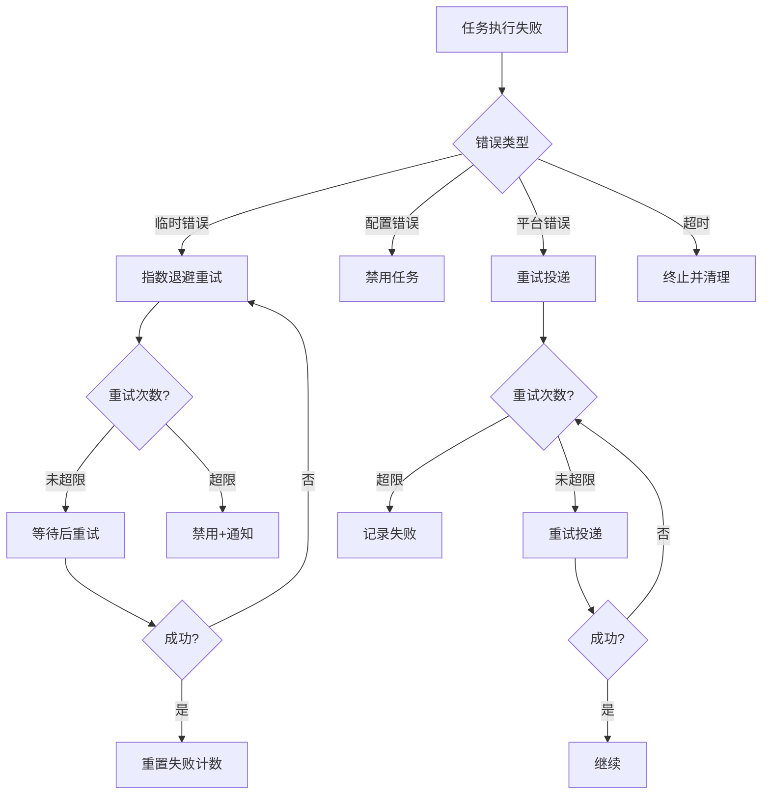

## 任务监控与通知

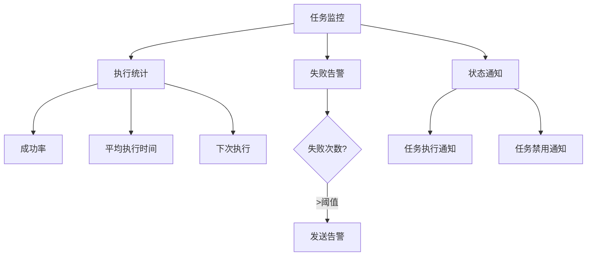

## CLI 命令示例

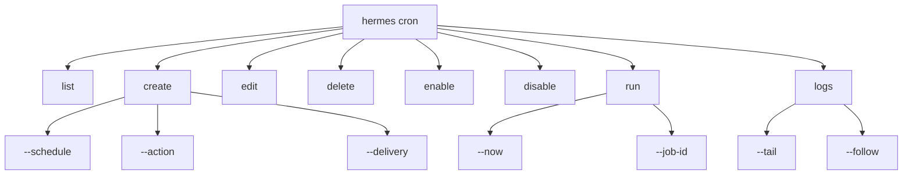

## 相关文档

- [整体架构](./overview.md)
- [网关架构](./gateway-architecture.md)
- [对话流程](./conversation-flow.md)
- [技术栈](../tech-stack.md)
