# 依赖关系图

本文档详细描述 Hermes Agent 各模块之间的依赖关系，包括内部模块依赖和外部库依赖。

## 整体依赖关系

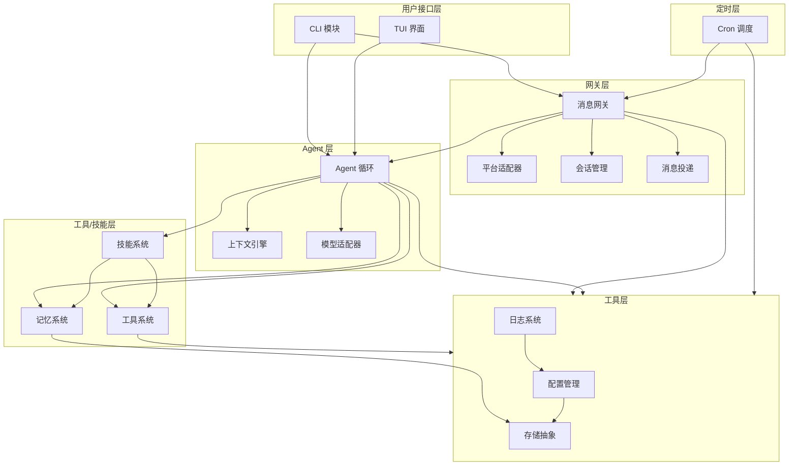

## 核心模块依赖详情

### 网关模块依赖

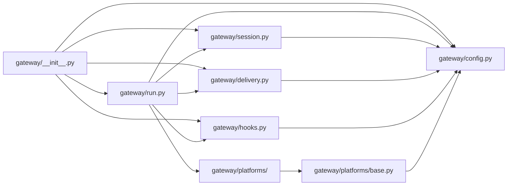

### Agent 模块依赖

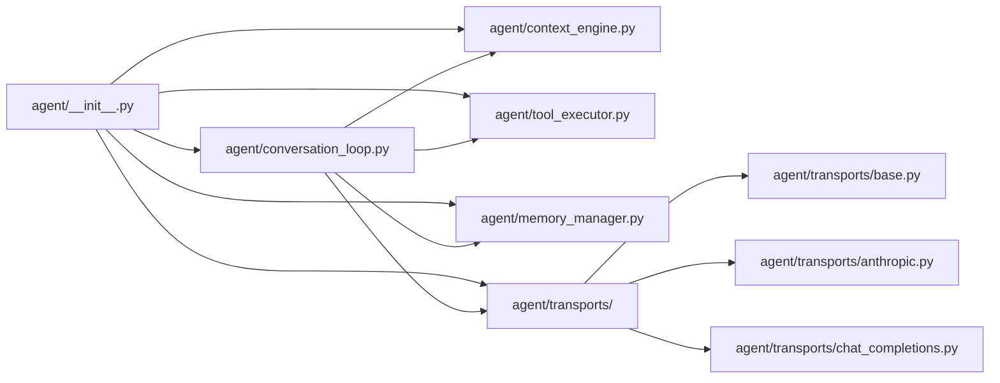

### 工具模块依赖

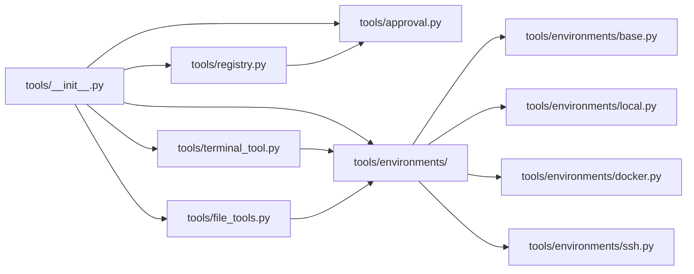

## 外部依赖分类

### 核心依赖

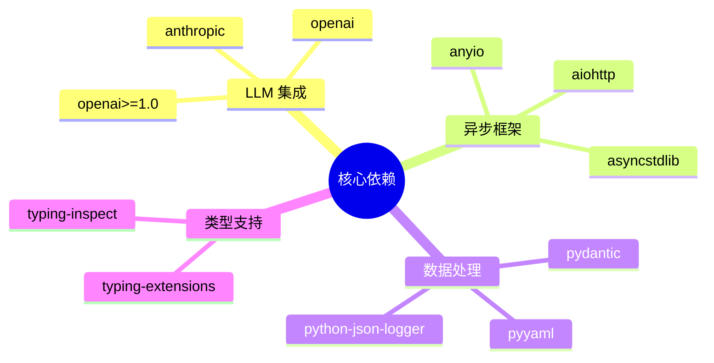

### 消息平台依赖

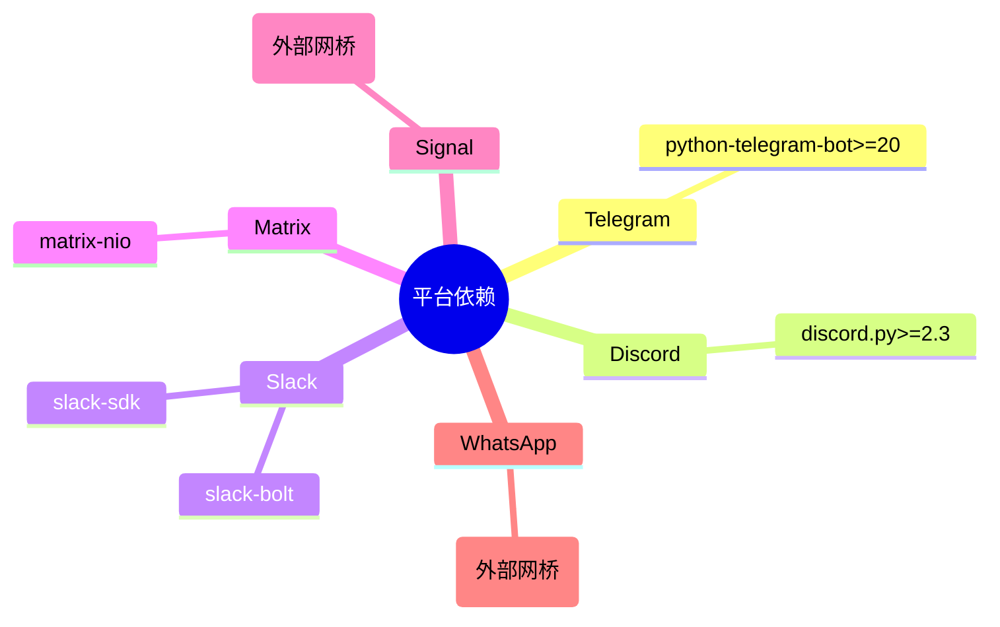

### 工具执行依赖

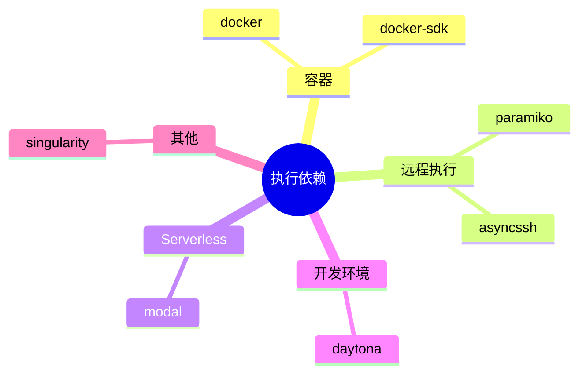

### 记忆与搜索依赖

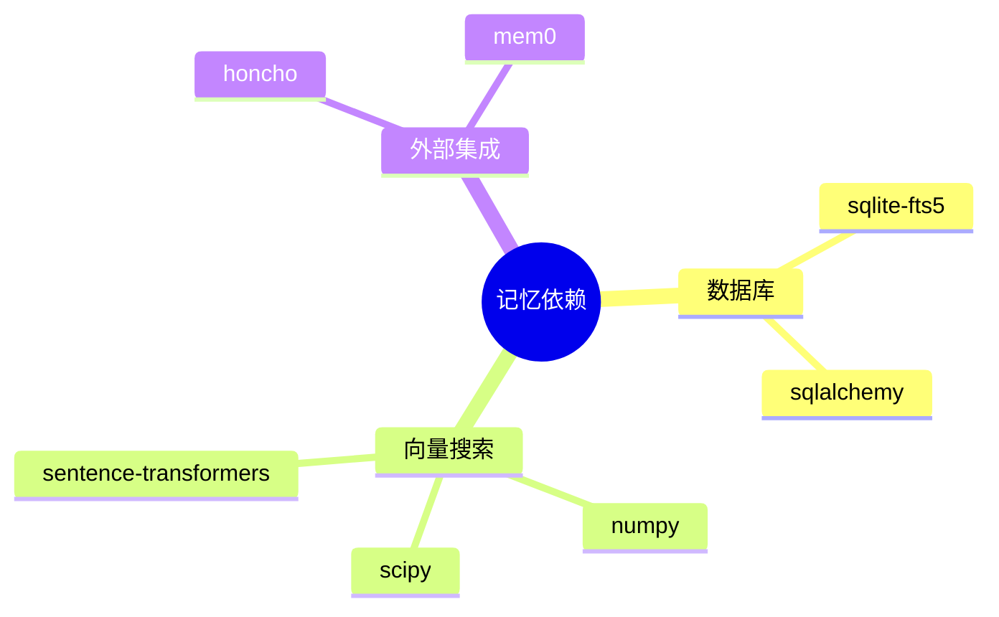

### CLI 与 TUI 依赖

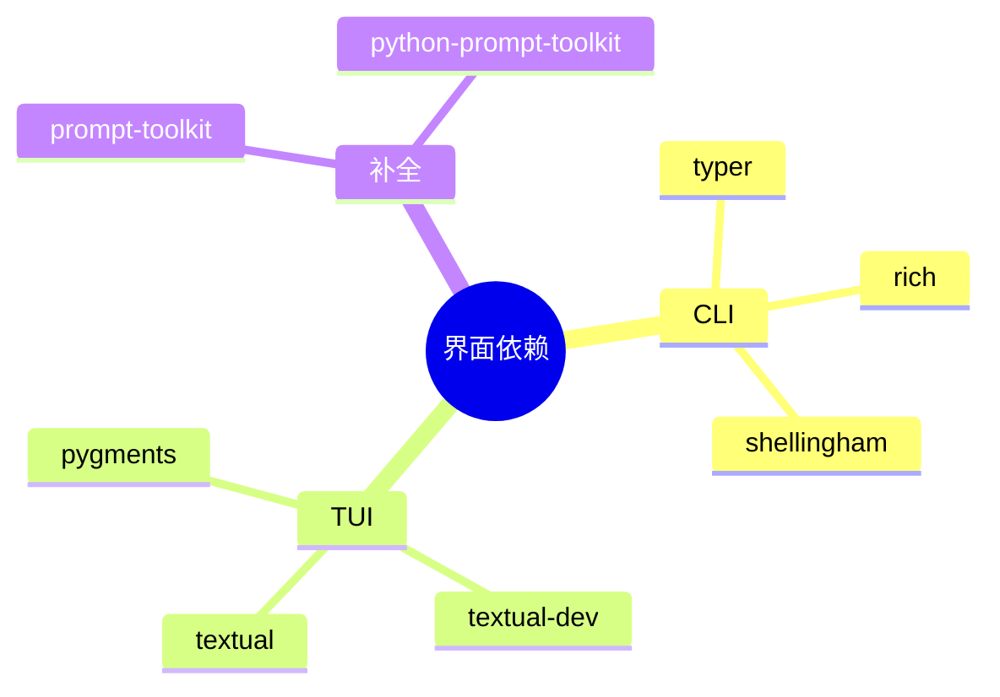

## 可选依赖组

```mermaid
graph TB
    A[hermes] --> B[hermes\[all\]]
    A --> C[hermes\[gateway\]]
    A --> D[hermes\[tools\]]
    A --> E[hermes\[voice\]]
    A --> F[hermes\[dev\]]
    
    B --> C
    B --> D
    B --> E
    
    C --> G[Telegram]
    C --> H[Discord]
    C --> I[Slack]
    
    D --> J[Docker]
    D --> K[SSH]
    D --> L[Modal]
    
    E --> M[OpenAI TTS]
    E --> N[ElevenLabs]
    E --> O[Whisper]
    
    F --> P[pytest]
    F --> Q[black]
    F --> R[mypy]
```

### 依赖组说明

| 依赖组 | 包含内容 | 用途 |
|--------|----------|------|
| `gateway` | 消息平台库 | 运行网关 |
| `tools` | 工具执行后端 | 完整工具支持 |
| `voice` | 语音 TTS/STT | 语音功能 |
| `dev` | 开发工具 | 开发测试 |
| `all` | 全部可选依赖 | 完整功能 |

## 开发依赖

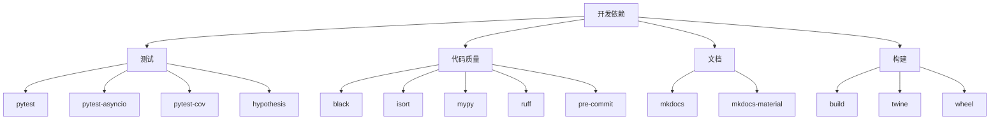

## 依赖版本约束策略

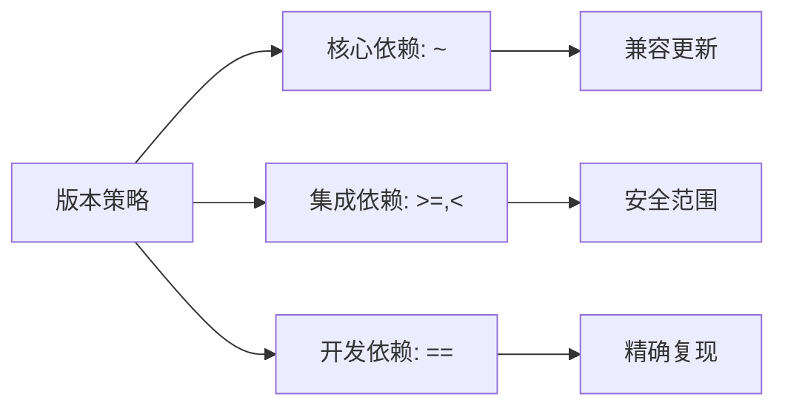

### 版本约束示例

```python
# pyproject.toml 示例
dependencies = [
    "anthropic>=0.20.0,<0.30.0",    # 集成依赖: 范围
    "pydantic~=2.5.0",              # 核心依赖: 兼容更新
    "typer>=0.9.0",                 # CLI: 最低版本
]

[project.optional-dependencies]
dev = [
    "pytest==7.4.3",               # 开发: 精确版本
    "black==23.12.1",
]
```

## 循环依赖防护

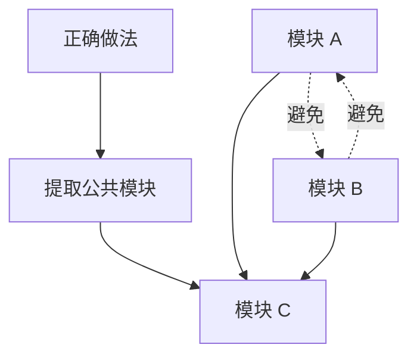

### 循环依赖解决方案

| 方案 | 说明 | 适用场景 |
|------|------|----------|
| 提取公共模块 | 将共享代码移到独立模块 | 双向依赖 |
| 依赖注入 | 运行时注入依赖而非导入 | 接口依赖 |
| 事件驱动 | 通过事件解耦 | 通知类依赖 |
| 延迟导入 | 在函数内部导入 | 可选依赖 |

## 依赖图可视化

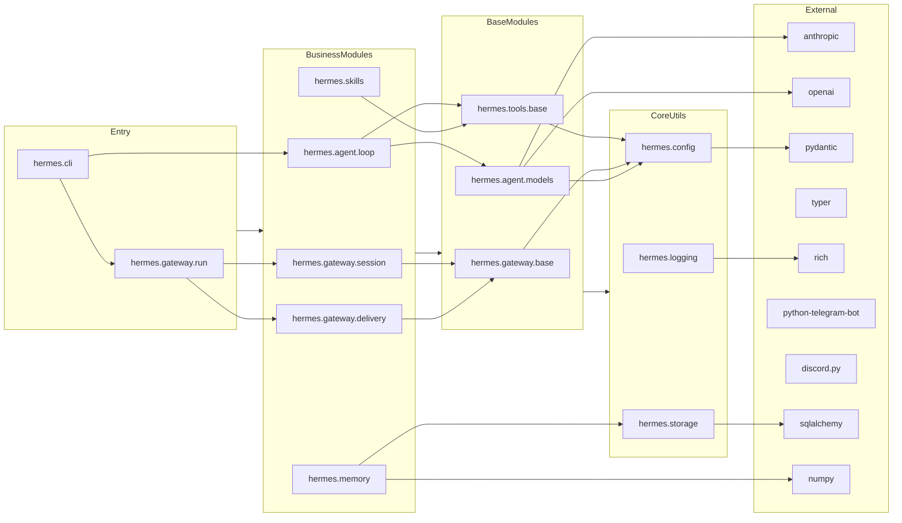

## 依赖更新策略

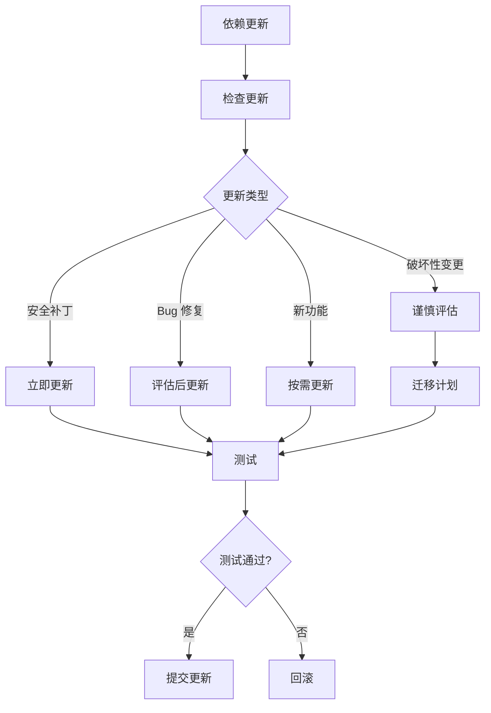

## 相关文档

- [整体架构](./overview.md)
- [目录结构](./directory-tree.md)
- [技术栈](../tech-stack.md)
