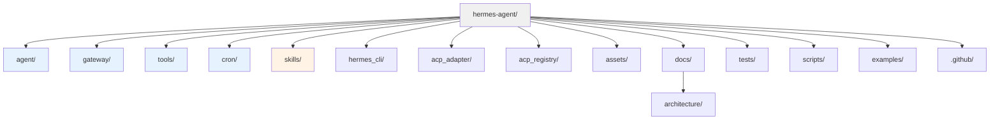
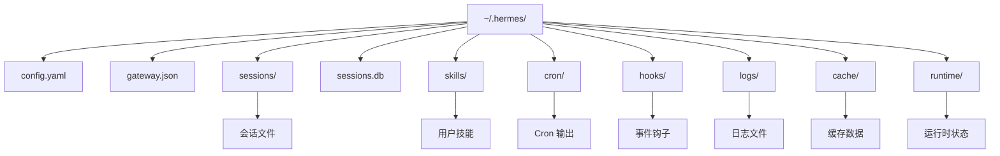
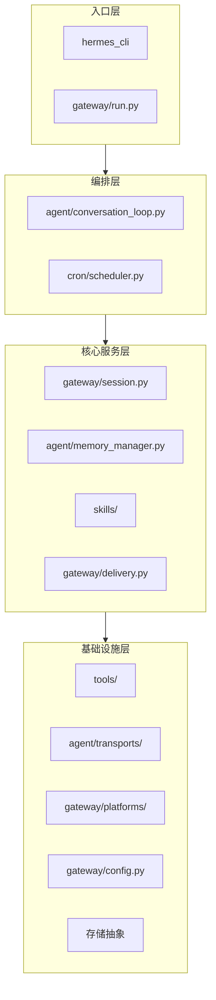

# 目录结构树状图

本文档详细描述 Hermes Agent 项目的完整目录结构，包括源代码、配置、文档等各个部分的组织方式。

## 整体项目结构



## 详细目录树

```
hermes-agent/
├── agent/                           # Agent 核心模块
│   ├── __init__.py
│   ├── __main__.py
│   ├── agent_init.py               # Agent 初始化
│   ├── agent_runtime_helpers.py    # 运行时辅助
│   ├── anthropic_adapter.py        # Anthropic 适配器
│   ├── async_utils.py              # 异步工具
│   ├── auxiliary_client.py         # 辅助客户端
│   ├── azure_identity_adapter.py   # Azure 身份
│   ├── background_review.py        # 后台审查
│   ├── bedrock_adapter.py          # Bedrock 适配器
│   ├── browser_provider.py         # 浏览器提供者
│   ├── browser_registry.py         # 浏览器注册
│   ├── chat_completion_helpers.py  # Chat 补全辅助
│   ├── codex_responses_adapter.py  # Codex 响应适配器
│   ├── codex_runtime.py            # Codex 运行时
│   ├── context_compressor.py       # 上下文压缩
│   ├── context_engine.py           # 上下文引擎
│   ├── context_references.py       # 上下文引用
│   ├── conversation_compression.py # 对话压缩
│   ├── conversation_loop.py        # 对话循环 ⭐
│   ├── copilot_acp_client.py       # Copilot ACP 客户端
│   ├── credential_pool.py          # 凭证池
│   ├── credential_sources.py       # 凭证源
│   ├── curator_backup.py           # 备份管理
│   ├── display.py                  # 显示管理
│   ├── error_classifier.py         # 错误分类
│   ├── file_safety.py              # 文件安全
│   ├── gemini_cloudcode_adapter.py # Gemini CloudCode
│   ├── gemini_native_adapter.py    # Gemini 原生
│   ├── gemini_schema.py            # Gemini Schema
│   ├── google_code_assist.py       # Google 代码辅助
│   ├── google_oauth.py             # Google OAuth
│   ├── i18n.py                     # 国际化
│   ├── image_gen_provider.py       # 图像生成提供者
│   ├── image_gen_registry.py       # 图像生成注册
│   ├── image_routing.py            # 图像路由
│   ├── insights.py                 # 洞察分析
│   ├── iteration_budget.py         # 迭代预算
│   ├── lmstudio_reasoning.py       # LM Studio 推理
│   ├── lsp/                        # LSP 集成
│   │   ├── __init__.py
│   │   ├── cli.py
│   │   ├── client.py
│   │   ├── eventlog.py
│   │   ├── install.py
│   │   ├── manager.py
│   │   ├── protocol.py
│   │   ├── range_shift.py
│   │   ├── reporter.py
│   │   ├── servers.py
│   │   └── workspace.py
│   ├── manual_compression_feedback.py # 手动压缩反馈
│   ├── markdown_tables.py          # Markdown 表格
│   ├── memory_manager.py           # 记忆管理器 ⭐
│   ├── memory_provider.py          # 记忆提供者
│   ├── message_sanitization.py     # 消息净化
│   ├── model_metadata.py           # 模型元数据
│   ├── models_dev.py               # 模型开发
│   ├── moonshot_schema.py          # Moonshot Schema
│   ├── nous_rate_guard.py          # Nous 费率防护
│   ├── onboarding.py               # 引导流程
│   ├── plugin_llm.py               # LLM 插件
│   ├── portal_tags.py              # Portal 标签
│   ├── process_bootstrap.py        # 进程引导
│   ├── prompt_builder.py           # 提示构建器
│   ├── prompt_caching.py           # 提示缓存
│   ├── rate_limit_tracker.py       # 费率限制追踪
│   ├── redact.py                   # 信息脱敏
│   ├── retry_utils.py              # 重试工具
│   ├── shell_hooks.py              # Shell 钩子
│   ├── stream_diag.py              # 流诊断
│   ├── subdirectory_hints.py       # 子目录提示
│   ├── system_prompt.py            # 系统提示
│   ├── think_scrubber.py           # 思考擦除器
│   ├── title_generator.py          # 标题生成器
│   ├── tool_dispatch_helpers.py    # 工具分发辅助
│   ├── tool_executor.py            # 工具执行器 ⭐
│   ├── tool_guardrails.py          # 工具防护
│   ├── tool_result_classification.py # 工具结果分类
│   ├── trajectory.py               # 轨迹记录
│   ├── transports/                 # 传输层
│   │   ├── __init__.py
│   │   ├── anthropic.py            # Anthropic 传输
│   │   ├── base.py                 # 基础传输
│   │   ├── bedrock.py              # Bedrock 传输
│   │   ├── chat_completions.py     # Chat Completions
│   │   ├── codex.py                # Codex 传输
│   │   ├── codex_app_server.py     # Codex App Server
│   │   ├── codex_app_server_session.py
│   │   ├── codex_event_projector.py
│   │   ├── hermes_tools_mcp_server.py
│   │   └── types.py                # 类型定义
│   └── user_context.py             # 用户上下文
│
├── gateway/                         # 消息网关模块 ⭐
│   ├── __init__.py
│   ├── __main__.py
│   ├── README.md                   # 网关文档
│   ├── channel_directory.py        # 频道目录
│   ├── config.py                   # 配置管理 ⭐
│   ├── delivery.py                 # 消息投递 ⭐
│   ├── display_config.py           # 显示配置
│   ├── hooks.py                    # 事件钩子 ⭐
│   ├── memory_monitor.py           # 内存监控
│   ├── mirror.py                   # 会话镜像
│   ├── pairing.py                  # 配对系统
│   ├── platform_registry.py        # 平台注册中心 ⭐
│   ├── platforms/                  # 平台适配器
│   │   ├── __init__.py
│   │   ├── base.py                 # 基础适配器 ⭐
│   │   ├── telegram.py             # Telegram
│   │   ├── discord.py              # Discord
│   │   ├── slack.py                # Slack
│   │   ├── signal.py               # Signal
│   │   ├── matrix.py               # Matrix
│   │   ├── whatsapp.py             # WhatsApp
│   │   ├── weixin.py               # 微信
│   │   ├── yuanbao.py              # 元宝
│   │   ├── qqbot.py                # QQ 机器人
│   │   ├── feishu.py               # 飞书
│   │   ├── wecom.py                # 企业微信
│   │   ├── dingtalk.py             # 钉钉
│   │   ├── mattermost.py           # Mattermost
│   │   ├── bluebubbles.py          # BlueBubbles
│   │   ├── api_server.py           # API Server
│   │   ├── local.py                # 本地
│   │   └── ADDING_A_PLATFORM.md    # 添加新平台指南
│   ├── restart.py                  # 重启常量
│   ├── runtime_footer.py           # 运行时页脚
│   ├── run.py                      # 网关运行器 ⭐
│   ├── session.py                  # 会话管理 ⭐
│   ├── session_context.py          # 会话上下文
│   ├── slash_access.py             # 斜杠命令访问
│   ├── status.py                   # 状态管理
│   ├── sticker_cache.py            # 贴纸缓存
│   ├── stream_consumer.py          # 流消费者 ⭐
│   ├── whatsapp_identity.py        # WhatsApp 身份
│   └── shutdown_forensics.py       # 关闭取证
│
├── tools/                           # 工具系统模块 ⭐
│   ├── __init__.py
│   ├── ansi_strip.py               # ANSI 清理
│   ├── approval.py                 # 审批系统
│   ├── binary_extensions.py        # 二进制扩展
│   ├── browser_camofox.py          # Browser Camofox
│   ├── browser_camofox_state.py    # Camofox 状态
│   ├── browser_cdp_tool.py         # CDP 浏览器工具
│   ├── browser_dialog_tool.py      # 浏览器对话工具
│   ├── browser_supervisor.py       # 浏览器监督器
│   ├── browser_tool.py             # 浏览器工具
│   ├── budget_config.py            # 预算配置
│   ├── checkpoint_manager.py       # 检查点管理
│   ├── clarify_gateway.py          # Clarify Gateway
│   ├── clarify_tool.py             # Clarify 工具
│   ├── code_execution_tool.py      # 代码执行工具
│   ├── computer_use/               # 计算机使用
│   │   ├── __init__.py
│   │   ├── backend.py
│   │   ├── cua_backend.py
│   │   ├── schema.py
│   │   └── tool.py
│   ├── computer_use_tool.py        # 计算机使用工具
│   ├── credential_files.py         # 凭证文件
│   ├── cronjob_tools.py            # Cron 任务工具
│   ├── debug_helpers.py            # 调试辅助
│   ├── delegate_tool.py            # 委派工具
│   ├── discord_tool.py             # Discord 工具
│   ├── environments/               # 执行环境
│   │   ├── __init__.py
│   │   ├── base.py                 # 基础环境
│   │   ├── local.py                # 本地环境
│   │   ├── docker.py               # Docker 环境
│   │   ├── ssh.py                  # SSH 环境
│   │   ├── modal.py                # Modal 环境
│   │   ├── managed_modal.py        # 托管 Modal
│   │   ├── daytona.py              # Daytona 环境
│   │   ├── singularity.py          # Singularity 环境
│   │   ├── vercel_sandbox.py       # Vercel Sandbox
│   │   └── file_sync.py            # 文件同步
│   ├── env_passthrough.py          # 环境透传
│   ├── feishu_doc_tool.py          # 飞书文档工具
│   ├── feishu_drive_tool.py        # 飞书网盘工具
│   ├── file_operations.py          # 文件操作
│   ├── file_state.py               # 文件状态
│   ├── file_tools.py               # 文件工具
│   ├── fuzzy_match.py              # 模糊匹配
│   ├── homeassistant_tool.py       # HomeAssistant 工具
│   ├── image_generation_tool.py    # 图像生成工具
│   ├── interrupt.py                # 中断处理
│   ├── kanban_tools.py             # 看板工具
│   ├── lazy_deps.py                # 懒加载依赖
│   ├── managed_tool_gateway.py     # 托管工具网关
│   ├── mcp_oauth.py                # MCP OAuth
│   ├── mcp_oauth_manager.py        # MCP OAuth 管理
│   ├── mcp_tool.py                 # MCP 工具
│   ├── memory_tool.py              # 记忆工具
│   ├── microsoft_graph_auth.py     # Microsoft Graph 认证
│   ├── microsoft_graph_client.py   # Microsoft Graph 客户端
│   ├── mixture_of_agents_tool.py   # 混合代理工具
│   ├── neutts_synth.py             # NeuTTS 合成
│   ├── openrouter_client.py        # OpenRouter 客户端
│   ├── osv_check.py                # OSV 检查
│   ├── patch_parser.py             # 补丁解析器
│   ├── path_security.py            # 路径安全
│   ├── process_registry.py         # 进程注册表
│   ├── registry.py                 # 工具注册表 ⭐
│   ├── schema_sanitizer.py         # Schema 净化器
│   ├── send_message_tool.py        # 发送消息工具
│   ├── session_search_tool.py      # 会话搜索工具
│   ├── skill_manager_tool.py       # 技能管理工具
│   ├── skill_provenance.py         # 技能来源
│   ├── skill_usage.py              # 技能使用
│   ├── skills_guard.py             # 技能防护
│   ├── skills_hub.py               # 技能中心
│   ├── skills_sync.py              # 技能同步
│   ├── skills_tool.py              # 技能工具
│   ├── slash_confirm.py            # 斜杠确认
│   ├── terminal_tool.py            # 终端工具 ⭐
│   ├── tirith_security.py          # Tirith 安全
│   ├── todo_tool.py                # TODO 工具
│   ├── tool_backend_helpers.py     # 工具后端辅助
│   ├── tool_output_limits.py       # 工具输出限制
│   ├── tool_result_storage.py      # 工具结果存储
│   ├── transcription_tools.py      # 转录工具
│   ├── tts_tool.py                 # TTS 工具
│   ├── url_safety.py               # URL 安全
│   ├── video_generation_tool.py    # 视频生成工具
│   ├── vision_tools.py             # 视觉工具
│   ├── voice_mode.py               # 语音模式
│   ├── web_tools.py                # Web 工具
│   ├── website_policy.py           # 网站策略
│   ├── xai_http.py                 # XAI HTTP
│   ├── x_search_tool.py            # X 搜索工具
│   └── yuanbao_tools.py            # 元宝工具
│
├── cron/                            # 定时任务模块 ⭐
│   ├── __init__.py
│   ├── jobs.py                     # 任务管理
│   └── scheduler.py                # 调度器
│
├── skills/                          # 内置技能目录 ⭐
│   ├── creative/                   # 创意技能
│   │   ├── comfyui/               # ComfyUI
│   │   │   ├── scripts/
│   │   │   │   ├── __init__.py
│   │   │   │   ├── auto_fix_deps.py
│   │   │   │   ├── check_deps.py
│   │   │   │   ├── extract_schema.py
│   │   │   │   ├── fetch_logs.py
│   │   │   │   ├── hardware_check.py
│   │   │   │   ├── health_check.py
│   │   │   │   └── run_workflow.py
│   │   │   └── tests/
│   │   ├── excalidraw/            # Excalidraw
│   │   └── pixel-art/             # 像素艺术
│   ├── media/                      # 媒体技能
│   │   └── youtube-content/       # YouTube 内容
│   ├── productivity/               # 生产力技能
│   │   ├── google-workspace/      # Google Workspace
│   │   ├── linear/                # Linear
│   │   ├── maps/                  # 地图
│   │   ├── ocr-and-documents/     # OCR 和文档
│   │   └── powerpoint/            # PowerPoint
│   ├── red-teaming/                # 红队技能
│   │   └── godmode/               # GodMode
│   └── research/                   # 研究技能
│       ├── arxiv/                 # arXiv
│       └── polymarket/            # Polymarket
│
├── hermes_cli/                      # CLI 模块
│   ├── __init__.py
│   ├── __main__.py
│   ├── cli.py                     # CLI 主入口
│   ├── commands/                  # 命令集
│   │   ├── __init__.py
│   │   ├── agent.py
│   │   ├── config.py
│   │   ├── cron.py
│   │   ├── gateway.py
│   │   ├── model.py
│   │   ├── skills.py
│   │   └── tools.py
│   ├── config.py                  # CLI 配置
│   ├── tui/                       # TUI 界面
│   │   ├── __init__.py
│   │   ├── app.py
│   │   ├── components/
│   │   └── screens/
│   └── utils.py                   # CLI 工具
│
├── acp_adapter/                     # ACP 适配器
│   ├── __init__.py
│   ├── __main__.py
│   ├── auth.py
│   ├── edit_approval.py
│   ├── entry.py
│   ├── events.py
│   ├── permissions.py
│   ├── server.py
│   ├── session.py
│   └── tools.py
│
├── acp_registry/                    # ACP 注册表
│   └── agent.json
│
├── assets/                          # 资源文件
│   ├── banner.png
│   ├── logo.svg
│   └── icons/
│
├── docs/                            # 文档目录
│   ├── architecture/               # 架构文档 ⭐
│   │   ├── overview.md             # 整体架构
│   │   ├── conversation-flow.md    # 对话流程
│   │   ├── tool-call-flow.md       # 工具调用流程
│   │   ├── gateway-architecture.md # 网关架构
│   │   ├── skill-system.md         # 技能系统
│   │   ├── memory-system.md        # 记忆系统
│   │   ├── cron-flow.md           # 定时任务流程
│   │   ├── dependencies.md        # 依赖关系
│   │   └── directory-tree.md      # 目录结构(本文件)
│   ├── user-guide/                # 用户指南
│   ├── developer-guide/           # 开发者指南
│   ├── api/                       # API 文档
│   └── tech-stack.md             # 技术栈
│
├── tests/                           # 测试目录
│   ├── __init__.py
│   ├── conftest.py                # pytest 配置
│   ├── agent/                     # Agent 测试
│   ├── gateway/                   # 网关测试
│   ├── tools/                     # 工具测试
│   ├── cron/                      # Cron 测试
│   ├── integration/               # 集成测试
│   └── e2e/                       # 端到端测试
│
├── scripts/                         # 脚本目录
│   ├── install.sh                 # 安装脚本
│   ├── setup-hermes.sh            # 设置脚本
│   ├── dev.sh                     # 开发脚本
│   ├── test.sh                    # 测试脚本
│   └── build.sh                   # 构建脚本
│
├── examples/                        # 示例目录
│   ├── skills/                    # 技能示例
│   ├── prompts/                   # 提示示例
│   └── configs/                   # 配置示例
│
├── .github/                         # GitHub 配置
│   ├── workflows/                 # GitHub Actions
│   │   ├── tests.yml
│   │   ├── lint.yml
│   │   ├── deploy-site.yml
│   │   └── ...
│   ├── ISSUE_TEMPLATE/            # Issue 模板
│   ├── PULL_REQUEST_TEMPLATE.md   # PR 模板
│   └── dependabot.yml             # Dependabot
│
├── .plans/                          # 计划文档
│   ├── openai-api-server.md
│   └── streaming-support.md
│
├── pyproject.toml                  # 项目配置 ⭐
├── uv.lock                         # uv 锁文件
├── requirements.txt                # 依赖列表
├── README.md                       # 项目 README
├── README.zh-CN.md                # 中文 README
├── AGENTS.md                       # 代理文档
├── CONTRIBUTING.md                 # 贡献指南
├── LICENSE                         # 许可证
├── SECURITY.md                     # 安全指南
├── .gitignore                      # Git 忽略
├── .dockerignore                   # Docker 忽略
├── Dockerfile                      # Dockerfile
├── .env.example                    # 环境变量示例
├── .envrc                          # direnv 配置
├── .mailmap                        # Git mailmap
├── RELEASE_v0.10.0.md             # 发布说明
├── RELEASE_v0.11.0.md
├── RELEASE_v0.12.0.md
├── RELEASE_v0.13.0.md
├── RELEASE_v0.14.0.md
├── RELEASE_v0.2.0.md
├── RELEASE_v0.3.0.md
├── RELEASE_v0.4.0.md
├── RELEASE_v0.5.0.md
├── RELEASE_v0.6.0.md
├── RELEASE_v0.7.0.md
├── RELEASE_v0.8.0.md
├── RELEASE_v0.9.0.md
└── todo.md                         # 待办事项
```

## 用户数据目录结构 (~/.hermes/)



```
~/.hermes/
├── config.yaml                     # 主配置文件
├── gateway.json                    # 网关配置(旧版)
├── sessions/                       # 会话目录
│   ├── <session-id>.jsonl         # 会话历史
│   └── ...
├── sessions.db                     # 会话数据库
├── skills/                         # 用户技能目录
│   ├── my-skill/
│   │   ├── skill.yaml
│   │   ├── prompt.md
│   │   └── scripts/
│   └── ...
├── cron/                           # Cron 目录
│   ├── jobs.yaml                  # Cron 任务
│   └── output/                    # Cron 输出
│       ├── job-123.txt
│       └── ...
├── hooks/                          # 事件钩子目录
│   ├── my-hook/
│   │   ├── HOOK.yaml
│   │   └── handler.py
│   └── ...
├── logs/                           # 日志目录
│   ├── hermes.log
│   ├── gateway.log
│   └── ...
├── cache/                          # 缓存目录
│   ├── sticker_cache.json
│   ├── channel_directory.json
│   └── ...
├── runtime/                        # 运行时目录
│   ├── gateway.pid
│   ├── status.json
│   └── ...
└── memory/                         # 记忆目录(可选)
    └── ...
```

## 关键文件说明

| 文件/目录 | 说明 | 重要度 |
|-----------|------|--------|
| `agent/conversation_loop.py` | Agent 对话循环核心 | ⭐⭐⭐ |
| `gateway/run.py` | 网关运行器 | ⭐⭐⭐ |
| `gateway/config.py` | 网关配置管理 | ⭐⭐⭐ |
| `gateway/session.py` | 会话管理 | ⭐⭐⭐ |
| `gateway/delivery.py` | 消息投递 | ⭐⭐ |
| `gateway/platforms/base.py` | 平台适配器基类 | ⭐⭐⭐ |
| `tools/registry.py` | 工具注册表 | ⭐⭐ |
| `tools/terminal_tool.py` | 终端工具 | ⭐⭐ |
| `tools/environments/` | 执行环境后端 | ⭐⭐ |
| `cron/scheduler.py` | Cron 调度器 | ⭐⭐ |
| `pyproject.toml` | 项目配置 | ⭐⭐⭐ |
| `~/.hermes/config.yaml` | 用户主配置 | ⭐⭐⭐ |

## 模块职责边界



## 相关文档

- [整体架构](./overview.md)
- [依赖关系](./dependencies.md)
- [技术栈](../tech-stack.md)
