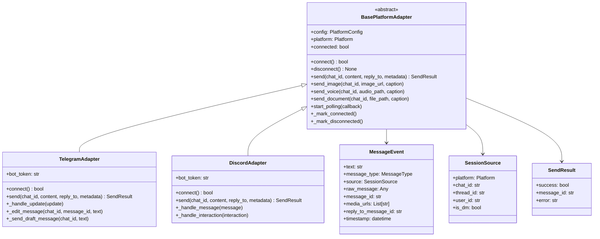
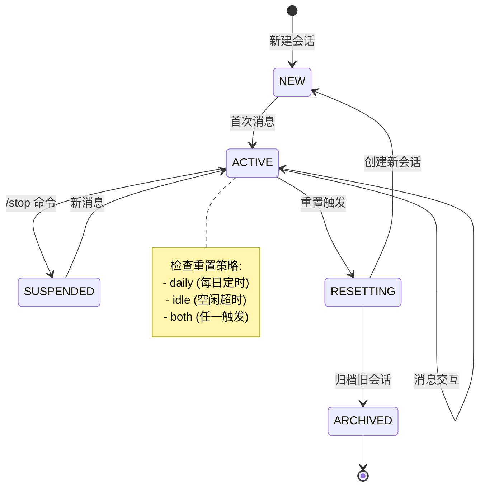
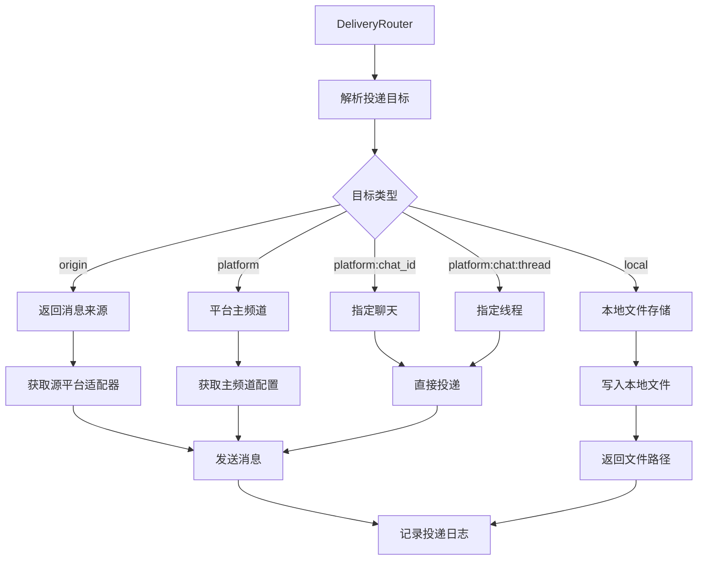
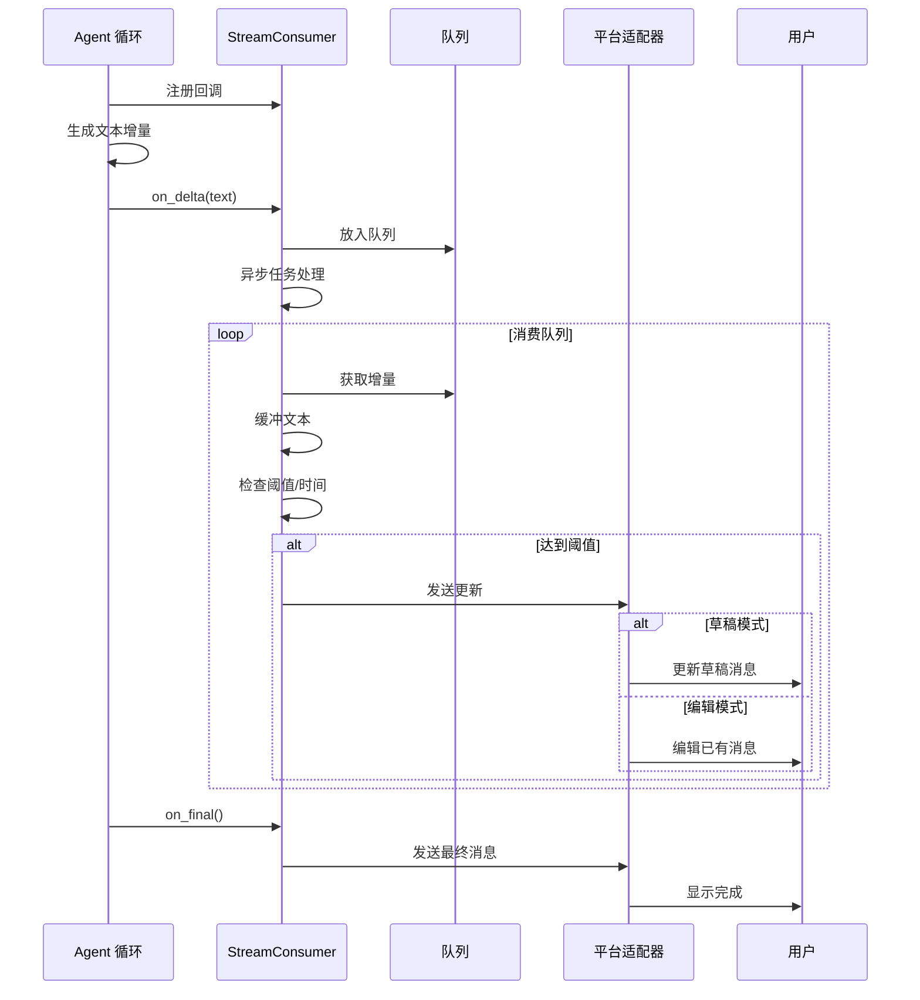
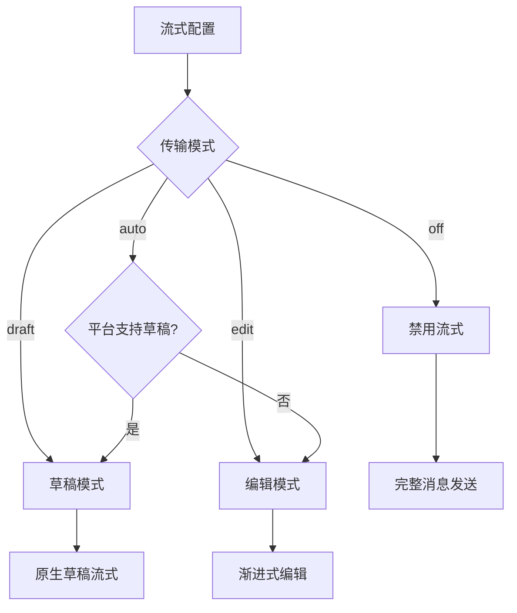
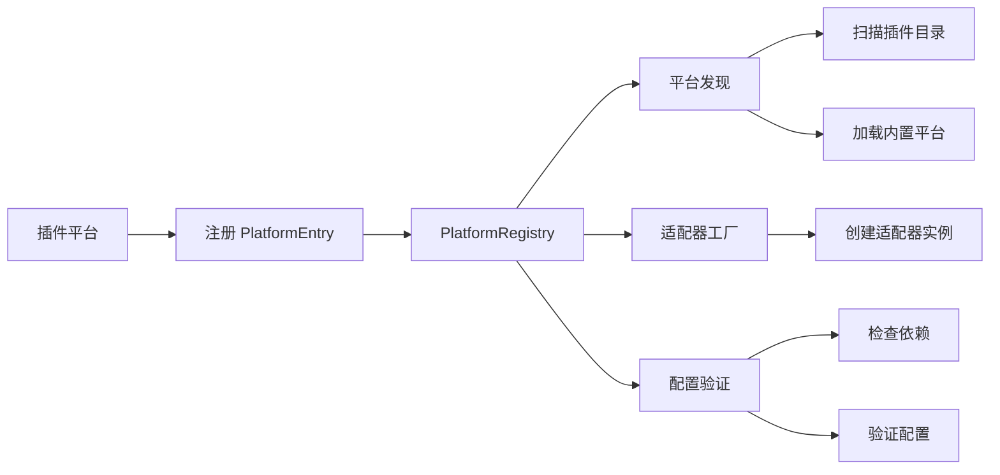
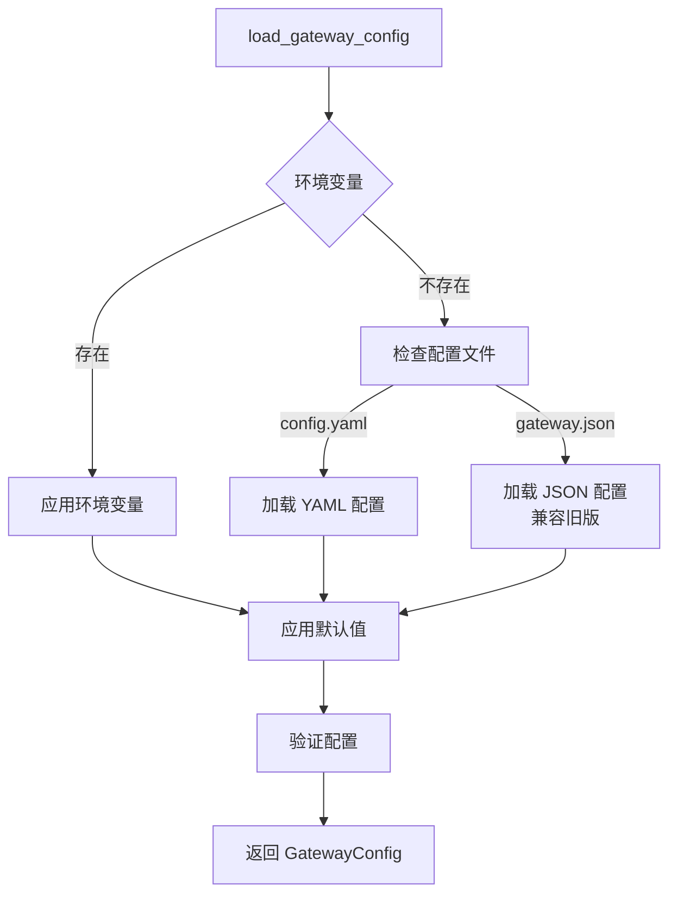
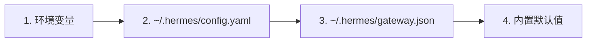
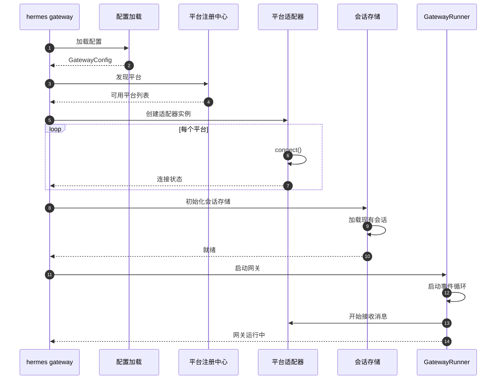

# 网关平台架构

本文档详细描述 Hermes 消息网关的架构设计，包括平台适配器、会话管理、消息路由等核心组件。

## 网关整体架构

```mermaid
graph TB
    subgraph External[外部平台]
        Telegram[Telegram]
        Discord[Discord]
        Slack[Slack]
        WhatsApp[WhatsApp]
        Signal[Signal]
        Weixin[微信]
        Other[其他平台...]
    end
    
    subgraph Gateway[网关核心]
        GatewayRunner[GatewayRunner<br/>主控制器]
        SessionStore[SessionStore<br/>会话存储]
        DeliveryRouter[DeliveryRouter<br/>投递路由器]
        HookRegistry[HookRegistry<br/>事件钩子]
        PlatformRegistry[PlatformRegistry<br/>平台注册中心]
        StreamConsumer[StreamConsumer<br/>流式消费者]
    end
    
    subgraph Adapters[平台适配器]
        BaseAdapter[BasePlatformAdapter<br/>基类]
        TelegramAdapter[TelegramAdapter]
        DiscordAdapter[DiscordAdapter]
        SlackAdapter[SlackAdapter]
        OtherAdapter[其他适配器...]
    end
    
    subgraph Agent[Agent 系统]
        AgentLoop[Agent 循环]
        Skills[技能系统]
        Memory[记忆系统]
    end
    
    %% 连接关系
    External --> Adapters
    Adapters --> Gateway
    Gateway --> Agent
    
    %% 适配器继承
    BaseAdapter <|-- TelegramAdapter
    BaseAdapter <|-- DiscordAdapter
    BaseAdapter <|-- SlackAdapter
    BaseAdapter <|-- OtherAdapter
    
    %% 网关内部连接
    GatewayRunner --> SessionStore
    GatewayRunner --> DeliveryRouter
    GatewayRunner --> HookRegistry
    GatewayRunner --> PlatformRegistry
    GatewayRunner --> StreamConsumer
    
    PlatformRegistry --> BaseAdapter
```

## 平台适配器模式

### 适配器架构



### 支持的平台列表

| 平台 | 状态 | 特殊功能 | 适配器文件 |
|------|------|----------|------------|
| Telegram | ✅ 完全支持 | 话题、草稿流式、按钮 | `gateway/platforms/telegram.py` |
| Discord | ✅ 完全支持 | 线程、按钮、技能绑定 | `gateway/platforms/discord.py` |
| Slack | ✅ 完全支持 | Assistant API、线程 | `gateway/platforms/slack.py` |
| WhatsApp | ✅ 支持 | 通过网桥 | `gateway/platforms/whatsapp.py` |
| Signal | ✅ 完全支持 | 加密消息 | `gateway/platforms/signal.py` |
| Weixin | ✅ 完全支持 | 个人微信、群聊 | `gateway/platforms/weixin.py` |
| Matrix | ✅ 完全支持 | 加密房间 | `gateway/platforms/matrix.py` |
| Feishu | ✅ 完全支持 | 富文本、按钮 | `gateway/platforms/feishu.py` |
| API Server | ✅ 完全支持 | HTTP API | `gateway/platforms/api_server.py` |
| Local | ✅ 完全支持 | CLI 交互 | `gateway/platforms/local.py` |

## 会话管理系统

### 会话存储架构

```mermaid
graph TB
    subgraph SessionStore[SessionStore]
        A[会话创建]
        B[会话查找]
        C[会话重置]
        D[会话挂起]
        E[消息存储]
        F[历史加载]
    end
    
    subgraph Storage[存储层]
        SQLite[(SQLite 数据库)]
        JSONL[(JSONL 文件)]
        Meta[(元数据 JSON)]
    end
    
    A --> G{会话存在?}
    G -->|否| H[创建新会话]
    G -->|是| B
    H --> I[生成会话 ID]
    I --> J[初始化会话文件]
    J --> SQLite
    J --> JSONL
    J --> Meta
    B --> K[构建会话键]
    K --> L[查询数据库]
    L -->> B
    E --> M[追加到 JSONL]
    E --> N[插入 SQLite]
    F --> O[从 JSONL 加载]
    F --> P[从 SQLite 加载]
```

### 会话键构建规则

```mermaid
graph LR
    A[SessionSource] --> B{聊天类型}
    B -->|DM| C[agent:main:{platform}:dm:{chat_id}]
    B -->|群聊| D{用户隔离?}
    D -->|是| E[agent:main:{platform}:group:{chat_id}:{user_id}]
    D -->|否| F[agent:main:{platform}:group:{chat_id}]
    B -->|线程| G{线程隔离?}
    G -->|是| H[agent:main:{platform}:thread:{thread_id}:{user_id}]
    G -->|否| I[agent:main:{platform}:thread:{thread_id}]
```

会话键示例：
- `agent:main:telegram:dm:123456789` - Telegram 私聊
- `agent:main:discord:group:987654321:user_123` - Discord 群聊用户隔离
- `agent:main:slack:channel:C0123456789` - Slack 频道共享会话

### 会话生命周期



## 消息路由与投递

### DeliveryRouter 架构



### 投递目标格式

| 目标格式 | 说明 | 示例 |
|----------|------|------|
| `origin` | 返回消息来源 | `origin` |
| `local` | 本地文件存储 | `local` |
| `{platform}` | 平台主频道 | `telegram` |
| `{platform}:{chat_id}` | 指定聊天 | `telegram:123456` |
| `{platform}:{chat_id}:{thread_id}` | 指定线程 | `discord:987654:789012` |

## 流式传输系统

### 流式传输架构



### 流式传输模式



## 平台注册中心

### 插件式平台注册



### PlatformEntry 结构

```python
@dataclass
class PlatformEntry:
    name: str                    # 平台标识符
    label: str                   # 显示名称
    adapter_factory: Callable    # 适配器工厂函数
    check_fn: Optional[Callable] = None  # 依赖检查
    validate_config: Optional[Callable] = None  # 配置验证
    required_env: List[str] = field(default_factory=list)
    install_hint: Optional[str] = None
```

## 事件钩子系统

### HookRegistry 架构

```mermaid
graph TB
    A[HookRegistry] --> B[钩子发现]
    A --> C[钩子加载]
    A --> D[事件触发]
    A --> E[结果收集]
    
    B --> F[扫描 ~/.hermes/hooks/]
    F --> G[读取 HOOK.yaml]
    
    C --> H[导入 handler.py]
    H --> I[注册事件处理器]
    
    D --> J[emit(event, data)]
    J --> K[异步执行钩子]
    
    E --> L[emit_collect(event, data)]
    L --> M[收集返回值]
```

### 支持的事件类型

| 事件 | 触发时机 | 数据 |
|------|----------|------|
| `gateway:startup` | 网关启动 | 配置信息 |
| `session:start` | 新会话创建 | 会话信息 |
| `session:end` | 会话结束 | 会话信息 |
| `session:reset` | 会话重置 | 重置原因 |
| `agent:start` | Agent 开始处理 | 消息事件 |
| `agent:step` | 工具调用步骤 | 步骤详情 |
| `agent:end` | Agent 完成处理 | 响应信息 |
| `command:*` | 斜杠命令 | 命令上下文 |

## 配置管理

### 配置加载流程



### 配置优先级



## 网关启动流程



## 相关文档

- [整体架构](./overview.md)
- [对话流程](./conversation-flow.md)
- [定时任务流程](./cron-flow.md)
- [技术栈](../tech-stack.md)
