# 记忆系统架构

本文档详细描述 Hermes Agent 的记忆系统，包括记忆存储、检索、用户建模和跨会话学习的完整机制。

## 记忆系统总览

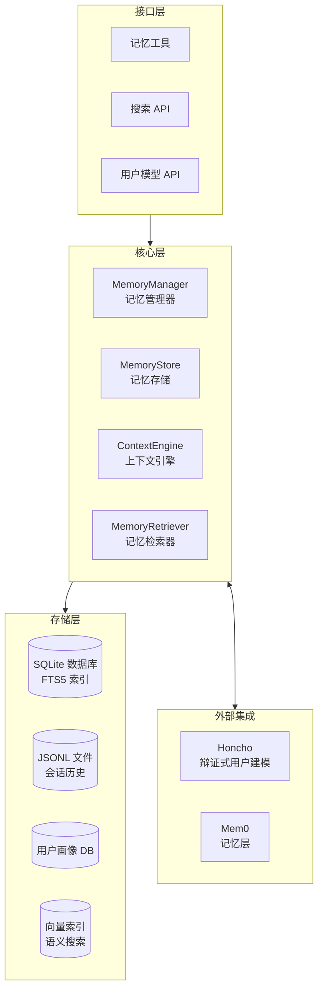

## 记忆类型

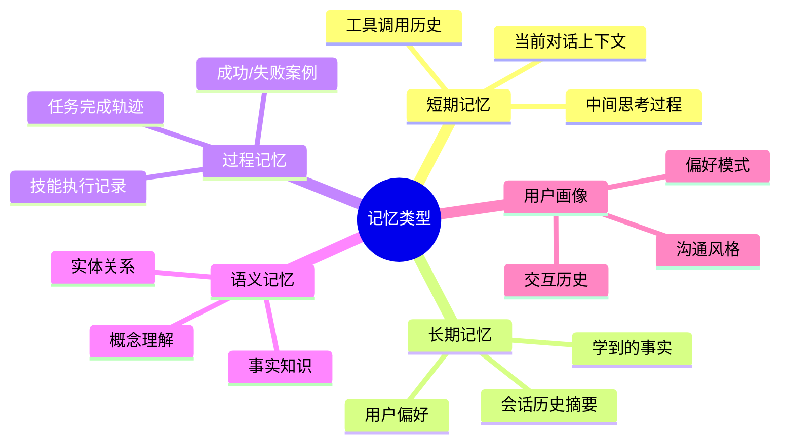

## 记忆存储架构

### 存储层次

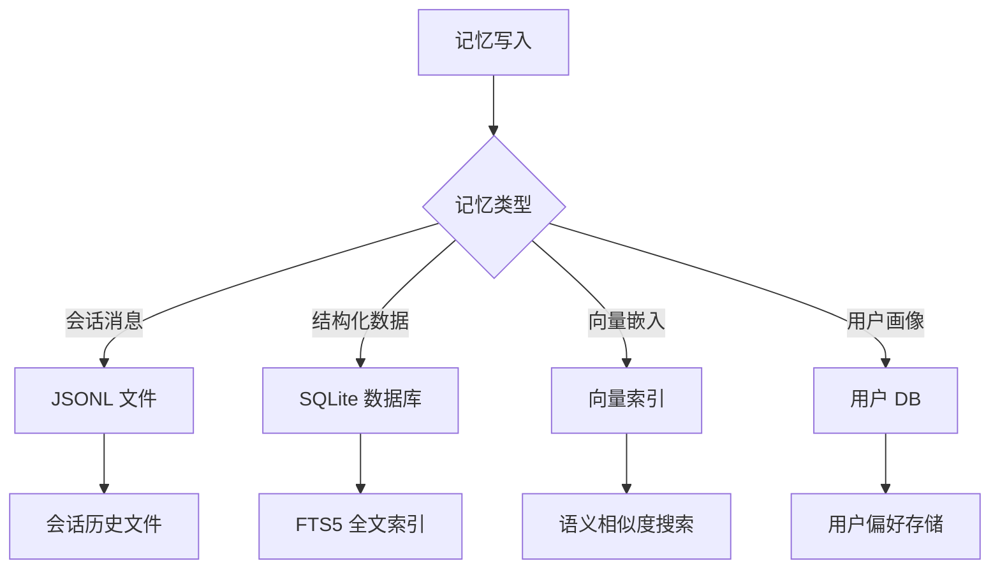

### 数据库 Schema

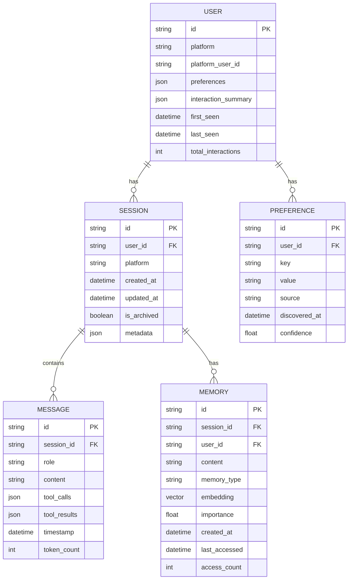

## 记忆写入流程

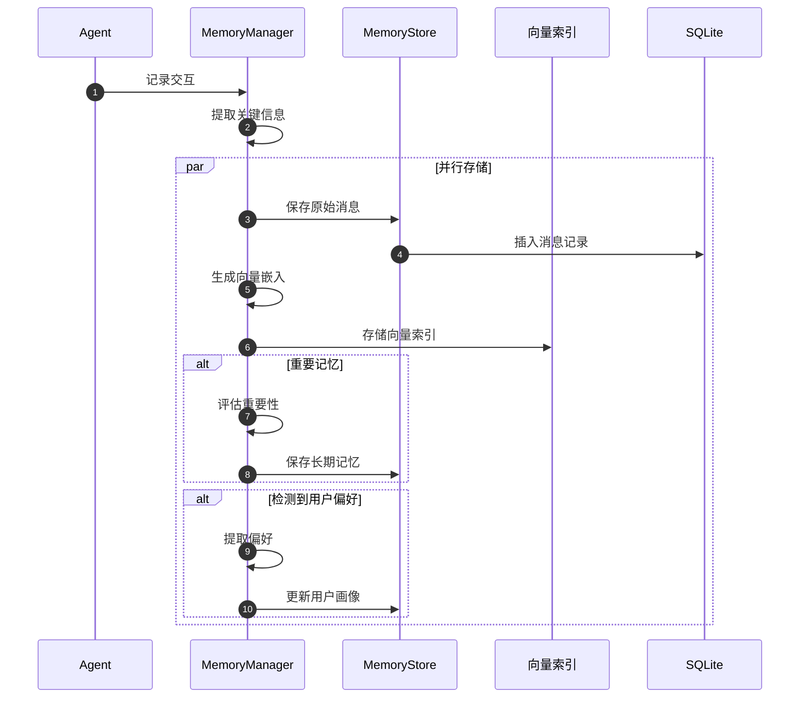

## 记忆检索流程

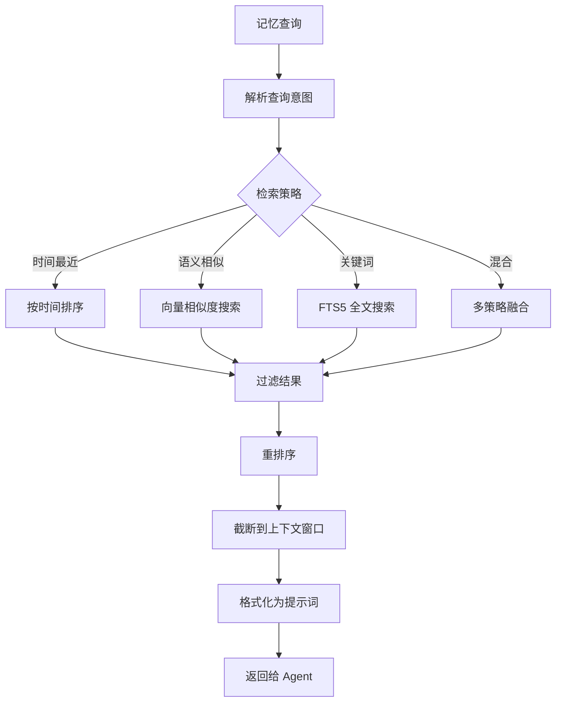

### 混合检索策略

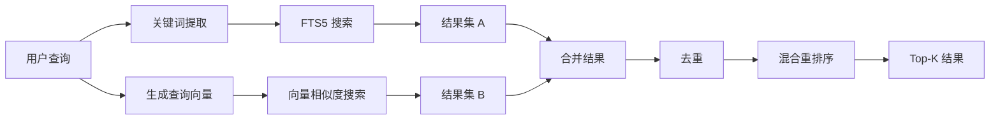

## 上下文管理

### 上下文构建流程

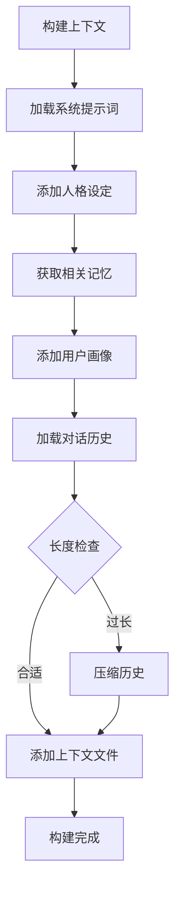

### 上下文压缩

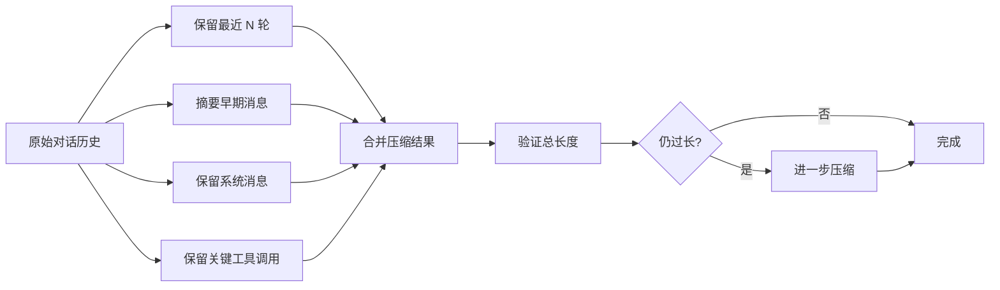

## 用户建模系统

### 用户画像维度

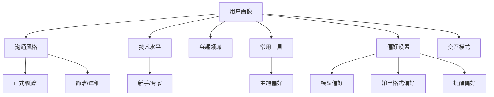

### 用户偏好学习

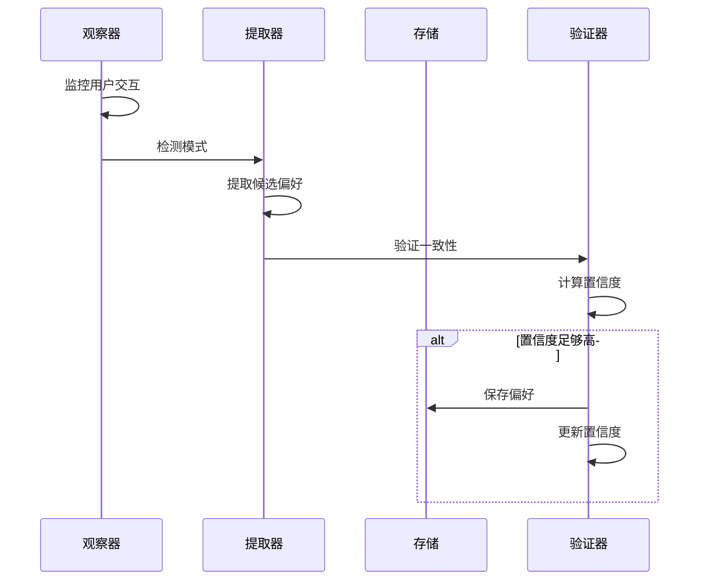

## 记忆重要性评估

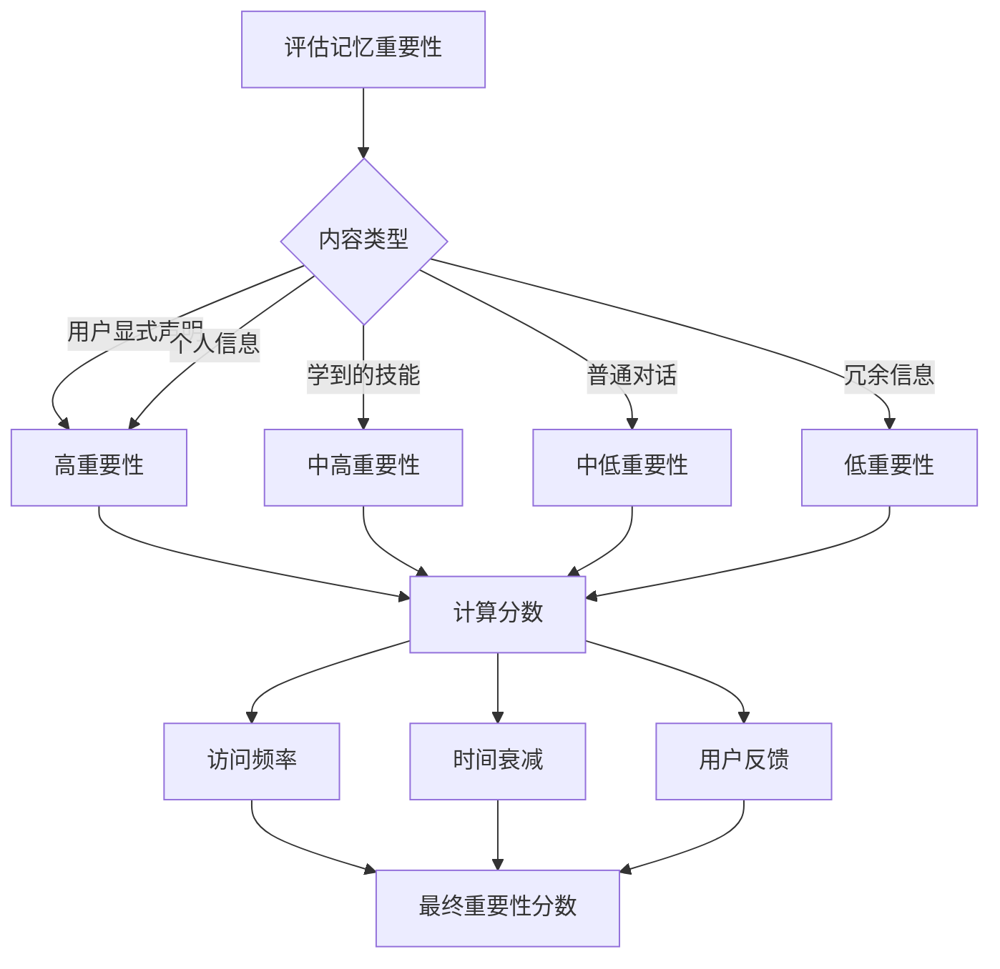

## 记忆老化与遗忘

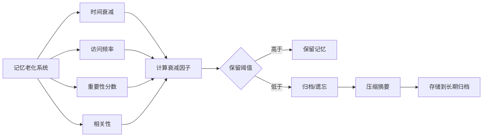

## 会话搜索

### 搜索接口

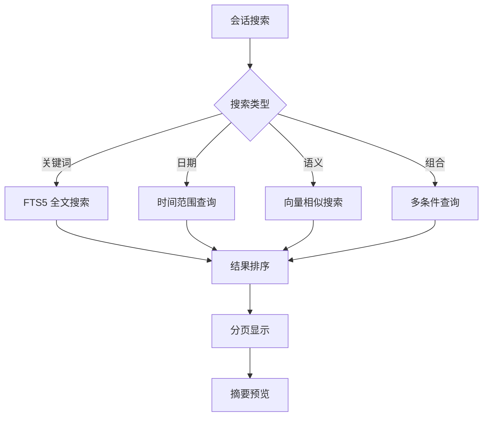

### FTS5 全文搜索

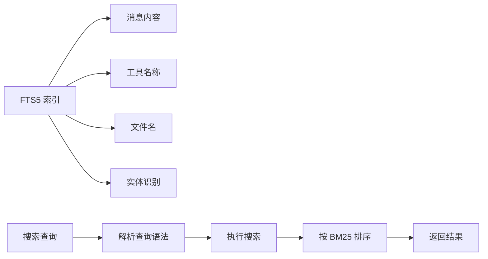

## 外部集成

### Honcho 集成

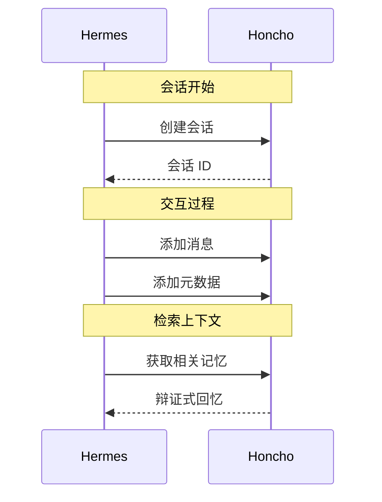

## 记忆工具

### 可用工具

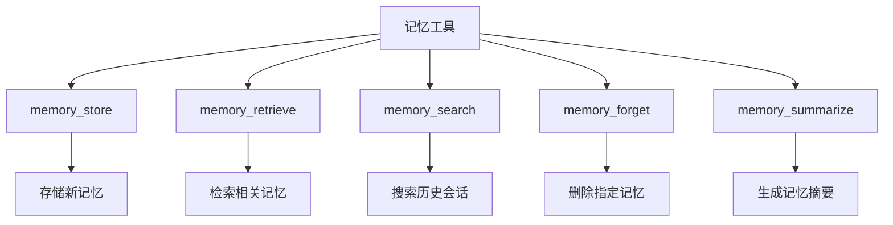

## 记忆分析与洞察

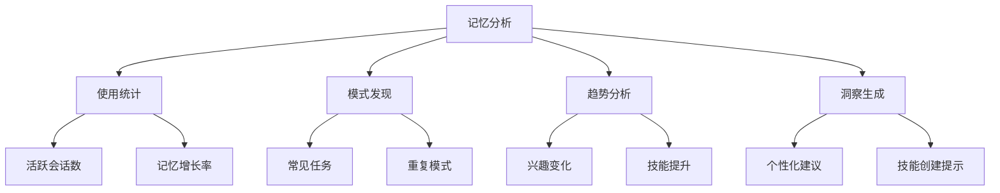

## 相关文档

- [整体架构](./overview.md)
- [对话流程](./conversation-flow.md)
- [技能系统](./skill-system.md)
- [技术栈](../tech-stack.md)
