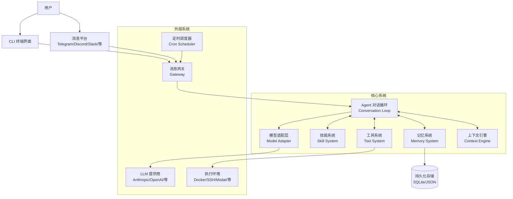
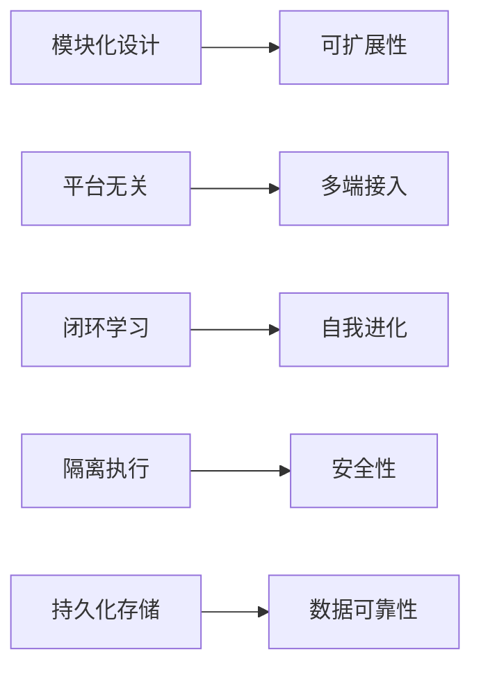
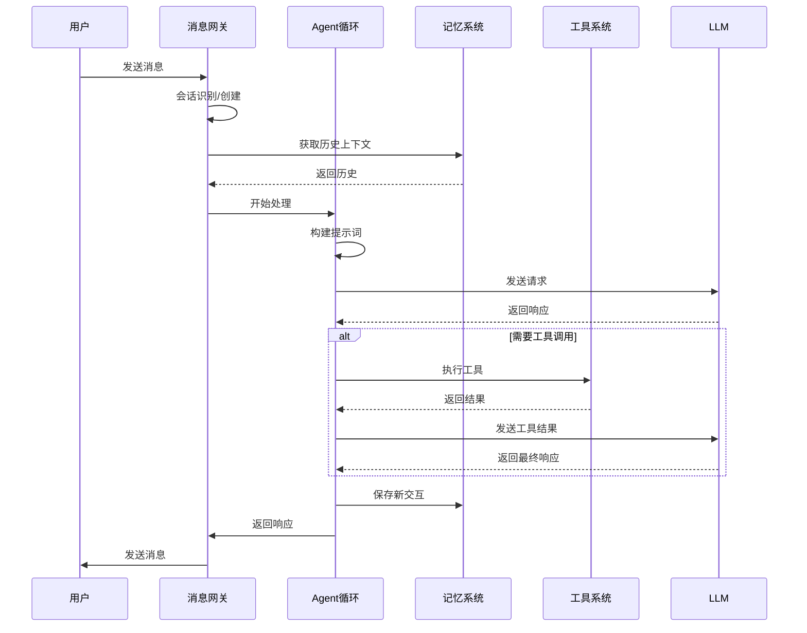
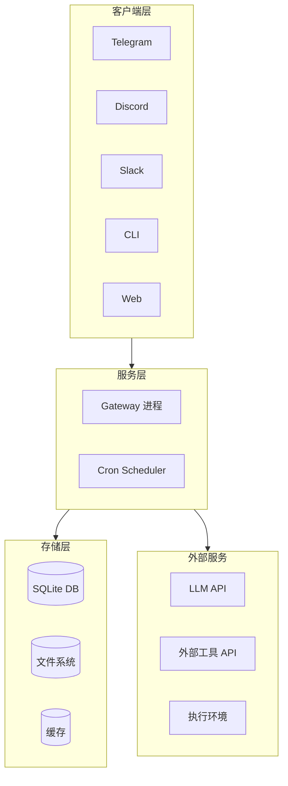

# Hermes Agent 整体架构

## 系统概览

Hermes Agent 是一个自进化 AI 代理系统，采用模块化设计，支持多平台交互、闭环学习、定时自动化等核心功能。

## 核心模块说明

### 1. 消息网关 (Gateway)
- 负责与各种消息平台的连接和通信
- 支持多平台适配器模式
- 管理会话生命周期和消息路由
- 流式传输支持

### 2. Agent 对话循环
- 核心消息处理逻辑
- 协调工具调用和技能执行
- 上下文管理和对话压缩
- 工具调用决策和执行

### 3. 记忆系统
- 跨会话记忆存储和检索
- 用户建模和个性化
- 对话历史摘要
- FTS5 全文搜索支持

### 4. 技能系统
- 技能创建和管理
- 技能改进和优化
- 技能发现和加载
- 过程记忆管理

### 5. 工具系统
- 40+ 内置工具
- 工具执行环境隔离
- 终端后端支持 (Docker/SSH/Modal 等)
- MCP 服务器集成

### 6. 模型适配层
- 支持 200+ 模型
- 多提供商统一接口
- 提示词缓存
- 流式输出支持

## 架构特点

### 关键设计原则

1. **模块化**：各系统独立开发和测试
2. **可扩展**：支持新平台、新模型、新工具的轻松集成
3. **安全隔离**：工具执行在隔离环境中
4. **状态持久化**：会话、记忆、技能均持久化存储
5. **流式优先**：支持实时流式响应
6. **并发安全**：使用 ContextVar 实现任务级状态隔离

## 数据流

## 部署架构

## 相关文档

- [网关架构](./gateway-architecture.md)
- [对话流程](./conversation-flow.md)
- [技能系统](./skill-system.md)
- [记忆系统](./memory-system.md)
- [技术栈](../tech-stack.md)
