# 技能系统架构

本文档详细描述 Hermes Agent 的技能系统，包括技能创建、管理、执行和自我改进的完整机制。

## 技能系统总览

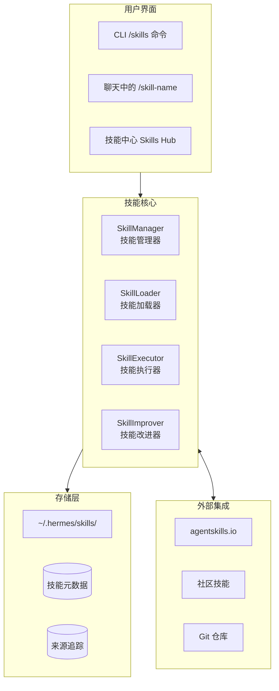

## 技能结构

### 技能目录结构

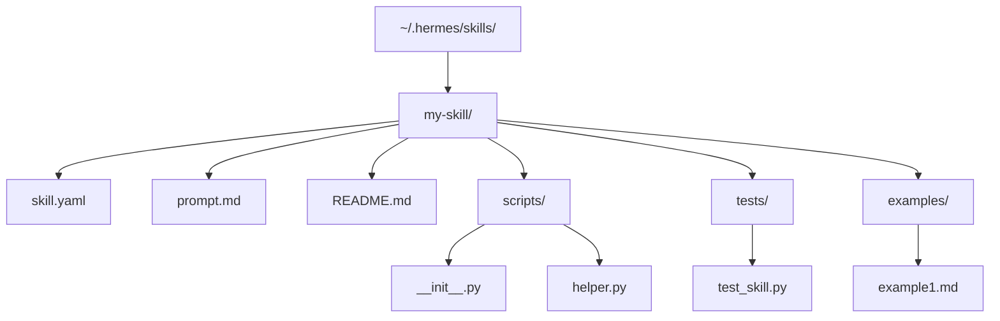

### 技能定义文件 (skill.yaml)

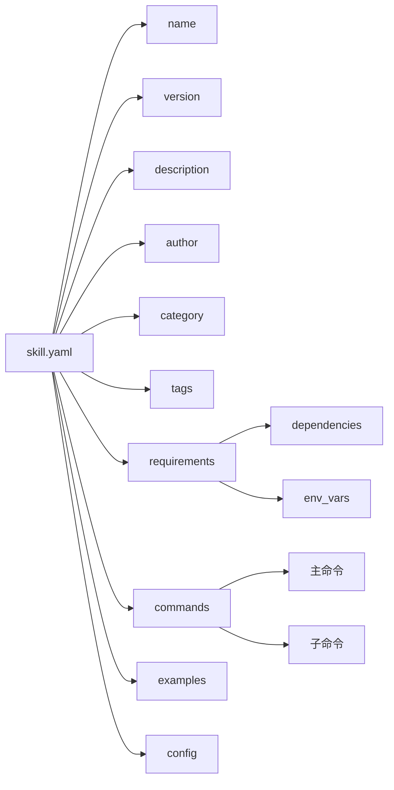

## 技能生命周期

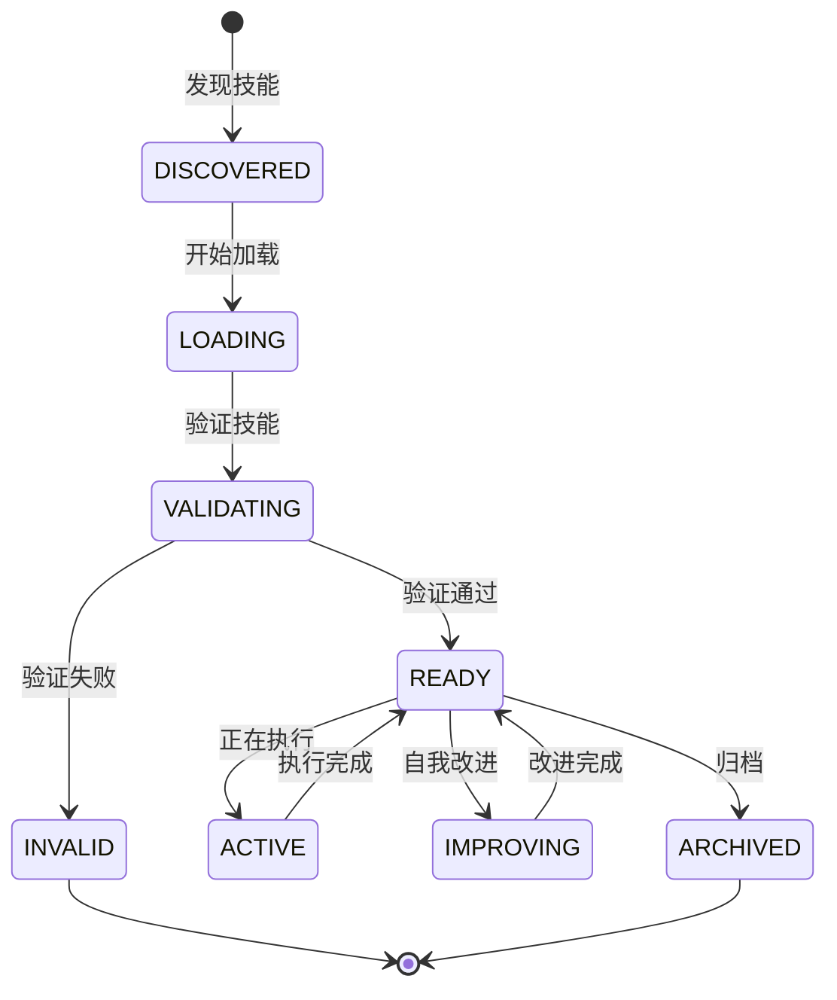

## 技能创建流程

### 自动技能创建

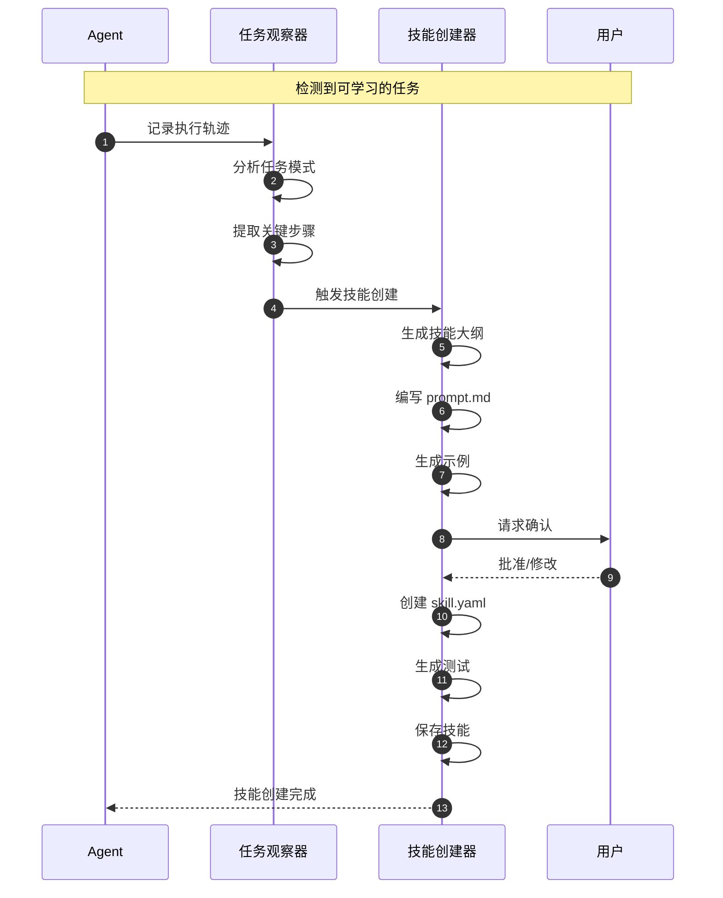

### 手动技能创建

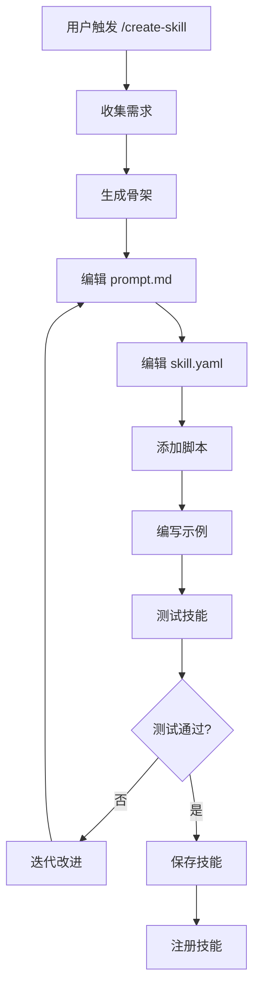

## 技能加载与发现

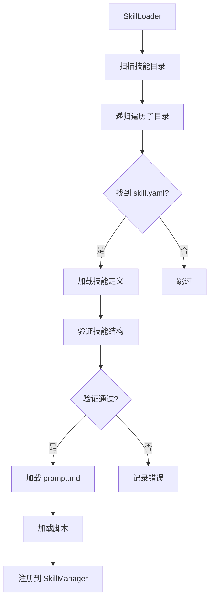

### 技能来源

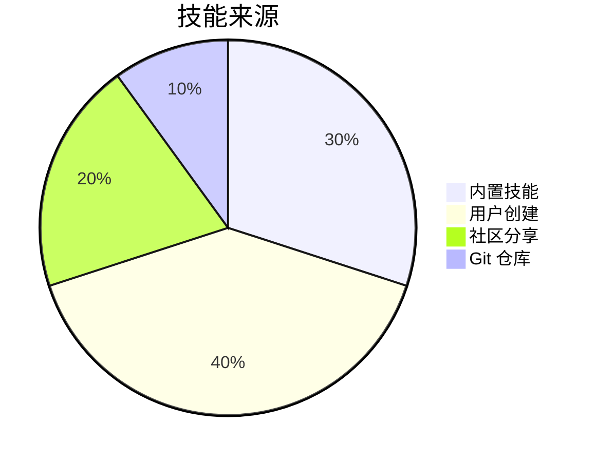

## 技能执行流程

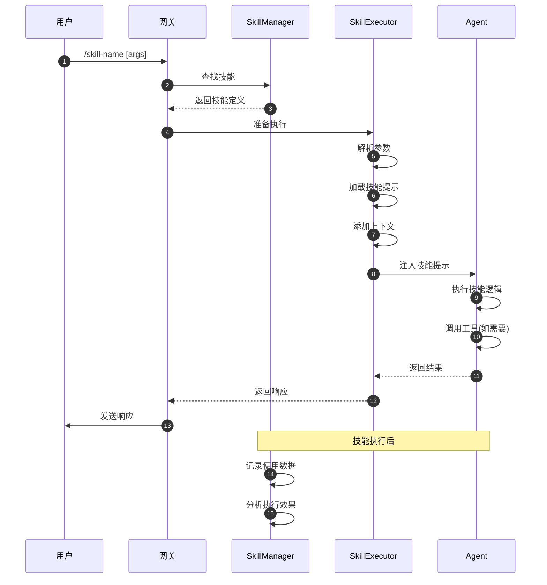

## 技能改进系统

### 改进触发条件

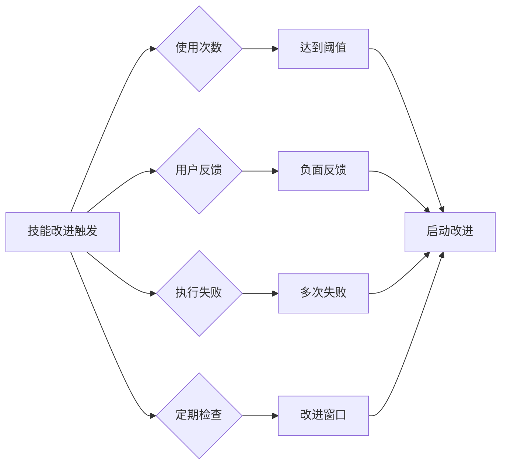

### 自我改进流程

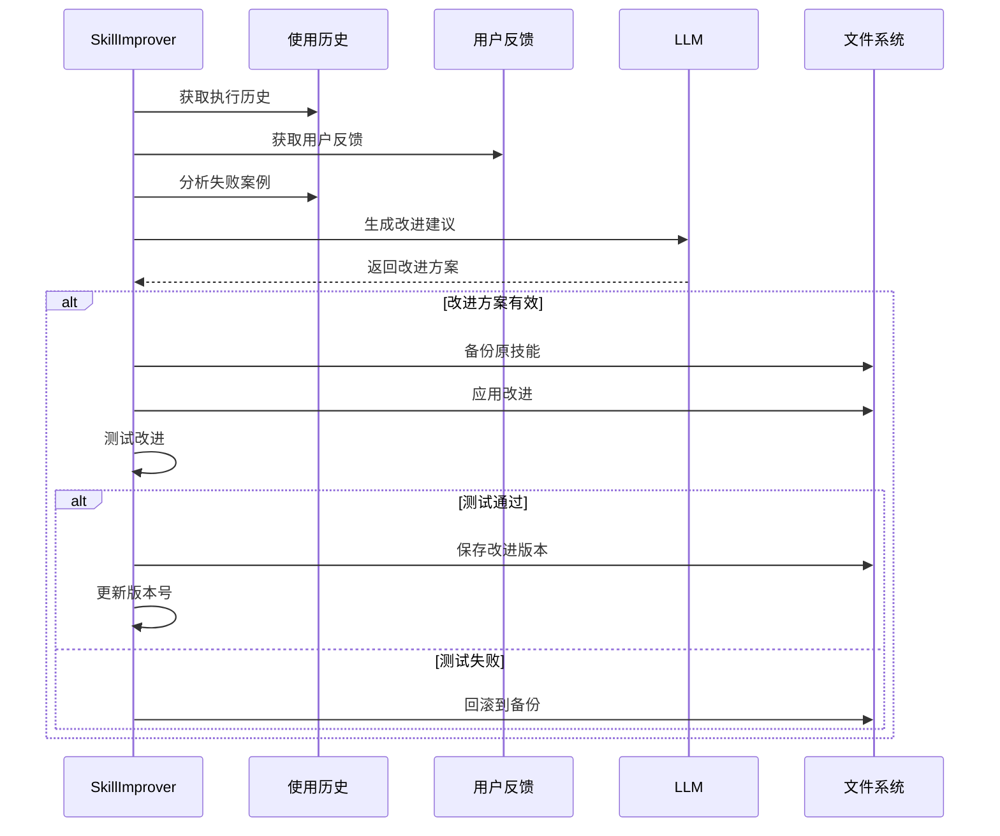

## 技能参数与命令

### 命令定义结构

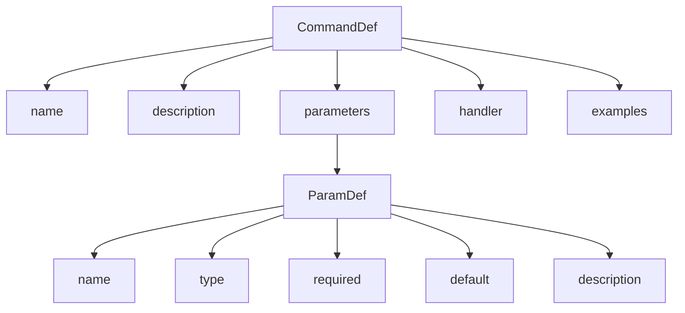

### 参数类型系统

| 类型 | 说明 | 验证 |
|------|------|------|
| `string` | 字符串 | 长度、正则 |
| `number` | 数字 | 范围 |
| `boolean` | 布尔 | 是/否 |
| `enum` | 枚举 | 选项列表 |
| `path` | 文件路径 | 存在性、权限 |
| `url` | URL | 格式、可达性 |
| `json` | JSON | 格式验证 |

## 技能组合与嵌套

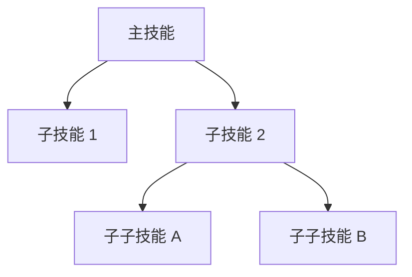

### 技能组合模式

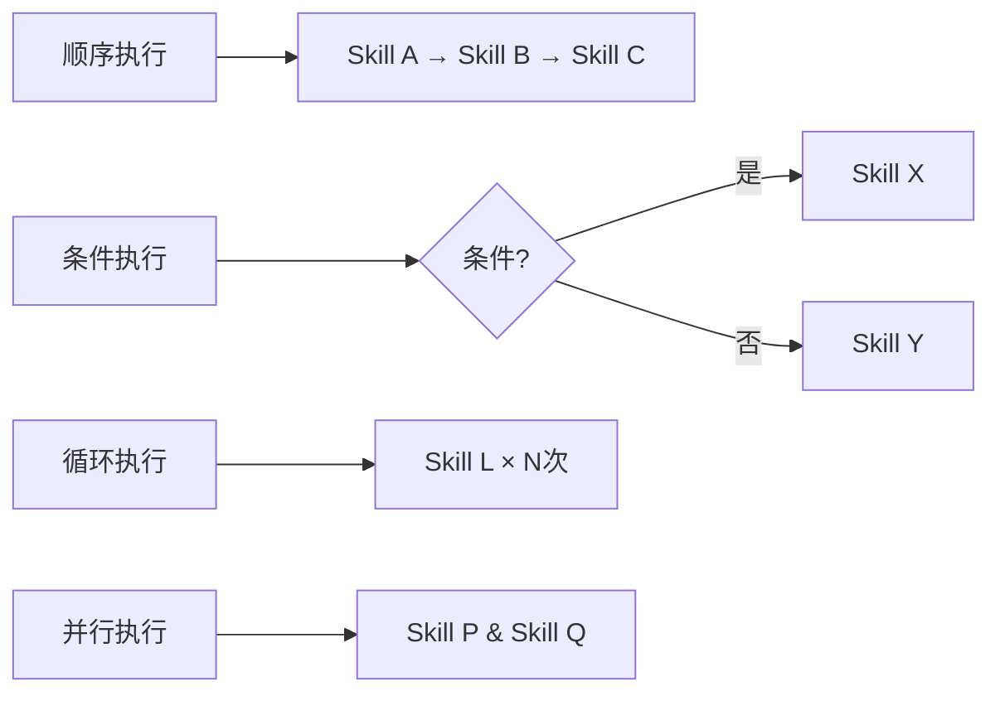

## 技能版本管理

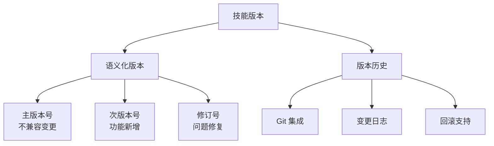

## 技能元数据与分析

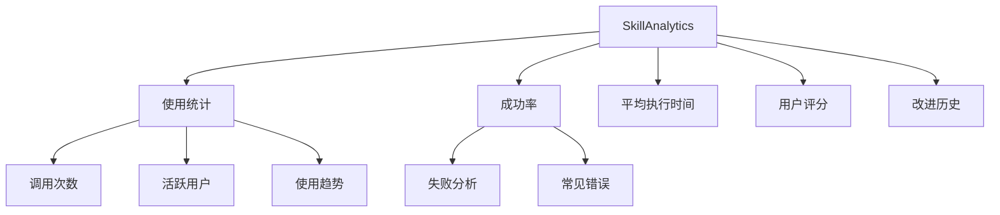

## 技能中心 (Skills Hub)

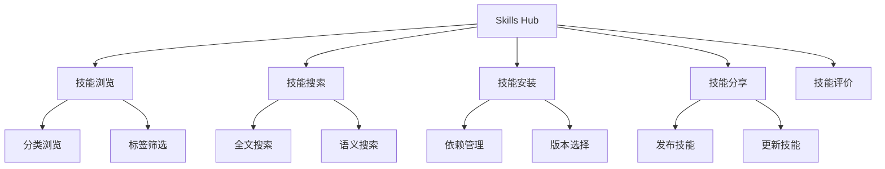

## 技能安全模型

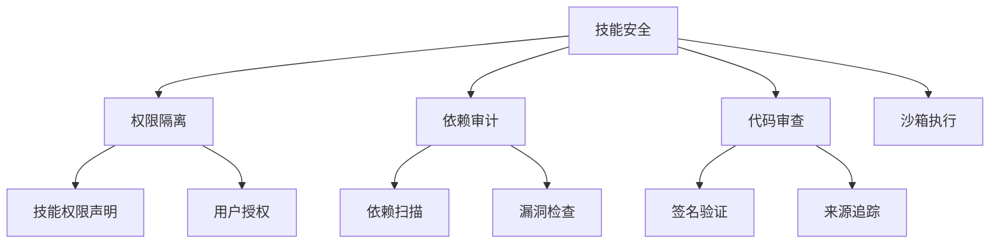

## 相关文档

- [整体架构](./overview.md)
- [工具调用流程](./tool-call-flow.md)
- [记忆系统](./memory-system.md)
- [技术栈](../tech-stack.md)
