# 工具调用流程

本文档详细描述 Hermes Agent 的工具调用系统，包括工具注册、执行、错误处理等完整流程。

## 工具调用总览图

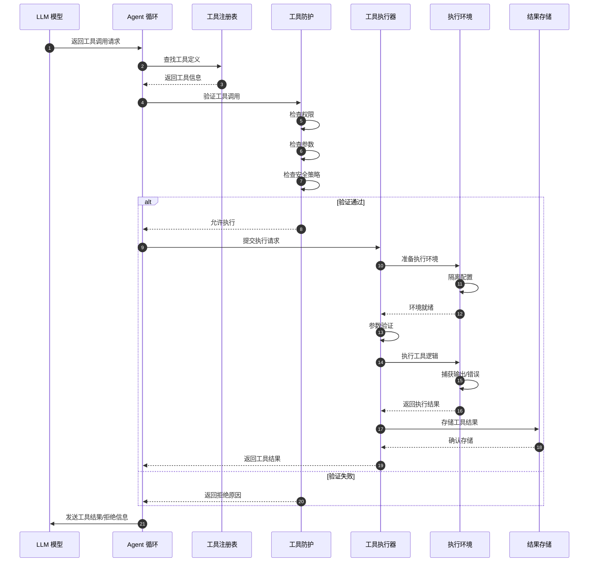

## 工具系统架构

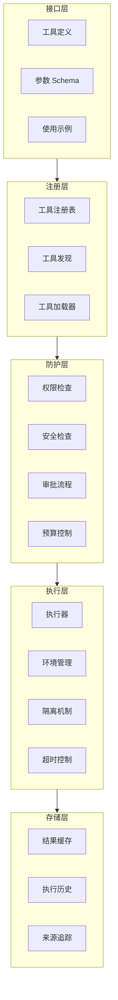

## 工具执行详细流程

### 1. 工具调用请求解析

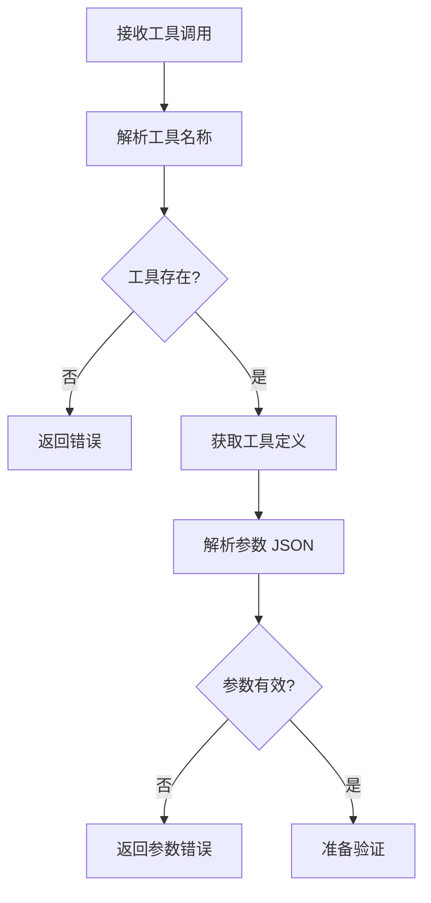

### 2. 安全检查与权限验证

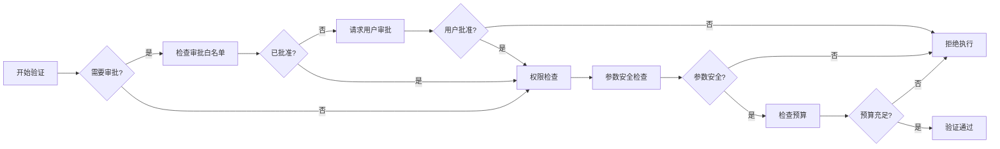

### 3. 执行环境准备

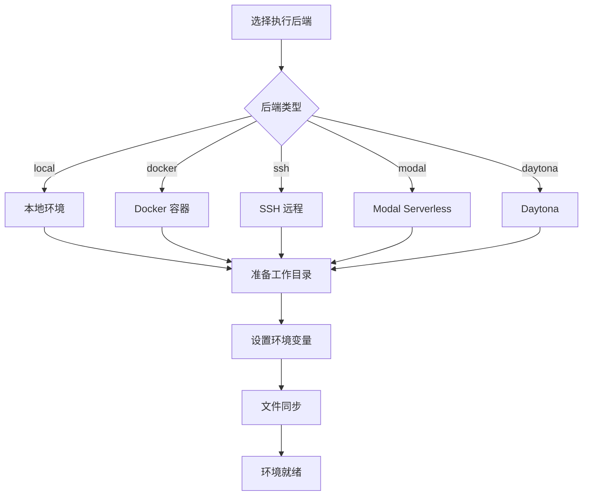

**支持的执行后端：**

| 后端 | 说明 | 隔离级别 |
|------|------|----------|
| `local` | 本地直接执行 | 低 |
| `docker` | Docker 容器 | 高 |
| `ssh` | 远程 SSH 服务器 | 中 |
| `modal` | Modal Serverless | 高 |
| `daytona` | Daytona 开发环境 | 中 |
| `singularity` | Singularity 容器 | 高 |

### 4. 工具执行

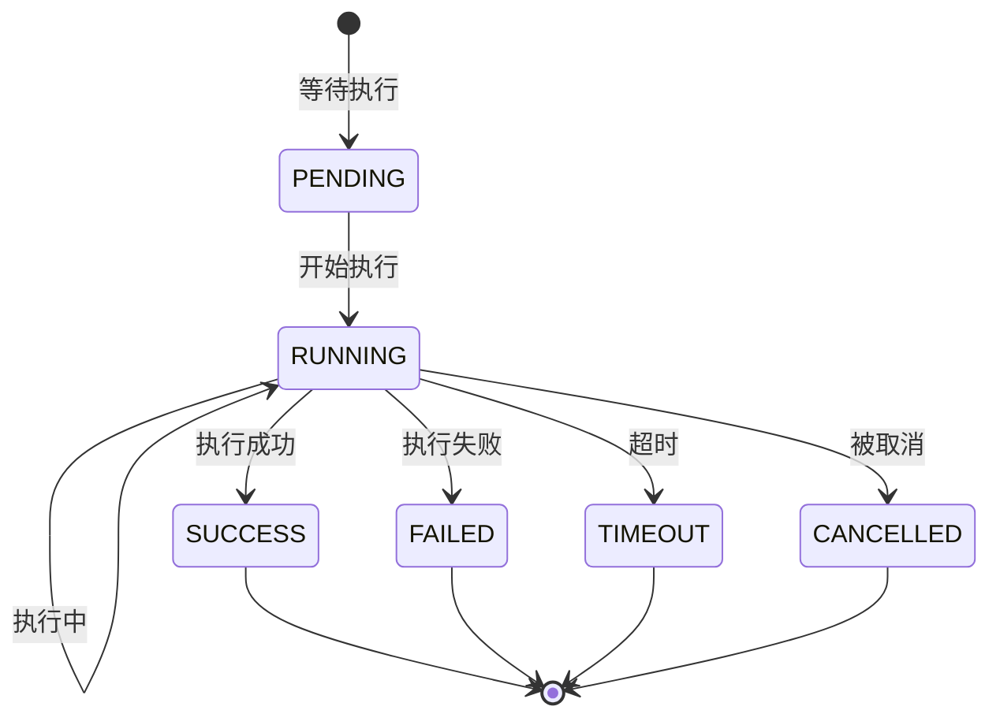

### 5. 结果处理与存储

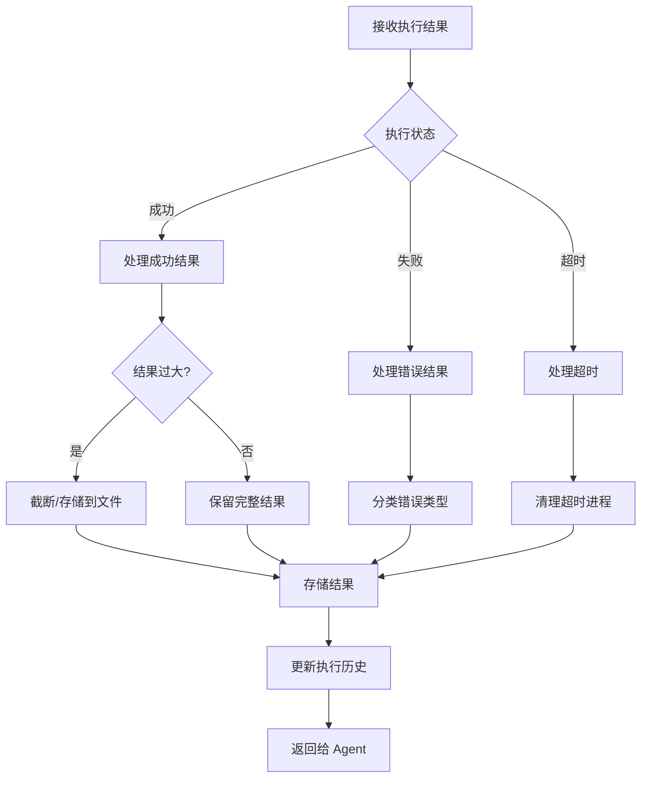

## 内置工具分类

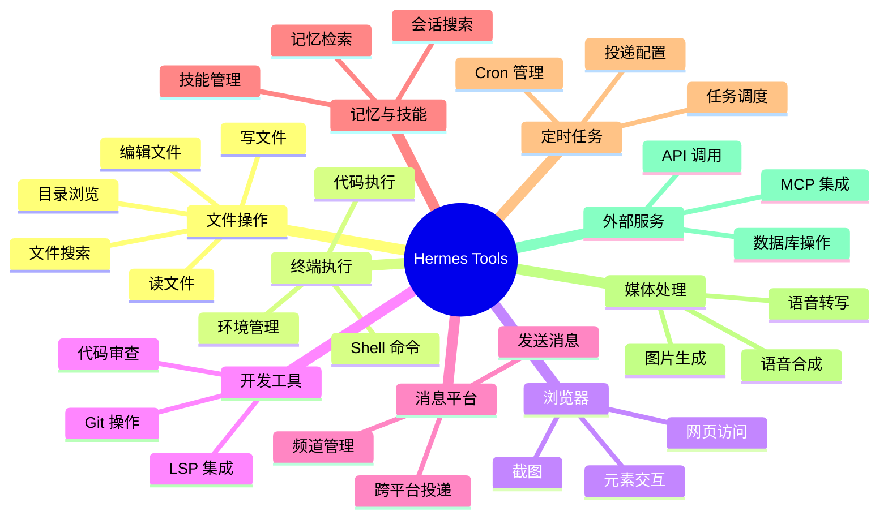

## 工具防护机制

### 安全检查层次

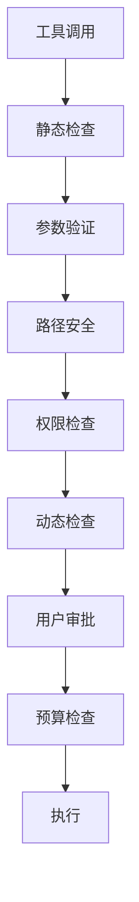

### 安全策略配置

```yaml
# 工具安全配置示例
tools:
  approval:
    # 需要审批的工具
    require_approval_for:
      - terminal
      - file_write
      - delegate
    # 自动批准的模式
    auto_approve_patterns:
      - "ls *"
      - "git status"
  
  # 路径白名单/黑名单
  paths:
    allowed:
      - "~/workspace"
      - "/tmp"
    blocked:
      - "/etc"
      - "~/.ssh"
  
  # 执行限制
  execution:
    timeout_seconds: 300
    max_output_size: "1MB"
    max_memory: "1GB"
```

## MCP 集成流程

Model Context Protocol (MCP) 允许 Hermes 连接外部 MCP 服务器获取更多工具。

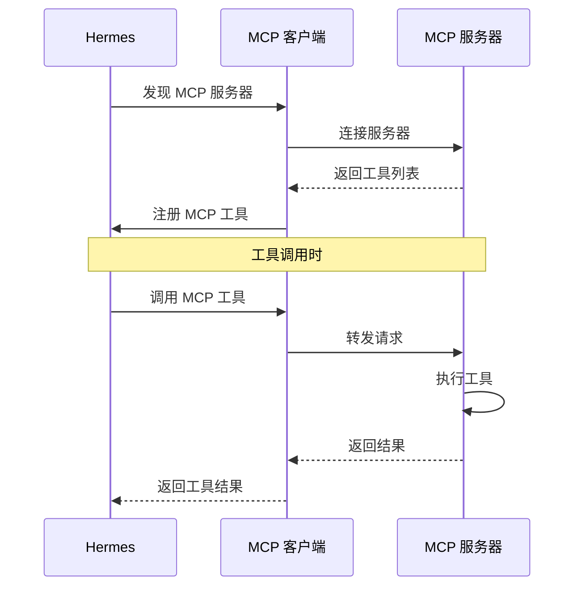

## 错误处理与重试

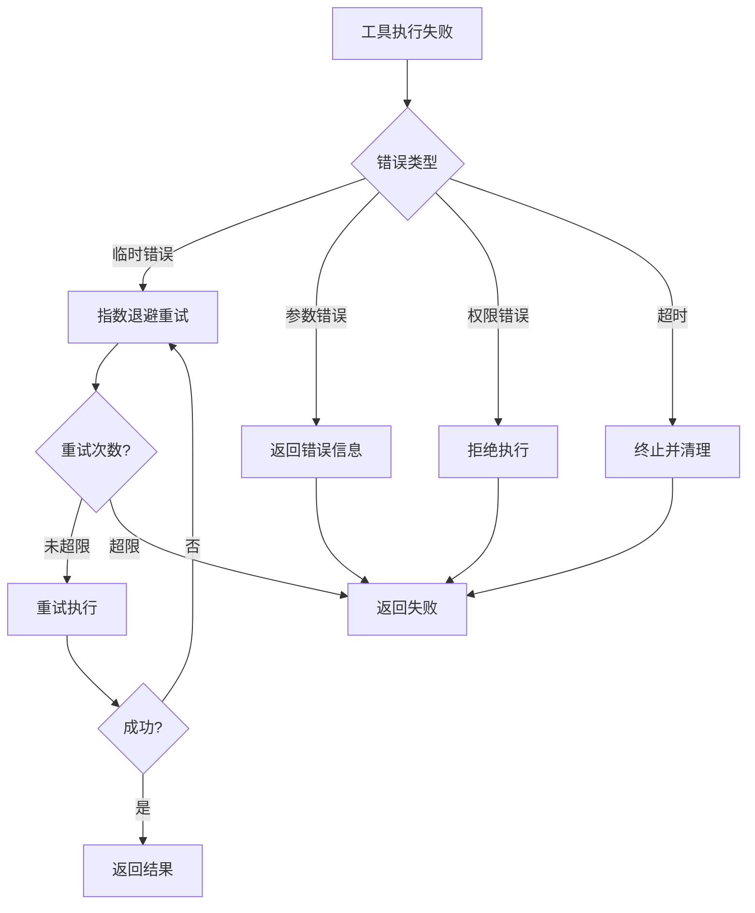

## 工具调用示例

### 示例 1：文件读取工具

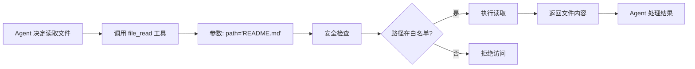

### 示例 2：终端命令执行

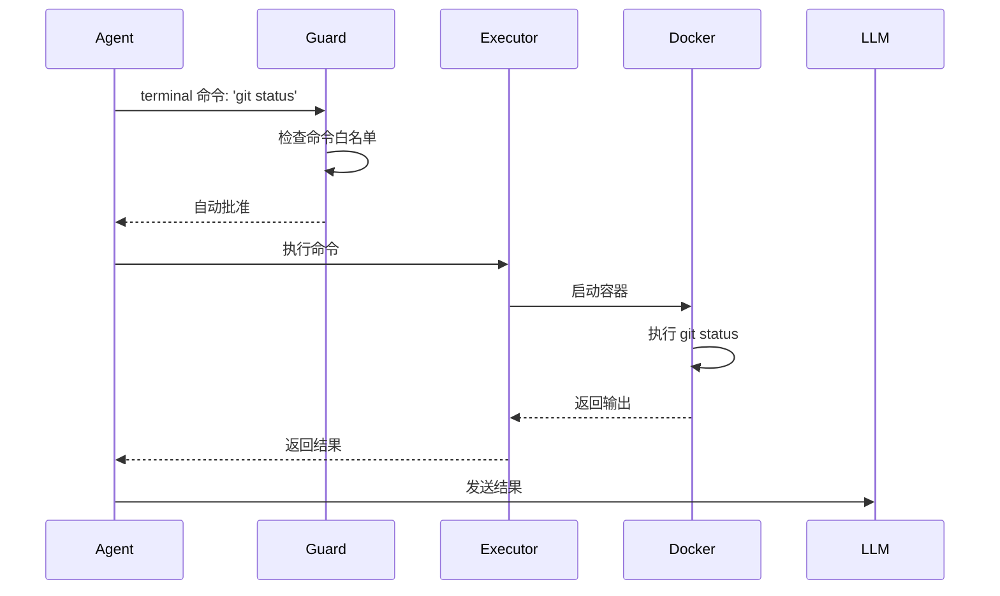

## 工具调试与监控

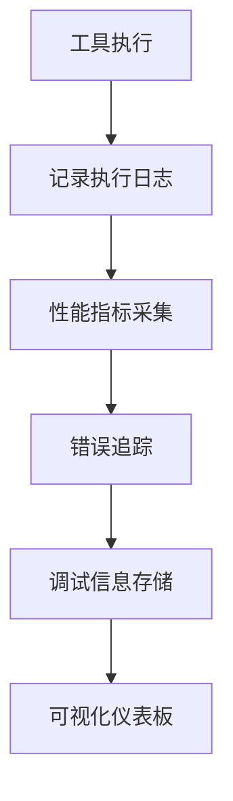

## 相关文档

- [对话流程](./conversation-flow.md)
- [整体架构](./overview.md)
- [技能系统](./skill-system.md)
- [技术栈](../tech-stack.md)
