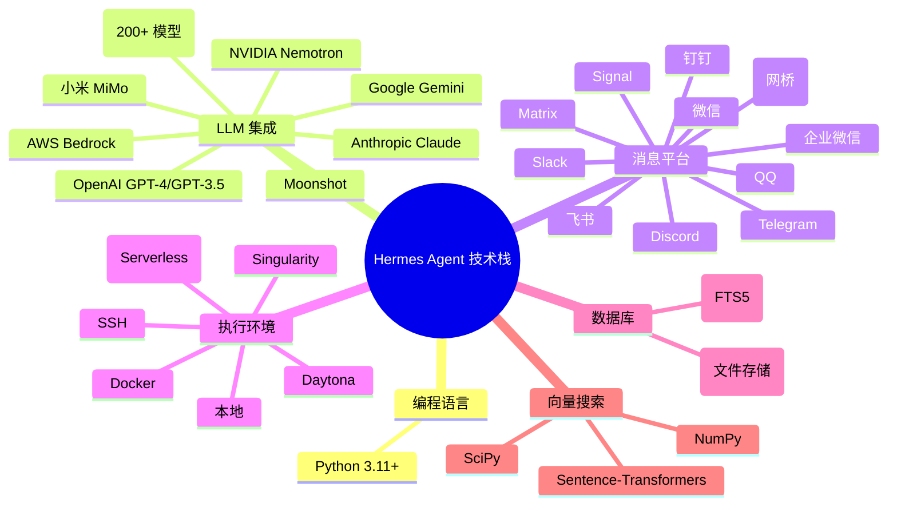

# 技术栈

本文档详细列出 Hermes Agent 项目使用的所有技术、框架、库和工具，包括核心依赖、平台集成、开发工具等各个方面。

## 核心技术栈

## 核心依赖

### LLM & AI 库

| 库 | 版本 | 用途 | 来源 |
|----|------|------|------|
| `anthropic` | `>=0.20.0,<0.30.0` | Anthropic Claude API | PyPI |
| `openai` | `>=1.0.0` | OpenAI API | PyPI |
| `google-generativeai` | 最新 | Google Gemini API | PyPI |
| `boto3` | 最新 | AWS Bedrock | PyPI |
| `sentence-transformers` | 最新 | 向量嵌入 | PyPI |
| `numpy` | `>=1.24.0` | 数值计算 | PyPI |
| `scipy` | `>=1.10.0` | 科学计算 | PyPI |

### 异步 & 并发

| 库 | 版本 | 用途 |
|----|------|------|
| `anyio` | `>=4.0.0` | 异步 I/O 框架 |
| `aiohttp` | `>=3.9.0` | 异步 HTTP 客户端/服务器 |
| `asyncstdlib` | 最新 | 异步标准库扩展 |
| `tenacity` | 最新 | 异步重试 |

### 数据 & 配置

| 库 | 版本 | 用途 |
|----|------|------|
| `pydantic` | `~=2.5.0` | 数据验证 & 设置管理 |
| `pyyaml` | `>=6.0` | YAML 配置解析 |
| `python-json-logger` | 最新 | JSON 格式化日志 |
| `python-dotenv` | 最新 | `.env` 文件支持 |

### 类型系统

| 库 | 版本 | 用途 |
|----|------|------|
| `typing-extensions` | `>=4.8.0` | 类型扩展 |
| `typing-inspect` | 最新 | 类型检查工具 |

## 消息平台依赖

### 即时通讯平台

| 平台 | 库 | 版本 | 用途 |
|------|----|------|------|
| Telegram | `python-telegram-bot` | `>=20.0` | Telegram Bot API |
| Discord | `discord.py` | `>=2.3.0` | Discord Bot |
| Slack | `slack-bolt` | 最新 | Slack Bot 框架 |
| | `slack-sdk` | 最新 | Slack Python SDK |
| Matrix | `matrix-nio` | `>=0.20.0` | Matrix 客户端 |

### 企业 & 其他平台

| 平台 | 库 | 版本 |
|------|----|------|
| 飞书 | `feishu` | 自定义 |
| 企业微信 | `wecom` | 自定义 |
| 钉钉 | `dingtalk` | 自定义 |
| QQ | `qq-botpy` | 最新 |

## 工具执行环境

### 容器 & 虚拟化

| 环境 | 库 | 版本 | 用途 |
|------|----|------|------|
| Docker | `docker` | `>=6.0` | Docker SDK |
| Singularity | `singularity` | 可选 | Singularity 容器 |

### 远程执行

| 环境 | 库 | 版本 |
|------|----|------|
| SSH | `paramiko` | `>=3.0` |
| | `asyncssh` | `>=2.10` |
| Modal | `modal` | 最新 | Serverless 执行 |
| Daytona | `daytona` | 最新 | 开发环境 |

### 浏览器自动化

| 库 | 版本 | 用途 |
|----|------|------|
| `playwright` | `>=1.40.0` | 浏览器自动化 |
| `selenium` | 可选 | 传统浏览器自动化 |

## 数据库 & 存储

### 核心存储

| 技术 | 版本 | 用途 |
|------|------|------|
| SQLite | 内置 | 主数据库 |
| SQLite FTS5 | 内置 | 全文搜索 |
| JSONL | 文件格式 | 会话历史 |

### 可选外部存储

| 库 | 用途 |
|----|------|
| `sqlalchemy` | ORM (可选) |
| `honcho` | 外部记忆管理 |
| `mem0` | 记忆层 (可选) |

## CLI & TUI

### 命令行界面

| 库 | 版本 | 用途 |
|----|------|------|
| `typer` | `>=0.9.0` | CLI 框架 |
| `rich` | `>=13.0.0` | 终端富文本 |
| `shellingham` | 最新 | Shell 检测 |
| `click` | `>=8.0` | 命令组合 (Typer 底层) |

### 终端用户界面

| 库 | 版本 | 用途 |
|----|------|------|
| `textual` | `>=0.40.0` | TUI 框架 |
| `textual-dev` | 最新 | TUI 开发工具 |
| `pygments` | `>=2.16.0` | 语法高亮 |
| `prompt-toolkit` | `>=3.0.0` | 交互式提示 |

## 媒体处理

### 图像 & 视频

| 库 | 版本 | 用途 |
|----|------|------|
| `Pillow` | `>=10.0.0` | 图像处理 |
| `opencv-python` | 可选 | 视频处理 |
| `imageio` | 可选 | 图像读写 |

### 语音处理

| 库 | 版本 | 用途 |
|----|------|------|
| `openai` | 最新 | Whisper STT / TTS |
| `elevenlabs` | 可选 | ElevenLabs TTS |
| `pyaudio` | 可选 | 音频录制/播放 |

## 开发工具

### 代码质量

| 工具 | 版本 | 用途 |
|------|------|------|
| `black` | `==23.12.1` | 代码格式化 |
| `isort` | `==5.13.2` | 导入排序 |
| `mypy` | `==1.8.0` | 静态类型检查 |
| `ruff` | `==0.1.9` | 快速 linter |
| `pre-commit` | 最新 | Git hooks 管理 |

### 测试框架

| 工具 | 版本 | 用途 |
|------|------|------|
| `pytest` | `==7.4.3` | 测试框架 |
| `pytest-asyncio` | `==0.21.1` | 异步测试 |
| `pytest-cov` | `==4.1.0` | 覆盖率报告 |
| `pytest-mock` | 最新 | Mock 支持 |
| `hypothesis` | 最新 | 基于属性的测试 |
| `responses` | 最新 | HTTP 响应 Mock |

### 文档工具

| 工具 | 版本 | 用途 |
|------|------|------|
| `mkdocs` | 最新 | 文档站点生成 |
| `mkdocs-material` | 最新 | Material 主题 |
| `mkdocstrings` | 最新 | 自动 API 文档 |

### 构建 & 发布

| 工具 | 版本 | 用途 |
|------|------|------|
| `build` | 最新 | 构建包 |
| `twine` | 最新 | 发布到 PyPI |
| `wheel` | 最新 | Wheel 包格式 |
| `uv` | 最新 | 现代 Python 包管理 |

## 安全 & 加密

| 库 | 用途 |
|----|------|
| `cryptography` | 加密原语 |
| `tirith` | 安全策略引擎 |
| `python-jose` | JWT 处理 (可选) |
| `keyring` | 系统密钥环 (可选) |

## 网络 & API

| 库 | 版本 | 用途 |
|----|------|------|
| `httpx` | `>=0.25.0` | 现代 HTTP 客户端 |
| `requests` | `>=2.31.0` | HTTP 客户端 (兼容) |
| `websockets` | 最新 | WebSocket 支持 |
| `mcp` | 最新 | Model Context Protocol |

## Git & 版本控制

| 工具 | 用途 |
|------|------|
| `gitpython` | Git 操作 (可选) |
| `python-semver` | 语义化版本 |

## 外部服务集成

### AI 服务

| 服务 | 用途 |
|------|------|
| Anthropic Claude | 主要 LLM |
| OpenAI GPT-4/GPT-3.5 | 可选 LLM |
| OpenRouter | 多模型聚合 |
| NVIDIA Nemotron | NVIDIA 模型 |
| Nous Portal | Nous 模型门户 |
| Google Gemini | Google 模型 |
| AWS Bedrock | Amazon AI 服务 |

### 媒体服务

| 服务 | 用途 |
|------|------|
| OpenAI Whisper | 语音转文字 |
| OpenAI TTS | 文字转语音 |
| ElevenLabs | 高质量 TTS |
| DALL-E 3 | 图像生成 |
| Stable Diffusion | 图像生成 (可选) |

### 开发者工具

| 服务 | 用途 |
|------|------|
| Sentry | 错误追踪 (可选) |
| LangSmith | LLM 调试 (可选) |
| LangFuse | LLM 可观测性 (可选) |

## 开发环境

### 推荐工具

| 工具 | 用途 |
|------|------|
| `uv` | 现代包管理器 |
| `direnv` | 环境变量管理 |
| `pyenv` | Python 版本管理 |
| `docker` | 容器化开发 |
| `vscode` | 推荐编辑器 |

### VS Code 扩展

| 扩展 | 用途 |
|------|------|
| Python | Python 支持 |
| Pylance | 类型检查 |
| Black Formatter | 代码格式化 |
| Ruff | Linting |
| Material Icon Theme | 图标 |

## 部署技术

### 容器化

| 技术 | 用途 |
|------|------|
| Docker | 容器化部署 |
| Docker Compose | 本地编排 |
| Kubernetes | 生产编排 (可选) |

### Serverless

| 平台 | 用途 |
|------|------|
| Modal | Serverless 执行 |
| AWS Lambda | 无服务器部署 (可选) |

### CI/CD

| 平台 | 用途 |
|------|------|
| GitHub Actions | CI/CD 流水线 |
| Dependabot | 依赖自动更新 |

## 监控 & 可观测性

| 工具 | 用途 |
|------|------|
| `logging` | 标准库日志 |
| `structlog` | 结构化日志 (可选) |
| `prometheus-client` | 指标 (可选) |

## 可选增强依赖

### 记忆增强

| 库 | 用途 |
|----|------|
| `chromadb` | 向量数据库 (可选) |
| `qdrant-client` | 向量数据库 (可选) |
| `pinecone` | 向量数据库 (可选) |

### 技能增强

| 库 | 用途 |
|----|------|
| `crewai` | 多代理协作 (可选) |
| `langchain` | LLM 应用框架 (可选) |

### 工作流

| 库 | 用途 |
|----|------|
| `prefect` | 工作流编排 (可选) |
| `temporal` | 持久化工作流 (可选) |

## Python 版本支持

| Python 版本 | 支持状态 | 说明 |
|--------------|----------|------|
| 3.13 | ✅ 推荐 | 最新稳定 |
| 3.12 | ✅ 支持 | 稳定 |
| 3.11 | ✅ 支持 | 最低 |
| 3.10 | ❌ 不支持 | EOL |
| 3.9 | ❌ 不支持 | EOL |

## 操作系统支持

| OS | 支持状态 | 说明 |
|----|----------|------|
| Linux | ✅ 完全支持 | 推荐 Ubuntu 22.04+ |
| macOS | ✅ 完全支持 | 11.0+ |
| Windows | ⚠️ WSL2 | 原生不支持，使用 WSL2 |
| Android | ✅ Termux | 部分功能 |

## 相关文档

- [整体架构](./architecture/overview.md)
- [依赖关系](./architecture/dependencies.md)
- [目录结构](./architecture/directory-tree.md)
