# Hermes Agent 技术调研报告

## 执行摘要

本报告汇总了 Hermes Agent 所有核心模块的技术调研结果。Hermes Agent 是一个由 Nous Research 构建的自进化 AI 代理系统，采用模块化架构设计，支持多平台交互、闭环学习、定时自动化等核心功能。

### 核心特性

- **自进化能力**：从经验中创建技能，在使用中改进技能
- **多平台支持**：CLI、Telegram、Discord、Slack、微信等 15+ 平台
- **强大工具生态**：40+ 内置工具，支持多种执行环境
- **闭环学习**：跨会话记忆、用户建模、技能自我改进
- **定时自动化**：内置 cron 调度器，支持自然语言任务定义

---

## 1. 核心代理引擎

### 1.1 架构概述

Hermes Agent 的核心是一个基于 LLM 的对话循环系统，采用模块化设计，各组件之间通过清晰的接口进行交互。

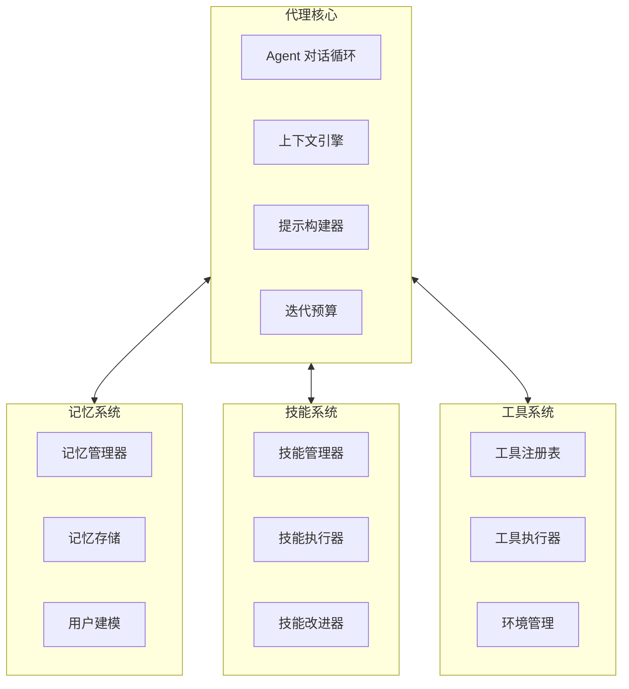

### 1.2 Agent 对话循环

Agent 对话循环是系统的核心处理单元，负责协调整个消息处理流程。

**关键组件：**
- `agent/conversation_loop.py` - 主循环实现
- `agent/context_engine.py` - 上下文管理
- `agent/prompt_builder.py` - 提示词构建
- `agent/tool_executor.py` - 工具执行协调

**处理流程：**
1. 接收用户消息并构建上下文
2. 发送提示词到 LLM
3. 处理 LLM 响应（可能包含工具调用）
4. 执行工具并收集结果
5. 迭代直到生成最终响应
6. 保存交互记录和更新记忆

**迭代预算机制：**
- 默认最大迭代次数：20-30 步
- 可配置的迭代限制
- 自动检测循环和停滞
- 支持手动中断 (`/stop` 命令)

### 1.3 上下文引擎

上下文引擎负责构建和管理发送给 LLM 的完整提示词。

**上下文组成：**
- 系统提示词（核心指令）
- 人格设定（SOUL.md）
- 对话历史（最近 N 轮）
- 上下文文件（项目相关文件）
- 平台特定提示
- 频道上下文
- 技能相关提示

**上下文压缩策略：**
- 保留最近 N 轮对话
- 摘要早期消息
- 保留系统消息
- 保留关键工具调用
- 验证总长度不超过模型限制

### 1.4 模型适配层

支持多种 LLM 提供商和模型：

| 提供商 | 特点 |
|--------|------|
| Anthropic Claude | 原生支持，推荐使用 |
| OpenAI GPT-4/GPT-3.5 | 完全兼容 |
| OpenRouter | 200+ 模型聚合 |
| NVIDIA Nemotron | NVIDIA 模型 |
| Nous Portal | Nous 模型门户 |
| Google Gemini | Google AI Studio |
| AWS Bedrock | Amazon AI 服务 |
| 小米 MiMo | 小米模型 |
| Moonshot | Moonshot AI |

**提示缓存：** 支持提示词缓存，提升重复请求效率
**流式输出：** 完整的流式输出支持，包括增量更新和编辑模式

---

## 2. CLI 模块

### 2.1 架构设计

CLI 模块提供命令行界面和终端用户界面 (TUI)。

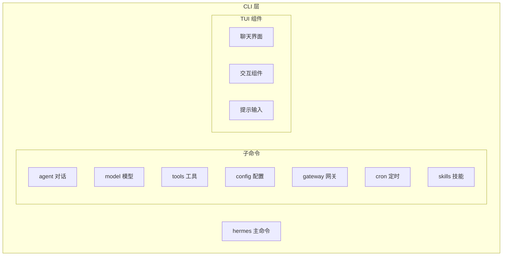

### 2.2 核心命令

| 命令 | 说明 |
|------|------|
| `hermes` | 启动交互式 TUI 对话 |
| `hermes model` | 选择 LLM 提供商和模型 |
| `hermes tools` | 配置启用的工具 |
| `hermes config` | 管理配置项 |
| `hermes gateway` | 管理消息网关 |
| `hermes cron` | 管理定时任务 |
| `hermes skills` | 管理技能 |
| `hermes setup` | 运行完整设置向导 |
| `hermes doctor` | 诊断环境问题 |
| `hermes update` | 更新到最新版本 |

### 2.3 TUI 特性

- **多行编辑**：支持多行文本输入
- **斜杠命令自动补全**：输入 `/` 显示可用命令
- **对话历史**：滚动查看历史对话
- **中断重定向**：`Ctrl+C` 中断当前操作
- **流式工具输出**：实时显示工具执行输出
- **富文本渲染**：Markdown、代码高亮等

### 2.4 配置管理

配置文件位置：`~/.hermes/config.yaml`

**配置优先级：**
1. 环境变量
2. 用户配置文件 (`~/.hermes/config.yaml`)
3. 默认配置

---

## 3. 工具系统

### 3.1 系统架构

工具系统采用分层架构，提供安全、灵活的工具执行能力。

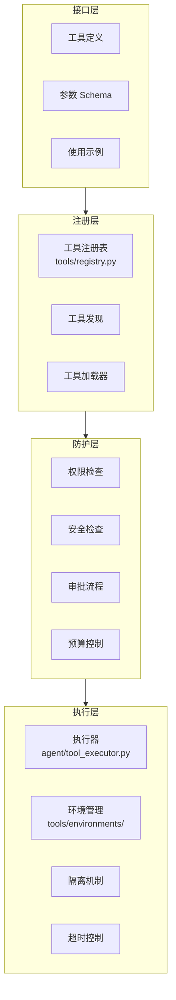

### 3.2 内置工具分类

#### 3.2.1 文件操作
- `file_read` - 读取文件
- `file_write` - 写入文件
- `file_edit` - 编辑文件（SEDR/补丁模式）
- `file_search` - 文件搜索
- `list_dir` - 目录浏览

#### 3.2.2 终端执行
- `terminal` - Shell 命令执行
- `python` - Python 代码执行
- `env_manage` - 环境管理

#### 3.2.3 浏览器工具
- `browser_navigate` - 网页访问
- `browser_click` - 元素点击
- `browser_type` - 文本输入
- `browser_screenshot` - 截图

#### 3.2.4 开发工具
- `git_*` - Git 操作系列
- `lsp_*` - LSP 集成系列
- `code_review` - 代码审查

#### 3.2.5 消息平台
- `send_message` - 发送消息
- `list_channels` - 频道管理
- `cross_platform_deliver` - 跨平台投递

#### 3.2.6 记忆与技能
- `memory_*` - 记忆管理系列
- `skill_*` - 技能管理系列
- `session_search` - 会话搜索

#### 3.2.7 定时任务
- `cron_*` - Cron 管理系列
- `schedule_task` - 任务调度

#### 3.2.8 媒体处理
- `image_generate` - 图片生成
- `transcribe_audio` - 语音转写
- `synthesize_speech` - 语音合成

#### 3.2.9 外部服务
- `api_call` - API 调用
- `mcp_*` - MCP 集成系列
- `db_*` - 数据库操作系列

### 3.3 执行环境后端

| 后端 | 说明 | 隔离级别 | 文件位置 |
|------|------|----------|----------|
| `local` | 本地直接执行 | 低 | `tools/environments/local.py` |
| `docker` | Docker 容器 | 高 | `tools/environments/docker.py` |
| `ssh` | 远程 SSH 服务器 | 中 | `tools/environments/ssh.py` |
| `modal` | Modal Serverless | 高 | `tools/environments/modal.py` |
| `daytona` | Daytona 开发环境 | 中 | `tools/environments/daytona.py` |
| `singularity` | Singularity 容器 | 高 | `tools/environments/singularity.py` |

### 3.4 安全防护机制

#### 3.4.1 多层安全检查
1. **静态检查**：工具存在性、参数验证
2. **路径安全**：检查文件路径是否在白名单内
3. **权限检查**：用户权限验证
4. **动态检查**：运行时安全策略
5. **用户审批**：敏感操作需要用户确认
6. **预算检查**：资源使用限制

#### 3.4.2 安全配置示例

```yaml
tools:
  approval:
    require_approval_for:
      - terminal
      - file_write
      - delegate
    auto_approve_patterns:
      - "ls *"
      - "git status"
  
  paths:
    allowed:
      - "~/workspace"
      - "/tmp"
    blocked:
      - "/etc"
      - "~/.ssh"
  
  execution:
    timeout_seconds: 300
    max_output_size: "1MB"
    max_memory: "1GB"
```

### 3.5 MCP (Model Context Protocol) 集成

支持连接外部 MCP 服务器以扩展工具能力。

**集成流程：**
1. 发现 MCP 服务器配置
2. 连接到 MCP 服务器
3. 获取工具列表并注册
4. 转发工具调用请求
5. 处理返回结果

---

## 4. 消息网关

### 4.1 架构概述

消息网关是 Hermes Agent 的多平台接入层，负责连接各种消息平台并管理会话。

```mermaid
graph TB
    subgraph External[外部平台]
        Telegram[Telegram]
        Discord[Discord]
        Slack[Slack]
        Signal[Signal]
        Matrix[Matrix]
        WeChat[微信]
        Other[其他平台...]
    end
    
    subgraph Gateway[网关核心]
        GatewayRunner[GatewayRunner<br>gateway/run.py]
        SessionStore[SessionStore<br>gateway/session.py]
        DeliveryRouter[DeliveryRouter<br>gateway/delivery.py]
        HookRegistry[HookRegistry<br>gateway/hooks.py]
        PlatformRegistry[PlatformRegistry<br>gateway/platform_registry.py]
        StreamConsumer[StreamConsumer<br>gateway/stream_consumer.py]
    end
    
    subgraph Adapters[平台适配器]
        BaseAdapter[BasePlatformAdapter<br>gateway/platforms/base.py]
        TelegramAdapter[TelegramAdapter]
        DiscordAdapter[DiscordAdapter]
        SlackAdapter[SlackAdapter]
        OtherAdapter[其他适配器...]
    end
    
    External --> Adapters
    Adapters --> Gateway
    BaseAdapter <|-- TelegramAdapter
    BaseAdapter <|-- DiscordAdapter
    BaseAdapter <|-- SlackAdapter
    BaseAdapter <|-- OtherAdapter
```

### 4.2 支持的平台

#### 4.2.1 即时通讯平台

| 平台 | 状态 | 特殊功能 | 适配器文件 |
|------|------|----------|------------|
| Telegram | ✅ 完全支持 | Forum Topics、流式传输预览、按钮 | `gateway/platforms/telegram.py` |
| Discord | ✅ 完全支持 | 线程、按钮交互、频道技能绑定 | `gateway/platforms/discord.py` |
| Slack | ✅ 完全支持 | Assistant API、线程、按钮 | `gateway/platforms/slack.py` |
| Signal | ✅ 完全支持 | 加密消息、群聊 | `gateway/platforms/signal.py` |
| Matrix | ✅ 完全支持 | 加密消息、房间 | `gateway/platforms/matrix.py` |
| WhatsApp | ✅ 支持 | 通过网桥 | `gateway/platforms/whatsapp.py` |
| 微信 | ✅ 完全支持 | 个人微信、群聊 | `gateway/platforms/weixin.py` |
| 元宝 | ✅ 完全支持 | 元宝、私信/群聊 | `gateway/platforms/yuanbao.py` |
| QQ Bot | ✅ 完全支持 | QQ 机器人、私信/群聊 | `gateway/platforms/qqbot.py` |
| 飞书 | ✅ 完全支持 | 富文本、按钮 | `gateway/platforms/feishu.py` |
| 企业微信 | ✅ 完全支持 | 应用回调 | `gateway/platforms/wecom.py` |
| 钉钉 | ✅ 完全支持 | AI 卡片 | `gateway/platforms/dingtalk.py` |
| Mattermost | ✅ 完全支持 | 群聊、频道 | `gateway/platforms/mattermost.py` |
| BlueBubbles | ✅ 完全支持 | iMessage 网桥 | `gateway/platforms/bluebubbles.py` |

#### 4.2.2 其他平台

| 平台 | 用途 |
|------|------|
| Local | CLI 本地交互 |
| Email | 邮件收发 |
| SMS | 短信 (Twilio) |
| ApiServer | HTTP API 服务 |
| Webhook | Webhook 接收 |
| MsGraphWebhook | Microsoft Graph Webhook |
| HomeAssistant | 智能家居 |

### 4.3 核心组件详解

#### 4.3.1 BasePlatformAdapter

所有平台适配器的基类，定义统一接口。

**主要方法：**
```python
class BasePlatformAdapter(ABC):
    async def connect(self) -> bool:
        """连接到平台并开始接收消息"""
    
    async def disconnect(self) -> None:
        """断开与平台的连接"""
    
    async def send(
        self,
        chat_id: str,
        content: str,
        reply_to: Optional[str] = None,
        metadata: Optional[Dict[str, Any]] = None
    ) -> SendResult:
        """发送消息到聊天"""
    
    async def send_image(self, chat_id: str, image_url: str, caption: Optional[str] = None):
        """发送图片"""
    
    async def send_voice(self, chat_id: str, audio_path: str, caption: Optional[str] = None):
        """发送语音消息"""
    
    async def send_document(self, chat_id: str, file_path: str, caption: Optional[str] = None):
        """发送文档"""
```

#### 4.3.2 GatewayConfig

网关配置管理器 (`gateway/config.py`)。

**配置优先级：**
1. 环境变量
2. `~/.hermes/config.yaml`
3. `~/.hermes/gateway.json` (兼容旧版)
4. 内置默认值

**主要配置类：**
- `GatewayConfig` - 网关主配置
- `PlatformConfig` - 单个平台配置
- `HomeChannel` - 平台主频道配置
- `SessionResetPolicy` - 会话重置策略

#### 4.3.3 SessionStore

会话存储管理器 (`gateway/session.py`)。

**主要功能：**
- 会话创建和查找
- 会话重置管理
- 会话挂起/恢复
- 消息持久化（SQLite + JSONL）
- 会话历史加载

**会话键构建规则：**
- DM 会话：`agent:main:{platform}:dm:{chat_id}[:{thread_id}]`
- 群聊用户隔离：`agent:main:{platform}:{chat_type}:{chat_id}[:{thread_id}]:{user_id}`
- 群聊共享：`agent:main:{platform}:{chat_type}:{chat_id}[:{thread_id}]`

#### 4.3.4 DeliveryRouter

消息投递路由器 (`gateway/delivery.py`)。

**支持的目标类型：**
- `origin` - 返回消息来源
- `local` - 本地文件存储
- `platform` - 平台主频道
- `platform:chat_id` - 指定聊天
- `platform:chat_id:thread_id` - 指定线程

#### 4.3.5 StreamConsumer

流式传输消费器 (`gateway/stream_consumer.py`)。

**传输模式：**
- `auto` - 自动选择最佳模式（优先原生草稿流式）
- `draft` - 原生草稿流式（Telegram Bot API 9.5+）
- `edit` - 渐进式编辑消息
- `off` - 禁用流式传输

### 4.4 会话管理

#### 4.4.1 会话重置策略

| 策略 | 说明 | 配置参数 |
|------|------|----------|
| `daily` | 每日定时重置 | `at_hour`（默认 4 点） |
| `idle` | 空闲超时重置 | `idle_minutes`（默认 1440 分钟） |
| `both` | 任一条件满足即重置 | 两者都配置 |
| `none` | 永不自动重置 | 手动 `/reset` |

#### 4.4.2 会话持久化

双重存储机制：
1. **SQLite 数据库** (`sessions.db`)
   - 会话元数据
   - 消息记录
   - 索引查询
2. **JSONL 文件** (`{session_id}.jsonl`)
   - 完整消息历史
   - 向后兼容
   - 便于迁移

### 4.5 事件钩子系统

HookRegistry (`gateway/hooks.py`) 提供轻量级事件驱动机制。

**支持的事件类型：**
- `gateway:startup` - 网关进程启动
- `session:start` - 新会话创建
- `session:end` - 会话结束
- `session:reset` - 会话重置
- `agent:start` - Agent 开始处理消息
- `agent:step` - 工具调用循环中的每一步
- `agent:end` - Agent 完成处理
- `command:*` - 任意斜杠命令（通配符匹配）

**钩子发现机制：**
扫描 `~/.hermes/hooks/` 目录，每个钩子子目录包含：
- `HOOK.yaml` - 元数据（名称、描述、事件列表）
- `handler.py` - 处理函数（支持同步和异步）

### 4.6 平台注册中心

PlatformRegistry (`gateway/platform_registry.py`) 允许平台适配器自注册。

**插件式架构：**
- 内置平台直接集成
- 第三方平台通过插件注册
- 无需修改核心代码即可扩展

### 4.7 辅助模块

| 模块 | 说明 | 文件位置 |
|------|------|----------|
| ChannelDirectory | 缓存各平台可达频道/联系人 | `gateway/channel_directory.py` |
| Mirror | 跨平台消息投递镜像 | `gateway/mirror.py` |
| Pairing | 基于配对码的新用户审批流程 | `gateway/pairing.py` |
| DisplayConfig | 显示配置管理 | `gateway/display_config.py` |
| MemoryMonitor | 内存使用监控 | `gateway/memory_monitor.py` |
| SlashAccess | 斜杠命令访问控制 | `gateway/slash_access.py` |
| StickerCache | Telegram 表情贴纸缓存 | `gateway/sticker_cache.py` |
| WhatsAppIdentity | WhatsApp 身份解析 | `gateway/whatsapp_identity.py` |
| Status | 运行时状态管理 | `gateway/status.py` |
| ShutdownForensics | 关闭取证 | `gateway/shutdown_forensics.py` |
| RuntimeFooter | 运行时元数据页脚 | `gateway/runtime_footer.py` |
| Restart | 重启常量 | `gateway/restart.py` |

---

## 5. 技能系统

### 5.1 系统架构

技能系统是 Hermes Agent 的核心特色，支持技能创建、管理、执行和自我改进。

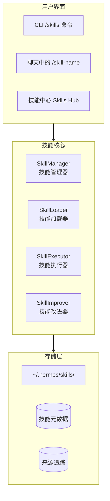

### 5.2 技能结构

#### 5.2.1 技能目录结构

```
~/.hermes/skills/
└── my-skill/
    ├── skill.yaml          # 技能定义
    ├── prompt.md           # 技能提示词
    ├── README.md           # 说明文档
    ├── scripts/            # 辅助脚本
    │   ├── __init__.py
    │   └── helper.py
    ├── tests/              # 测试
    │   └── test_skill.py
    └── examples/           # 使用示例
        └── example1.md
```

#### 5.2.2 skill.yaml 定义文件

```yaml
name: my-skill
version: 1.0.0
description: 技能描述
author: 作者名
category: 分类
tags: [标签1, 标签2]

requirements:
  dependencies: []
  env_vars: []

commands:
  - name: main
    description: 主命令
    parameters:
      - name: param1
        type: string
        required: true
        description: 参数说明
    handler: main_handler

examples:
  - title: 示例1
    content: 使用示例

config:
  # 配置项
```

### 5.3 技能生命周期

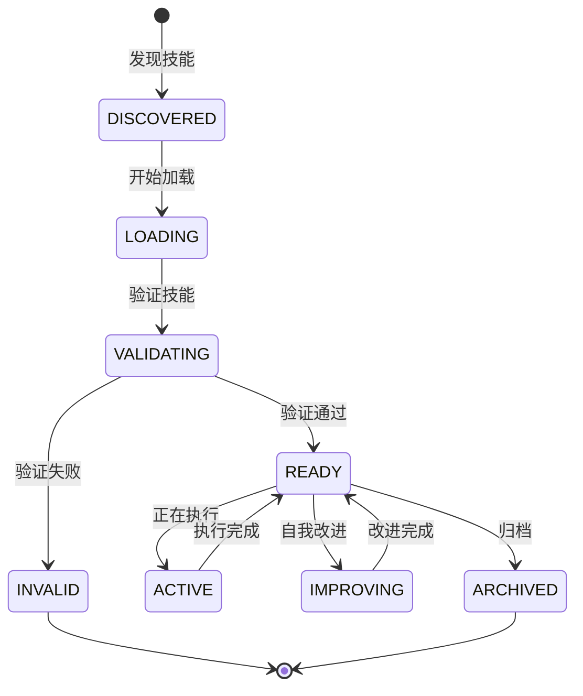

### 5.4 自动技能创建

Hermes 可以从任务执行中自动学习并创建技能：

1. **观察执行**：记录任务执行轨迹
2. **分析模式**：识别关键步骤和模式
3. **生成大纲**：创建技能结构
4. **编写提示**：生成技能提示词
5. **用户确认**：请求用户确认和调整
6. **保存技能**：保存到技能目录

### 5.5 技能自我改进

**触发条件：**
- 使用次数达到阈值
- 用户负面反馈
- 执行失败多次
- 定期检查窗口

**改进流程：**
1. 获取执行历史和用户反馈
2. 分析失败案例
3. 生成改进建议
4. 备份原技能
5. 应用改进
6. 测试改进后的技能
7. 保存并更新版本号

### 5.6 技能组合与嵌套

支持多种组合模式：
- **顺序执行**：Skill A → Skill B → Skill C
- **条件执行**：根据条件选择执行路径
- **循环执行**：重复执行技能 N 次
- **并行执行**：同时执行多个技能

### 5.7 技能版本管理

- 语义化版本（主版本.次版本.修订号）
- Git 集成支持
- 变更历史记录
- 回滚支持

### 5.8 内置技能

#### 5.8.1 创意技能
- `comfyui` - ComfyUI 图像生成集成
- `excalidraw` - Excalidraw 图表
- `pixel-art` - 像素艺术

#### 5.8.2 媒体技能
- `youtube-content` - YouTube 内容处理

#### 5.8.3 生产力技能
- `google-workspace` - Google Workspace 集成
- `linear` - Linear 项目管理
- `maps` - 地图功能
- `ocr-and-documents` - OCR 和文档处理
- `powerpoint` - PowerPoint 生成

#### 5.8.4 红队技能
- `godmode` - GodMode 工具

#### 5.8.5 研究技能
- `arxiv` - arXiv 论文检索
- `polymarket` - Polymarket 预测市场

---

## 6. 记忆系统

### 6.1 系统架构

记忆系统提供跨会话的持久化记忆和用户建模能力。

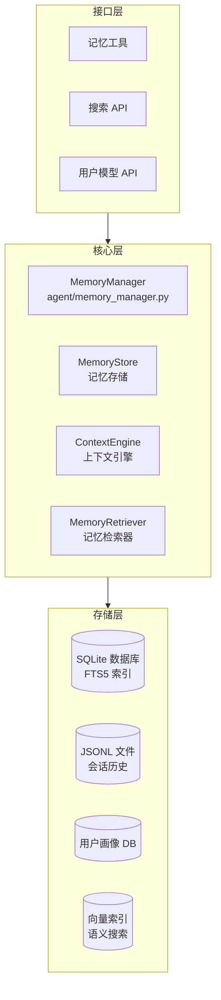

### 6.2 记忆类型

#### 6.2.1 短期记忆
- 当前对话上下文
- 工具调用历史
- 中间思考过程

#### 6.2.2 长期记忆
- 会话历史摘要
- 用户偏好
- 学到的事实

#### 6.2.3 过程记忆
- 技能执行记录
- 任务完成轨迹
- 成功/失败案例

#### 6.2.4 语义记忆
- 实体关系
- 事实知识
- 概念理解

#### 6.2.5 用户画像
- 交互历史
- 偏好模式
- 沟通风格

### 6.3 存储架构

#### 6.3.1 存储层次

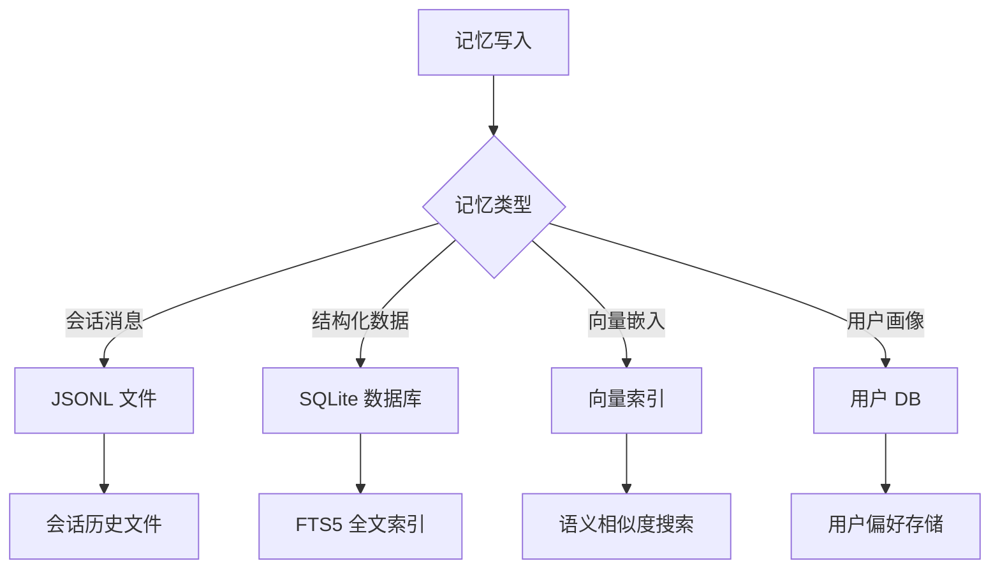

#### 6.3.2 数据库 Schema

**Session（会话表）**
- `id` - 会话 ID（主键）
- `user_id` - 用户 ID（外键）
- `platform` - 平台
- `created_at` - 创建时间
- `updated_at` - 更新时间
- `is_archived` - 是否已归档
- `metadata` - 元数据（JSON）

**Message（消息表）**
- `id` - 消息 ID（主键）
- `session_id` - 会话 ID（外键）
- `role` - 角色
- `content` - 内容
- `tool_calls` - 工具调用（JSON）
- `tool_results` - 工具结果（JSON）
- `timestamp` - 时间戳
- `token_count` - Token 数量

**Memory（记忆表）**
- `id` - 记忆 ID（主键）
- `session_id` - 会话 ID（外键）
- `user_id` - 用户 ID（外键）
- `content` - 内容
- `memory_type` - 记忆类型
- `embedding` - 向量嵌入
- `importance` - 重要性分数
- `created_at` - 创建时间
- `last_accessed` - 最后访问时间
- `access_count` - 访问次数

**User（用户表）**
- `id` - 用户 ID（主键）
- `platform` - 平台
- `platform_user_id` - 平台用户 ID
- `preferences` - 偏好（JSON）
- `interaction_summary` - 交互摘要（JSON）
- `first_seen` - 首次出现时间
- `last_seen` - 最后出现时间
- `total_interactions` - 总交互次数

**Preference（偏好表）**
- `id` - 偏好 ID（主键）
- `user_id` - 用户 ID（外键）
- `key` - 偏好键
- `value` - 偏好值
- `source` - 来源
- `discovered_at` - 发现时间
- `confidence` - 置信度

### 6.4 记忆检索

#### 6.4.1 检索策略

| 策略 | 说明 |
|------|------|
| 时间最近 | 按时间排序获取最近记忆 |
| 语义相似 | 向量相似度搜索 |
| 关键词 | FTS5 全文搜索 |
| 混合 | 多策略融合重排序 |

#### 6.4.2 混合检索流程

1. **关键词提取**：从查询中提取关键词
2. **向量生成**：生成查询的向量嵌入
3. **并行搜索**：同时执行 FTS5 和向量搜索
4. **结果合并**：合并两种搜索结果
5. **去重处理**：移除重复条目
6. **混合重排序**：综合多种因素重新排序
7. **Top-K 返回**：返回最相关的 K 条结果

### 6.5 用户建模系统

#### 6.5.1 用户画像维度

- **沟通风格**：正式/随意、简洁/详细
- **技术水平**：新手/专家
- **兴趣领域**：关注的话题
- **常用工具**：偏好的工具集
- **偏好设置**：模型偏好、输出格式等
- **交互模式**：使用习惯和模式

#### 6.5.2 偏好学习流程

1. 监控用户交互
2. 检测行为模式
3. 提取候选偏好
4. 验证一致性
5. 计算置信度
6. 保存高置信度偏好

### 6.6 记忆重要性评估

评估因素：
- **内容类型**：用户声明 > 个人信息 > 技能 > 普通对话
- **访问频率**：频繁访问的更重要
- **时间衰减**：近期访问的更重要
- **用户反馈**：用户明确标记的重要

### 6.7 记忆老化与遗忘

- **时间衰减**：重要性随时间降低
- **访问计数**：访问少的更容易被遗忘
- **归档机制**：旧会话自动归档
- **摘要压缩**：归档会话生成摘要

### 6.8 会话搜索

支持多种搜索方式：
- **关键词搜索**：FTS5 全文索引
- **日期范围**：按时间筛选
- **语义搜索**：向量相似度
- **组合查询**：多条件组合

### 6.9 外部集成

#### 6.9.1 Honcho 集成

支持 Honcho 辩证式用户建模：
- 会话创建和管理
- 消息和元数据存储
- 辩证式记忆检索

#### 6.9.2 Mem0 集成

可选的 Mem0 记忆层集成。

### 6.10 记忆工具

| 工具 | 说明 |
|------|------|
| `memory_store` | 存储新记忆 |
| `memory_retrieve` | 检索相关记忆 |
| `memory_search` | 搜索历史会话 |
| `memory_forget` | 删除指定记忆 |
| `memory_summarize` | 生成记忆摘要 |

---

## 7. 定时任务系统

### 7.1 系统架构

定时任务系统提供 cron 调度能力，支持自动化工作流。

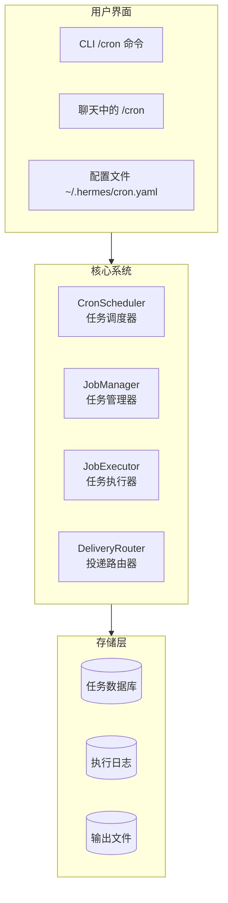

### 7.2 Cron 表达式解析

#### 7.2.1 字段说明

| 字段 | 范围 | 特殊字符 | 示例 |
|------|------|----------|------|
| 分钟 | 0-59 | `*` `,` `-` `/` | `*/5` 每 5 分钟 |
| 小时 | 0-23 | `*` `,` `-` `/` | `9-17` 早 9 晚 5 |
| 日期 | 1-31 | `*` `,` `-` `/` `?` `L` `W` | `15` 每月 15 号 |
| 月份 | 1-12 | `*` `,` `-` `/` | `1,3,5` 1/3/5 月 |
| 星期 | 0-6 (日-六) | `*` `,` `-` `/` `?` `L` `#` | `1-5` 工作日 |
| 年份 (可选) | 2024-2100 | `*` `,` `-` `/` | `2024/2` 偶数年 |

#### 7.2.2 常见任务示例

| 任务类型 | Cron 表达式 | 说明 |
|----------|-------------|------|
| 日报 | `0 9 * * 1-5` | 工作日早 9 点 |
| 周报 | `0 10 * * 1` | 周一早 10 点 |
| 备份 | `0 2 * * *` | 每天凌晨 2 点 |
| 健康检查 | `*/30 * * * *` | 每 30 分钟 |
| 月度报告 | `0 8 1 * *` | 每月 1 号早 8 点 |

### 7.3 任务定义

#### 7.3.1 任务结构

```yaml
jobs:
  - id: daily-report
    name: 日报
    description: 生成每日工作摘要
    schedule: '0 9 * * 1-5'
    timezone: Asia/Shanghai
    enabled: true
    
    action:
      type: prompt  # prompt/skill/command/python
      content: '总结今日工作内容...'
    
    delivery:
      - 'telegram:123456'  # 投递目标列表
      - 'local'
    
    metadata:
      created_by: user
```

#### 7.3.2 动作类型

| 类型 | 说明 |
|------|------|
| `prompt` | LLM 提示词 |
| `skill` | 技能名称 + 参数 |
| `command` | Shell 命令 |
| `python` | Python 脚本 |

### 7.4 任务调度流程

1. 加载任务列表
2. 解析每个任务的 cron 表达式
3. 计算下次执行时间
4. 启动调度循环（每秒检查）
5. 到期任务提交执行
6. 更新下次执行时间

### 7.5 任务执行流程

1. 准备执行环境
2. 记录开始时间
3. 执行动作（提示词/技能/命令/脚本）
4. 记录执行结果
5. 投递结果到目标
6. 记录投递状态

### 7.6 消息投递

投递目标格式：
- `origin` - 返回消息来源
- `local` - 保存本地文件
- `platform` - 发送到平台主频道
- `platform:chat_id` - 发送到指定聊天
- `platform:chat:thread` - 发送到指定线程

### 7.7 任务状态机

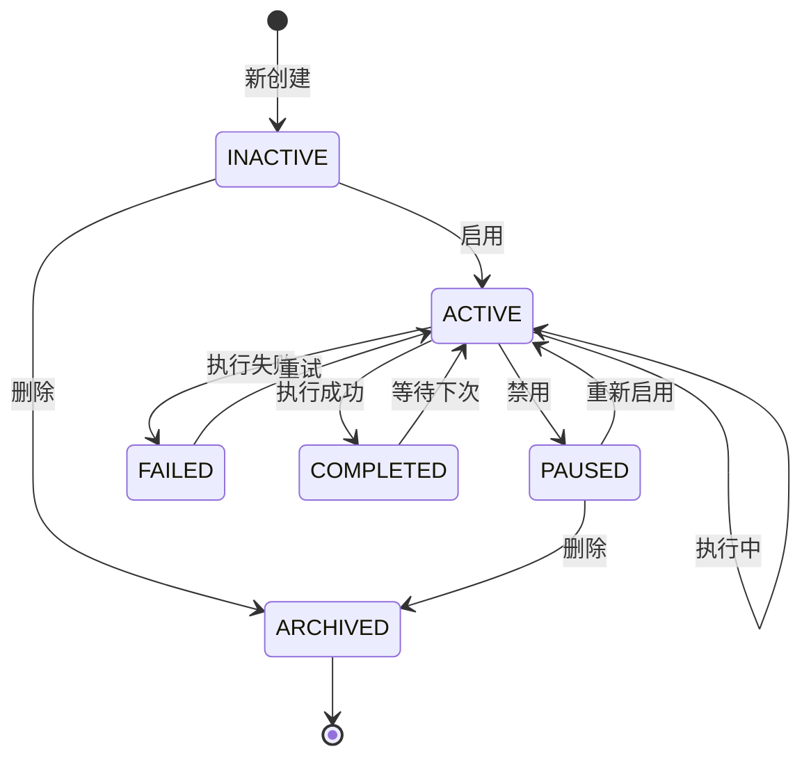

### 7.8 时区处理

时区优先级：
1. 任务级 `timezone` 字段
2. 全局配置 `~/.hermes/config.yaml`
3. 系统时区

### 7.9 错误处理与重试

| 错误类型 | 处理策略 |
|----------|----------|
| 临时错误 | 指数退避重试 |
| 配置错误 | 禁用任务并通知 |
| 平台错误 | 重试投递 |
| 超时 | 终止并清理 |

### 7.10 CLI 命令

| 命令 | 说明 |
|------|------|
| `hermes cron list` | 列出所有任务 |
| `hermes cron create` | 创建新任务 |
| `hermes cron edit` | 编辑任务 |
| `hermes cron delete` | 删除任务 |
| `hermes cron enable` | 启用任务 |
| `hermes cron disable` | 禁用任务 |
| `hermes cron run` | 立即执行任务 |
| `hermes cron logs` | 查看任务日志 |

---

## 8. 技术栈

### 8.1 核心技术

| 类别 | 技术 | 说明 |
|------|------|------|
| **编程语言** | Python 3.11+ | 主要开发语言 |
| **异步框架** | asyncio, anyio | 异步 I/O |
| **HTTP 客户端** | httpx, aiohttp | 现代 HTTP 客户端 |
| **数据验证** | pydantic ~2.5.0 | 数据验证和设置管理 |
| **配置管理** | pyyaml, python-dotenv | YAML/环境变量配置 |
| **日志** | python-json-logger | JSON 格式化日志 |

### 8.2 LLM 集成

- Anthropic Claude SDK
- OpenAI SDK
- Google Generative AI SDK
- AWS Boto3 (Bedrock)
- OpenRouter API
- Sentence-Transformers (向量嵌入)
- NumPy, SciPy (数值计算)

### 8.3 消息平台

- python-telegram-bot >=20.0
- discord.py >=2.3.0
- slack-bolt, slack-sdk
- matrix-nio >=0.20.0
- 飞书/企业微信/钉钉/QQ 自定义集成

### 8.4 执行环境

- Docker SDK
- Paramiko (SSH)
- Modal SDK
- Daytona SDK
- Singularity (可选)

### 8.5 数据库

- SQLite (内置，FTS5 全文搜索)
- JSONL 文件格式

### 8.6 CLI & TUI

- Typer >=0.9.0 (CLI 框架)
- Rich >=13.0.0 (终端富文本)
- Textual >=0.40.0 (TUI 框架)
- Pygments (语法高亮)
- Prompt Toolkit (交互式提示)

### 8.7 媒体处理

- Pillow >=10.0.0 (图像处理)
- OpenAI Whisper (语音转写)
- ElevenLabs (语音合成，可选)

### 8.8 开发工具

- **代码质量**：Black, isort, MyPy, Ruff
- **测试**：pytest, pytest-asyncio, pytest-cov
- **文档**：MkDocs, MkDocs Material
- **构建**：uv (现代 Python 包管理)

### 8.9 安全与加密

- cryptography (加密原语)
- Tirith (安全策略引擎)
- python-jose (JWT，可选)
- keyring (系统密钥环，可选)

### 8.10 Python 版本支持

| Python 版本 | 支持状态 |
|--------------|----------|
| 3.13 | ✅ 推荐 |
| 3.12 | ✅ 支持 |
| 3.11 | ✅ 支持（最低） |
| 3.10 | ❌ 不支持 |
| 3.9 | ❌ 不支持 |

### 8.11 操作系统支持

| OS | 支持状态 | 说明 |
|----|----------|------|
| Linux | ✅ 完全支持 | 推荐 Ubuntu 22.04+ |
| macOS | ✅ 完全支持 | 11.0+ |
| Windows | ⚠️ WSL2 | 原生不支持，使用 WSL2 |
| Android | ✅ Termux | 部分功能 |

---

## 9. 项目架构与设计

### 9.1 目录结构

```
hermes-agent/
├── agent/                      # Agent 核心模块
│   ├── conversation_loop.py   # 对话循环 ⭐
│   ├── context_engine.py      # 上下文引擎
│   ├── memory_manager.py      # 记忆管理器 ⭐
│   ├── tool_executor.py       # 工具执行器 ⭐
│   ├── prompt_builder.py      # 提示构建器
│   └── ...
├── gateway/                    # 消息网关模块 ⭐
│   ├── run.py                 # 网关运行器 ⭐
│   ├── config.py              # 配置管理 ⭐
│   ├── session.py             # 会话管理 ⭐
│   ├── delivery.py            # 消息投递 ⭐
│   ├── hooks.py               # 事件钩子 ⭐
│   ├── platform_registry.py   # 平台注册中心 ⭐
│   ├── stream_consumer.py     # 流消费者 ⭐
│   └── platforms/             # 平台适配器
│       ├── base.py            # 基础适配器 ⭐
│       ├── telegram.py
│       ├── discord.py
│       └── ...
├── tools/                      # 工具系统模块 ⭐
│   ├── registry.py            # 工具注册表 ⭐
│   ├── terminal_tool.py       # 终端工具 ⭐
│   ├── environments/          # 执行环境
│   └── ...
├── cron/                       # 定时任务模块 ⭐
│   ├── jobs.py
│   └── scheduler.py
├── skills/                     # 内置技能目录 ⭐
├── hermes_cli/                 # CLI 模块
├── docs/                       # 文档
│   └── architecture/           # 架构文档 ⭐
├── tests/                      # 测试
├── pyproject.toml             # 项目配置 ⭐
├── README.md
└── README.zh-CN.md
```

### 9.2 模块职责边界

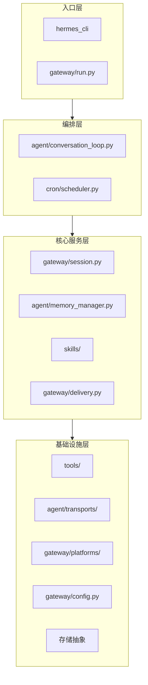

### 9.3 设计原则

1. **模块化设计**：各组件独立开发和测试
2. **可扩展性**：支持新平台、新模型、新工具的轻松集成
3. **安全隔离**：工具执行在隔离环境中
4. **状态持久化**：会话、记忆、技能均持久化存储
5. **流式优先**：支持实时流式响应
6. **并发安全**：使用 ContextVar 实现任务级状态隔离

### 9.4 关键设计模式

- **适配器模式**：平台适配器统一接口
- **策略模式**：会话重置、记忆检索等多种策略
- **工厂模式**：工具、技能、平台适配器的创建
- **事件驱动**：HookRegistry 事件系统
- **插件架构**：平台、技能、MCP 服务器的动态加载

---

## 10. 依赖关系

### 10.1 核心依赖

```toml
# pyproject.toml 示例
dependencies = [
    "anthropic>=0.20.0,<0.30.0",
    "openai>=1.0.0",
    "pydantic~=2.5.0",
    "pyyaml>=6.0",
    "anyio>=4.0.0",
    "httpx>=0.25.0",
    "rich>=13.0.0",
    "typer>=0.9.0",
    "textual>=0.40.0",
    "numpy>=1.24.0",
    "scipy>=1.10.0",
]
```

### 10.2 可选依赖

```toml
[project.optional-dependencies]
all = [
    "docker>=6.0",
    "paramiko>=3.0",
    "playwright>=1.40.0",
    "pillow>=10.0.0",
    "sentence-transformers",
]
dev = [
    "black==23.12.1",
    "isort==5.13.2",
    "mypy==1.8.0",
    "ruff==0.1.9",
    "pytest==7.4.3",
    "pytest-asyncio==0.21.1",
    "pytest-cov==4.1.0",
]
```

---

## 11. 部署架构

### 11.1 部署方式

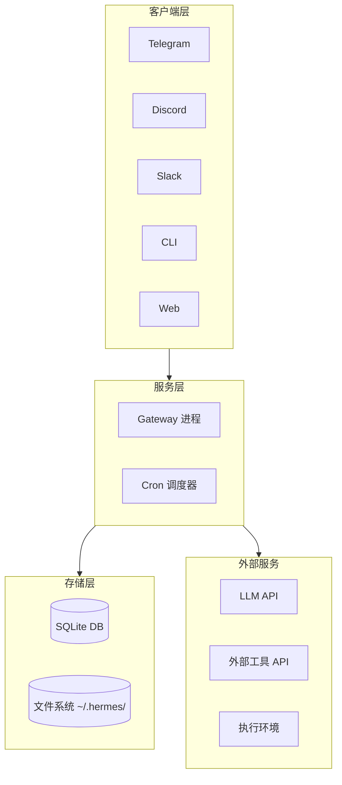

### 11.2 容器化部署

- **Docker** 镜像支持
- **Docker Compose** 本地编排
- **Kubernetes** 生产编排（可选）

### 11.3 Serverless 部署

- **Modal** - Serverless 执行环境
- **AWS Lambda** - 无服务器部署（可选）

---

## 12. 开发与贡献

### 12.1 开发环境设置

```bash
# 克隆仓库
git clone https://github.com/NousResearch/hermes-agent.git
cd hermes-agent

# 使用 setup-hermes.sh 脚本
./setup-hermes.sh

# 或手动设置
curl -LsSf https://astral.sh/uv/install.sh | sh
uv venv venv --python 3.11
source venv/bin/activate
uv pip install -e ".[all,dev]"
python -m pytest tests/ -q
```

### 12.2 代码风格

- **格式化**：Black
- **导入排序**：isort
- **类型检查**：MyPy
- **Linting**：Ruff
- **Git Hooks**：pre-commit

### 12.3 测试

- **单元测试**：pytest
- **集成测试**：pytest-asyncio
- **覆盖率**：pytest-cov（目标 80%+）

---

## 13. 总结与建议

### 13.1 技术优势

1. **架构设计优秀**：模块化、可扩展、职责清晰
2. **多平台支持完善**：15+ 消息平台，统一接口
3. **安全机制健全**：多层防护、隔离执行、审批流程
4. **自进化能力**：自动学习、技能改进、用户建模
5. **工具生态丰富**：40+ 内置工具，多种执行环境
6. **技术选型现代**：Python 3.11+、asyncio、pydantic v2

### 13.2 改进建议

1. **性能优化**
   - 考虑添加 Redis 缓存层
   - 优化向量检索性能
   - 异步化更多 I/O 操作

2. **可观测性增强**
   - 添加 Prometheus metrics
   - 集成 OpenTelemetry
   - 完善日志和追踪

3. **高可用部署**
   - 支持集群部署
   - 会话存储可迁移到 PostgreSQL
   - 添加健康检查和自动故障转移

4. **开发者体验**
   - 更完善的 API 文档
   - 插件开发模板和教程
   - 调试工具和可视化仪表板

### 13.3 未来方向

1. **多代理协作**：支持多个 Hermes Agent 协作
2. **更强大的技能系统**：技能市场、技能组合、可视化技能编排
3. **增强的记忆系统**：更复杂的推理、知识图谱集成
4. **多模态原生**：深度集成图像、音频、视频处理
5. **个性化定制**：更精细的用户建模和个性化

---

## 附录

### A. 相关文档链接

- [整体架构](./architecture/overview.md)
- [对话流程](./architecture/conversation-flow.md)
- [工具调用流程](./architecture/tool-call-flow.md)
- [网关架构](./architecture/gateway-architecture.md)
- [技能系统](./architecture/skill-system.md)
- [记忆系统](./architecture/memory-system.md)
- [定时任务流程](./architecture/cron-flow.md)
- [目录结构](./architecture/directory-tree.md)
- [技术栈](./tech-stack.md)
- [快速入门](./getting-started.md)
- [部署指南](./deployment.md)
- [配置文档](./configuration.md)
- [开发者指南](./developer-guide.md)
- [API 文档](./api-docs.md)
- [最佳实践](./best-practices.md)

### B. 参考资源

- [Hermes Agent GitHub](https://github.com/NousResearch/hermes-agent)
- [Nous Research](https://nousresearch.com)
- [Discord 社区](https://discord.gg/NousResearch)
- [Agents Skills](https://agentskills.io)
- [OpenRouter](https://openrouter.ai)

---

**报告版本**：1.0.0
**最后更新**：2026-05-21
**编写人员**：技术调研团队
