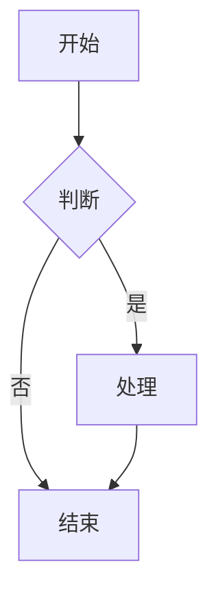

# Hermes Agent - 文档网站

这是 Hermes Agent 的官方文档网站，使用 Docusaurus 构建，提供现代化的静态网站生成体验。

## 技术栈

- **框架**: Docusaurus 3.9.2
- **主题**: Docusaurus 经典主题 + Mermaid 主题
- **文档**: Markdown/MDX
- **图表**: Mermaid
- **搜索**: @easyops-cn/docusaurus-search-local
- **语言**: TypeScript
- **样式**: 自定义 CSS + Docusaurus 主题系统

## 快速开始

### 安装依赖

```bash
npm install
```

### 本地开发

```bash
npm start
```

这会启动本地开发服务器并打开浏览器窗口。大多数更改会实时反映，无需重启服务器。

### 构建生产版本

```bash
npm run build
```

这会将静态内容生成到 `build` 目录中，可以使用任何静态内容托管服务提供服务。

### 预览构建

```bash
npm run serve
```

预览生产构建结果。

### 部署

使用 SSH 部署：

```bash
USE_SSH=true npm run deploy
```

不使用 SSH：

```bash
GIT_USER=<你的 GitHub 用户名> npm run deploy
```

如果你使用 GitHub Pages 托管，这是一个方便的命令，可以构建网站并推送到 `gh-pages` 分支。

### 其他命令

| 命令 | 描述 |
|------|------|
| `npm run swizzle` | 自定义 Docusaurus 组件 |
| `npm run clear` | 清除 Docusaurus 缓存 |
| `npm run write-translations` | 提取翻译 |
| `npm run write-heading-ids` | 生成标题 ID |
| `npm run typecheck` | 运行 TypeScript 类型检查 |
| `npm run lint:diagrams` | 检查文档中的 ASCII 图表（使用 Mermaid 代替） |

## 架构概述

### 目录结构

```
website/
├── docs/                   # 文档源文件
│   ├── getting-started/    # 快速开始指南
│   ├── user-guide/         # 用户指南
│   ├── developer-guide/    # 开发者指南
│   ├── reference/          # 参考文档
│   └── ...
├── i18n/                   # 国际化翻译文件
│   ├── en/                # 英文
│   ├── zh-Hans/           # 简体中文
│   └── ko/                # 韩语
├── src/
│   ├── components/         # 自定义 React 组件
│   │   └── UserStoriesCollage/  # 用户故事拼贴组件
│   ├── pages/              # 自定义页面
│   │   ├── skills/         # 技能页面
│   │   └── index.tsx       # 首页（如果需要）
│   ├── css/                # 自定义样式
│   │   └── custom.css      # 全局自定义样式
│   └── data/               # 数据文件
│       └── userStories.json  # 用户故事数据
├── static/                 # 静态资源
│   ├── img/               # 图片
│   └── ...
├── scripts/                # 构建脚本
│   └── prebuild.mjs       # 预构建脚本
├── docusaurus.config.ts   # Docusaurus 配置
├── sidebars.ts            # 侧边栏配置
├── package.json           # 项目依赖
└── tsconfig.json          # TypeScript 配置
```

### 站点配置 (`docusaurus.config.ts`)

#### 基本信息

```typescript
title: 'Hermes Agent'
tagline: 'The self-improving AI agent'
favicon: 'img/favicon.ico'
url: 'https://hermes-agent.nousresearch.com'
baseUrl: '/docs/'
organizationName: 'NousResearch'
projectName: 'hermes-agent'
```

#### 多语言支持

配置了三种语言：

| 语言代码 | 语言名称 | 说明 |
|----------|----------|------|
| `en` | English | 默认语言 |
| `zh-Hans` | 简体中文 | 简体中文 |
| `ko` | 한국어 | 韩语 |

#### 主题配置

```typescript
themes: [
  '@docusaurus/theme-mermaid',  // Mermaid 图表支持
  [
    '@easyops-cn/docusaurus-search-local',  // 本地搜索
    {
      hashed: true,
      language: ['en', 'zh'],
      indexBlog: false,
      docsRouteBasePath: '/',
      highlightSearchTermsOnTargetPage: false,
      ignoreFiles: [
        /^user-guide\/skills\/bundled\//,
        /^user-guide\/skills\/optional\//
      ]
    }
  ]
]
```

#### 预设配置

```typescript
presets: [
  [
    'classic',
    {
      docs: {
        routeBasePath: '/',  // 文档在 /docs/ 根路径
        sidebarPath: './sidebars.ts',
        editUrl: 'https://github.com/NousResearch/hermes-agent/edit/main/website/'
      },
      blog: false,  // 禁用博客
      theme: {
        customCss: './src/css/custom.css'
      }
    }
  ]
]
```

#### 主题设置 (themeConfig)

```typescript
themeConfig: {
  image: 'img/hermes-agent-banner.png',
  colorMode: {
    defaultMode: 'dark',
    respectPrefersColorScheme: true
  },
  docs: {
    sidebar: {
      hideable: true,
      autoCollapseCategories: true
    }
  },
  navbar: {
    title: 'Hermes Agent',
    logo: {
      alt: 'Hermes Agent',
      src: 'img/logo.png'
    },
    items: [
      { type: 'docSidebar', sidebarId: 'docs', position: 'left', label: 'Docs' },
      { to: '/skills', label: 'Skills', position: 'left' },
      { type: 'localeDropdown', position: 'right' },
      { href: 'https://hermes-agent.nousresearch.com', label: 'Home', position: 'right' },
      { href: 'https://github.com/NousResearch/hermes-agent', label: 'GitHub', position: 'right' },
      { href: 'https://discord.gg/NousResearch', label: 'Discord', position: 'right' }
    ]
  },
  footer: {
    style: 'dark',
    links: [/* 文档、社区、更多链接 */],
    copyright: 'Built by <a href="https://nousresearch.com">Nous Research</a> · MIT License · 2025'
  },
  prism: {
    theme: prismThemes.github,
    darkTheme: prismThemes.dracula,
    additionalLanguages: ['bash', 'yaml', 'json', 'python', 'toml']
  },
  mermaid: {
    theme: { light: 'neutral', dark: 'dark' }
  }
}
```

### 侧边栏配置 (`sidebars.ts`)

侧边栏结构定义在 `sidebars.ts` 中，支持：
- 分类嵌套
- 自动生成侧边栏
- 手动链接
- 外部链接

## 文档组织

### 文档结构

```
docs/
├── getting-started/
│   ├── quickstart.md         # 快速开始
│   ├── installation.md       # 安装指南
│   └── ...
├── user-guide/
│   ├── cli.md               # CLI 使用
│   ├── tui.md               # TUI 使用
│   ├── web.md               # Web UI 使用
│   ├── skills/              # 技能文档
│   │   ├── bundled/         # 内置技能（自动生成）
│   │   ├── optional/        # 可选技能（自动生成）
│   │   └── index.md         # 技能目录
│   └── ...
├── developer-guide/
│   ├── architecture.md      # 架构文档
│   ├── plugins.md           # 插件开发
│   ├── contributing.md      # 贡献指南
│   └── ...
└── reference/
    ├── cli-commands.md      # CLI 命令参考
    ├── configuration.md     # 配置参考
    ├── api.md               # API 参考
    ├── skills-catalog.md    # 技能目录（人工编写）
    └── optional-skills-catalog.md  # 可选技能目录
```

### 技能文档生成

- 内置和可选技能的单页面文档是自动生成的
- 这些页面在搜索中被排除（`ignoreFiles`）
- 人工编写的目录页面（`skills-catalog.md`、`optional-skills-catalog.md`）被索引
- 预构建脚本可能参与这个生成过程

## 自定义组件

### UserStoriesCollage

位于 `src/components/UserStoriesCollage/`，从 `src/data/userStories.json` 读取数据，展示用户故事拼贴。

### 技能页面

自定义技能页面位于 `src/pages/skills/`，提供技能库的特殊视图。

## 国际化 (i18n)

### 翻译文件结构

```
i18n/
├── en/
│   ├── docusaurus-theme-classic/
│   │   └── navbar.json
│   │   └── footer.json
│   └── code.json
├── zh-Hans/
│   ├── docusaurus-theme-classic/
│   │   └── navbar.json
│   │   └── footer.json
│   ├── code.json
│   └── docusaurus-plugin-content-docs/
│       └── current/
│           └── (翻译后的 Markdown 文件)
└── ko/
    └── (同上)
```

### 提取翻译

```bash
npm run write-translations
```

这会提取所有可翻译的字符串到 `i18n/` 目录中。

### 翻译文档

每种语言的文档版本放在 `i18n/<lang>/docusaurus-plugin-content-docs/current/` 中。

## 预构建脚本

`scripts/prebuild.mjs` 在 `start` 和 `build` 之前运行，可能负责：
- 生成技能文档
- 处理 API 文档
- 同步版本信息
- 其他构建预处理任务

## Markdown/MDX 特性

### 前置元数据 (Frontmatter)

```markdown
---
title: 页面标题
description: 页面描述
sidebar_label: 侧边栏标签
sidebar_position: 1
slug: /custom-path
hide_title: false
hide_table_of_contents: false
keywords: [关键词1, 关键词2]
---
```

### Mermaid 图表

支持 Mermaid 图表：



### 代码高亮

支持多种语言的语法高亮：
- Python
- JavaScript/TypeScript
- Bash
- YAML
- JSON
- TOML
- 等等

### 告警 (Admonitions)

```markdown
:::note
这是一个备注
:::

:::tip
这是一个提示
:::

:::info
这是一条信息
:::

:::caution
这是一个警告
:::

:::danger
这是一个危险警告
:::
```

## 样式自定义

### 自定义 CSS

`src/css/custom.css` 包含全局样式覆盖：

```css
/* 自定义样式示例 */
:root {
  --custom-color: #...;
}

.docusaurus-highlight-code-line {
  background-color: rgba(0, 0, 0, 0.1);
  display: block;
  margin: 0 calc(-1 * var(--ifm-pre-padding));
  padding: 0 var(--ifm-pre-padding);
}

html[data-theme='dark'] .docusaurus-highlight-code-line {
  background-color: rgba(0, 0, 0, 0.3);
}
```

### 主题切换

- 默认暗色模式
- 尊重用户系统偏好
- 亮色/暗色主题切换

## 搜索功能

使用 `@easyops-cn/docusaurus-search-local` 提供本地搜索：

- 离线搜索（无需 Algolia）
- 支持中英文搜索
- 哈希索引
- 可配置搜索结果高亮（已禁用）
- 排除自动生成的技能文档

## 导航结构

### 顶部导航栏 (Navbar)

| 项目 | 位置 | 说明 |
|------|------|------|
| Docs | 左侧 | 文档侧边栏 |
| Skills | 左侧 | 技能页面 |
| 语言下拉 | 右侧 | 切换语言 |
| Home | 右侧 | 项目主页 |
| GitHub | 右侧 | GitHub 仓库 |
| Discord | 右侧 | Discord 社区 |

### 底部 (Footer)

分为三个部分：
1. **文档**: 快速开始、用户指南、开发者指南、参考
2. **社区**: Discord、GitHub Discussions、Skills Hub
3. **更多**: GitHub、Nous Research

## 图表规范

### 禁止使用 ASCII 图表

CI 运行 `ascii-guard lint` 检查文档中的 ASCII 框图。使用 Mermaid 或纯列表/表格代替，以避免 CI 失败。

### 推荐方式

- 使用 Mermaid 图表 (` ```mermaid `)
- 使用列表
- 使用表格

## 环境要求

```json
engines: {
  node: ">=20.0"
}
```

## 部署注意事项

1. **Base URL**: 站点部署在 `/docs/` 路径下，不是根路径
2. **静态资源**: 所有静态资源都有正确的相对路径
3. **搜索索引**: 搜索索引在构建时生成
4. **语言版本**: 所有语言版本一起构建

## 性能优化

- 静态生成
- 客户端导航
- 代码分割
- 图像优化
- 搜索索引分块

## 相关文档

- [Docusaurus 官方文档](https://docusaurus.io/)
- [Mermaid 文档](https://mermaid-js.github.io/)
- [Web UI 文档](../web/README.zh-CN.md)
- [TUI 文档](../ui-tui/README.zh-CN.md)
- [项目主 README](../README.zh-CN.md)
